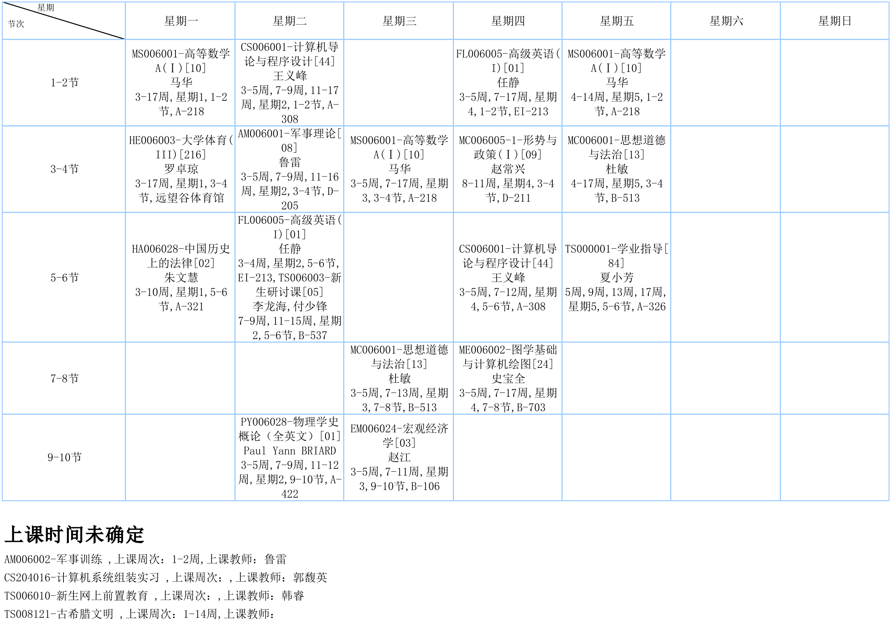
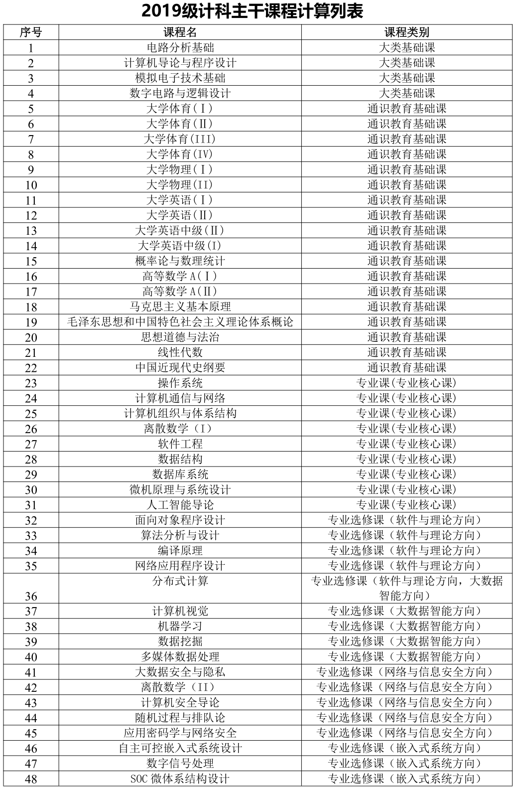
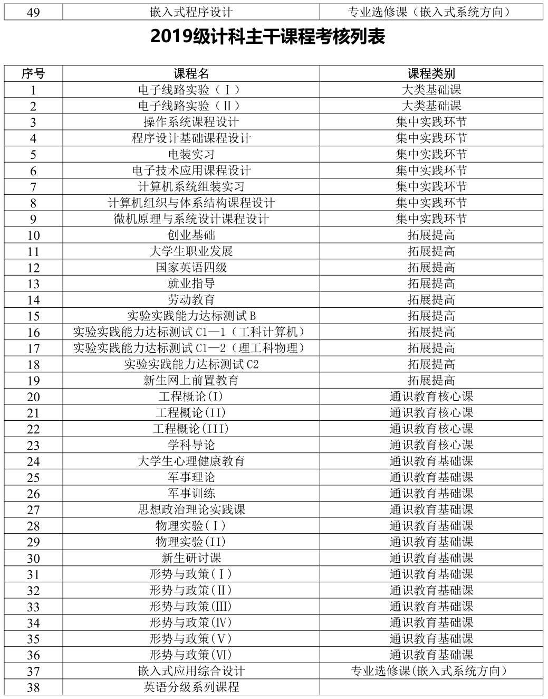
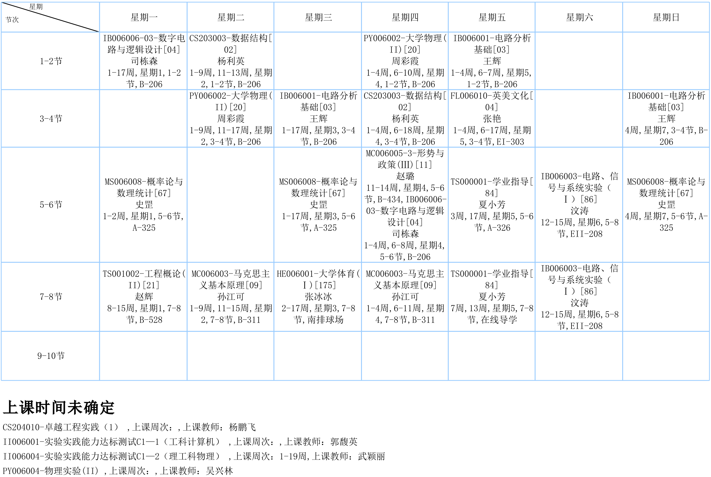
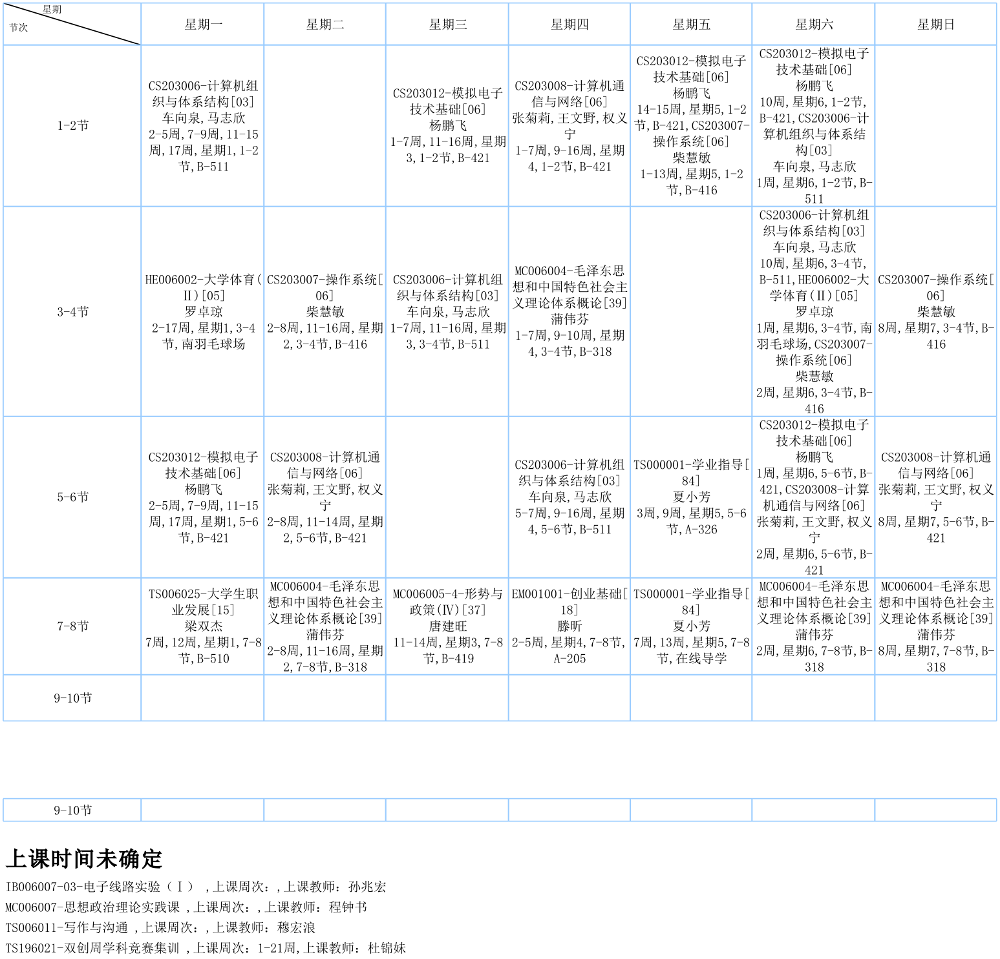
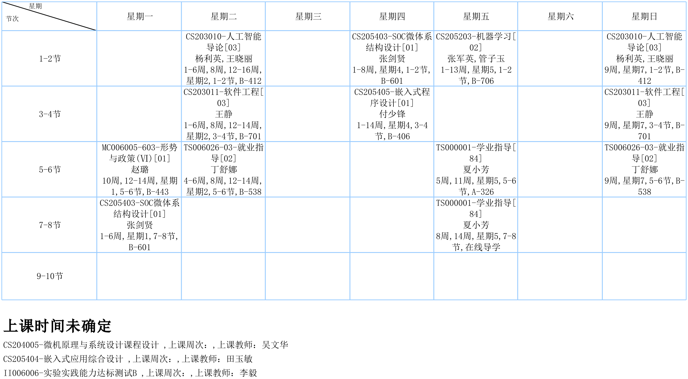
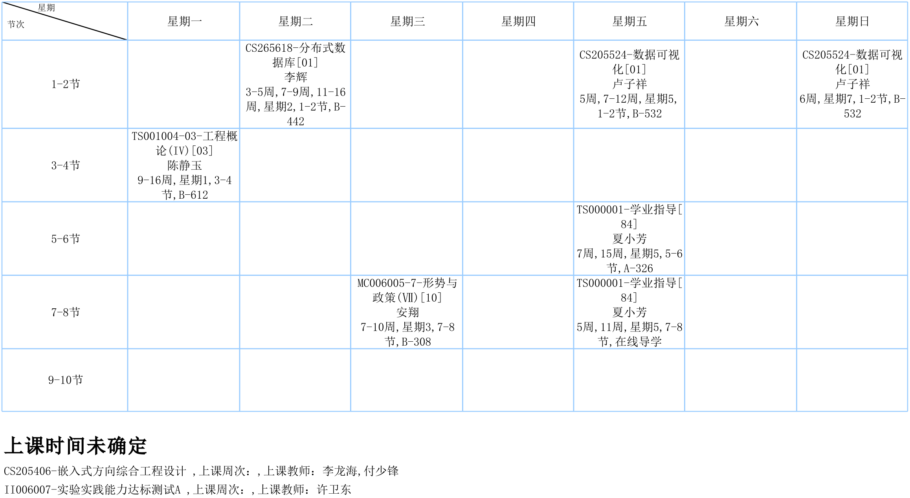
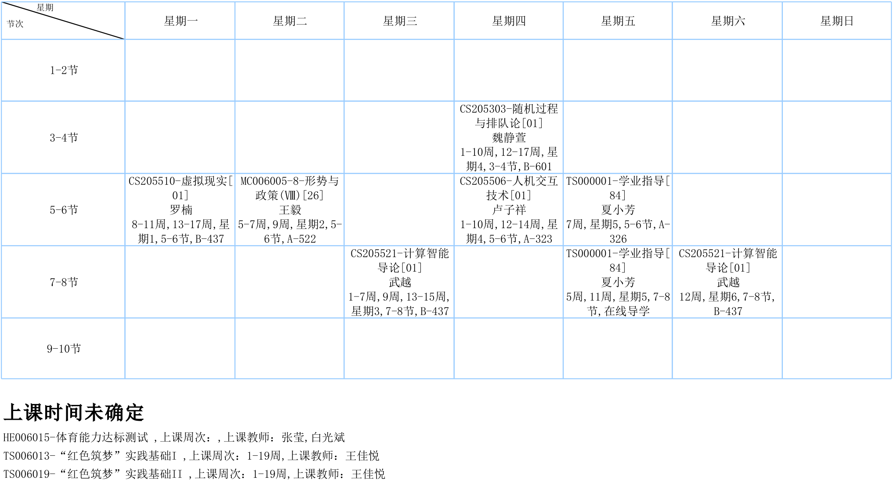
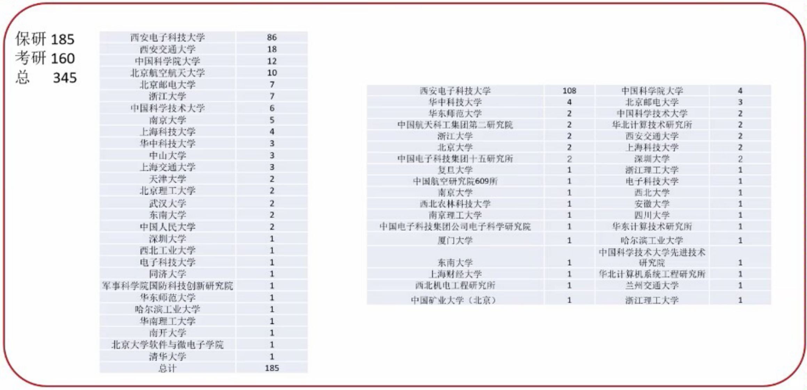

博主是一名普通的 19 级西电计科学生，今年 6 月刚毕业，希望在研究生生活开始之前整理一些自己和其他人本科四年学习的经验感想，同时汇总一些还找得到的有用资料方便后人参考，以尽自己所能抹平信息差，让学弟学妹们少走一些弯路，多腾出时间去玩或者干更有意义的事情。

**本贴会从开学考开始讲起，一直到毕业典礼结束，尽量详细地介绍西电计科学习生活的各个方面，因此篇幅会很长。内容上本贴主要介绍四年里不同时间段会学习的课程，分享相关的学习经验，列出还找得到的我认为有用的资料和笔记。同时用\*标识单独讲一些时间节点会遇到的大事和专业课学习之外有必要提一嘴的重要问题。最后邀请一些同学分享竞赛、工作、留学和科研方面的经验**。

**本贴所有涉及笔记的 PDF 及 Markdown 文件下载见[计算机专业课自整笔记集中索引贴](https://blog.csdn.net/zimuzi2019/article/details/126227917)。目前整理了 C 语言程序设计、C++ 面向对象程序设计、Python 程序设计、数据结构、操作系统、计算机组成原理、计算机通信与网络、微机原理与系统设计几门课的笔记**。相信对平时学习和考研都有一定帮助。

如果有时间可以都看下 [XDU-CS-Learning-Cracker](https://xdu-cs-learning.readthedocs.io/en/latest/)、[xducs 学习经验分享](https://blog.csdn.net/qq_45717425/article/details/114377616)、[西安电子科技大学 计算机科学与技术专业 笔记、上机作业、实验 etc.](https://github.com/SincereXIA/XidianCS)、[西电的本科教育存在哪些问题？](https://www.zhihu.com/question/477478128/answer/2047620602)，本文写时也参考了这些前辈的成果。其他自己也可以多找找能找得到前辈的博客和 GitHub 相关资源看看。

## 写在开始

请注意博主是一名**19 级**的计科学生，所以**1. 主要面向计科的同学，计算机大类其他专业的情况只能略作涉及。2.对于大一结束的大类专业分流，要上四年的体育课之类自己没有经历的东西可能并不了解或者并不能给出多少有效的建议，这些内容博主尽量找了解的同学写点。3.政策每届都有可能变动，并不能保证每一届都是一样的情况，要自己注意及时检查**。~~事实上大部分政策只有最后时刻才会敲定，在这之前问教务基本不会给你确定的答复，所幸大政策一般不会有太大的变动~~。

然后，由于博主是那种四年基本在嗯卷均分，竞赛只打过数模，科研没做过，应用能力巨拉的类型，所以**前面讲的时候可能卷保研的气息会浓烈一些，尽管这未必是比直接工作、留学和考研更好的选择，这些部分和博主没上过或者学得不好的课，以及竞赛和科研博主会尽量找人写点。下文中如果未注明是谁写的，这些内容博主只做转述，其他默认内容是博主自己写的**。

竞赛最好不要一开始就抱太大的功利心去打，计科院至少 19 级普通班大部分都还是靠着均分上研，保研外校给的排名也是裸分。

科研当然是越早参与越好，虽然大部分人做科研本科也很难发顶会或者做出什么很成熟的成果，但提前接触也很有价值，直接翻教师主页给老师发邮件即可，大部分老师还是挺欢迎的。

找工作和留学最好趁早抱相应的团，我们学校有留学和工作交流群，低年级怎么跑路去实习我不太清楚，但我知道能这么干，可以自己去了解一下。**学校的教学与业界是脱节的，实用技术基本要靠自学。**

往届的保研政策到计科院官网上找就行，哪些课算保研都会说，每年政策都在变，但很多课肯定怎么变都是要算的。如果想保研外校，我个人觉得排名是硬门槛，如果排名不高就要早做打算调整。**如果做科研发不出顶会，竞赛也不算特别突出，一般保研外校时各因素的重要性是学校 > 专业对口 > 排名 > 科研经历 > 项目和竞赛 > 其他。本校则宽松的多，能保研大胆联系老师就是**。

**总而言之就是越早知道自己想干什么越好，而知道自己想干什么则要靠多试错或者直接问前辈**。

此外，博主大部分大学课是自学的，所以本帖的自学浓度会比较高，适合每个人的学习路线都是不同的，所以我的经历未必对大家都适用。**以博主的经验大部分课如果上课不适应，其实都可以自学补救，要有信心：西电的考试只要你认真投入足够的时间，有适当的方法，考高是不难的！但是离散数学、计算机组织与体系结构、模拟电子技术基础、微机原理与系统设计这几门课强烈推荐你跟着西电老师的进度走，最好不要自己学**。这几门课的特点是老师都讲的不错，听听不管是收获还是效率都比自学好。或者讲的内容和考试侧重点未必和网上的主流网课相契合，有一定的西电特色，自学未必有效。

&nbsp;

最后是一些偏私货的个人感想，可以跳过不看：

- **最好不要经常自己感动自己，努力与否和是否有好结果没有必然关系，很多时候运气、方向、方法都更重要**。
- **多思考，不要别人干什么你就干什么，很多人都是看到别人怎么卷，所以他也怎么卷，然后就没了，要自己尝试摸索出适合自己的道路**。确实客观上是越来越卷，但这不能成为逃避思考的借口，越卷反而越需要思考而不是盲目努力。
- **前人的经验很重要，多和学长学姐交流**，尤其是比你们高一两届的学长学姐，因为他们的情况和你们最类似。但注意不要听一家之言，每个人情况不同，要根据自己的现状判断是否合适。
- **精力的分配很重要，大部分人其实都做不到把所有方面都做好。要合理调配自己的时间，在你认为重要的事情上投入足够的精力**。
- **要意识到你在某个时间点做出的某个选择，比如分流，比如选课等等会决定日后很长一段时间内的生活状态，这还往往不是个人努力就能弥补的，如果你做出了不合适的选择，日后是一定要为之付出代价的**。尽管很多时候所谓好的选择可能只是运气好而已，并不是自身有什么出众的判断力，但是想想总比不想好。而**要提升做出正确选择的概率，我能想到的方法一是多问，多参考前人的经验和教训。二是及时根据个人和周围的现状调整自己的规划，而不是一成不变地一条道走到黑**。

**总之，要有意识地去思考自己的未来规划并落实到眼前的选择和行为上，并且认真反思周围的环境给你施加了多大的影响，周围人的行动是否已经无形之中影响了你对自己现状的正确判断。也要合理地衡量自己的精力和智力，不要高估自己的意志力和能力**。不过也没必要太焦虑，偶尔也要学会和自己和解，以下所有内容也只是大学生活的一部分，坐不住就没有负罪感地去玩，不要读个大学把自己整得太苦大仇深了（笑。

## 入学之前

正常来说，正式入学前会先军训和开学考。

### *开学考

开学考大致是在军训刚开始的那段时间进行。

考试科目为数学、英语、物理，各 100 分。这件事的影响主要有：

- 英语成绩用于确定入学后英语是初级班、中级班还是高级班。
- 数学、英语成绩用于试点班的选拔。

我们当时数学很简单，难度远小于高考数学，在各类新生群和贴吧都可以搜集到往年卷，暑假里有空可以做一做，不难考高。英语比较拉分，题型和难度大致和英语四级差不多，85+就是校前 40，准备可以直接做四级真题，此外注意准备好要求的耳机，不要考试时被听力整的惊慌失措。物理题目略难，考 65+就是全校前 100，但这成绩没用，甚至可以不去考。

### *英语分班与四六级

初级班和中级班都要上四个学期的英语课，高级班则只需要上三个学期。我印象里我们那届高级班大概 200 人，中级班大概 900 多人，剩下都是初级班。

各种班上的课不一样，初级班分别学大学英语 (Ⅰ) 、大学英语 (Ⅱ)、大学英语中级 (Ⅰ)、大学英语中级 (Ⅱ)   。中级班分别学大学英语中级 (Ⅰ)、大学英语中级 (Ⅱ)、高级英语（Ⅰ）、高级英语（Ⅱ）。高级班分别学高级英语（Ⅰ）、高级英语（Ⅱ）和高级英语选修。

现在似乎高级班大一上学期能考四级，初级中级班大一下学期能考四级，此后就每次都可以报名考。

19 级计科保研时会计算大学英语 (Ⅰ) 、大学英语 (Ⅱ)、大学英语中级 (Ⅰ)、大学英语中级 (Ⅱ)   的成绩，并且要求四级 550 分或者六级 425 分以上，我印象里竞赛保研对四六级成绩要求会放宽一点，但应该也要求四级 425 分以上。中级班和高级班没上的课按照免修 85 分计算，实际因为英语课高分难拿，85 分基本已经够了。毕业则似乎要求四级 425 分以上。

&nbsp;

因为分班上课不同，后面也就不介绍英语课的经验了。

### *试点班

注：据我所知，现在试点班大部分名额都直接放在高考招生了，所以情况可能有所不同。

&nbsp;

开学考的另一个作用是选拔试点班成员。一般每个院有教改班、卓越班和拔尖班。计科目前应该只有卓越班和拔尖班，19 级当时并没有拔尖班，我不了解拔尖班的情况，关于拔尖班的部分是麻烦问了几个拔尖班的同学写的。

首先要明确一点：**大学的实验班和高中的实验班是不一样的！高中的实验班是把一帮大佬聚在一起，好集中资源刷学校的高考成绩上限，而大学的实验班是真的用来实验的，选择需谨慎，这点也适用于学校所有的试点班**。

#### 卓越班

留在卓越班保研时不能保外校，不过 19 级计卓大二下学期结束时可以自由选择是留班还是分流到计科普通班，后者后面和普通班学生就没区别了。

19 级计卓的好处有：

- 理论上能保 50%。尽管卷到飞起，但由于 19 级的卓越班可以退班，所以当时 40 个人退了 30+，留下的人只要满足一些条件比如必修课均分 80 以上就可以直接保研。
- 能通过进实验班在开学转专业。
- 比普通班多上一些课，比如高阶竞赛程序设计之类，退班时会被置换成对应的学院任选学分。
- 大四可以直接上研一的课，六年即可拿到西电专硕学位。

坏处有：

- 奖学金竞争很激烈，在普通班能拿二等奖学金在卓越班可能毛都挣不到。
- 行政很孤立，一些重要通知比较滞后甚至就没人通知，行政上咨询一些问题经常会被踢皮球。
- 有一些课的老师可能会给卓越班额外布置一些大作业。
- 选课时推荐班级很少，可能只有一个安排的“好老师”可以选。后面自由选课时可以换，但要解决课程冲突问题也很头疼。

除此之外，19 级卓越班考试用卷和上的课和普通班一样，退班时不存在课程置换的问题。

&nbsp;

题外话 —— 虽然总体来看，本人算是计科卓越班的受益者，直接通过进卓越班在开学就换了专业，但还是要说，**进各种试点班一定要谨慎！！！**，因为试点班有可能存在以下问题：

- **所有卓越班限定只能保研本校，如果你想通过进试点班开学转专业但又想保研外校就要确认是否能退班，而且要注意退班后要补哪些课，在保研前来得及补不。**
- **因为是试点班，负责人可能会给你乱糊个课程体系，比如 19 级通院卓越班，普通班上的课你不上，普通班不上的课你得上，退班的时候缺的课程你得补。**
- **考试可能会单独出卷，但是最后给课程总分时不会管卷子难度不同的问题。**
- **容易招进来一批卷王，最后可能变成原本留在普通班躺着保研，但是在实验班卷成麻花最后还保不了研，比如 19 级钱学森班。**
- **保研外校时大部分实验班并不会被外校高看多少，而且实验班人基数少，卷王多容易导致名次不好看**
- **说给你 50% 保研名额不一定给你分配 50%，因为纸上写的是“不能超过 50%”，所以少于 50% 也是可以的！比如 19 级网安实验班，40 个人只分配了 18 个名额。**
- **因为人少，遇到问题容易被踢皮球，各种政策的变动可能相比普通班也会更不稳定，容易被随意拿捏。**

&nbsp;

&nbsp;

当事人说明一下当时网安实验班的情况：

当时我的综合测评成绩为 94.693 分，高于网络空间安全普通班保外推免录取线 5.283 分，高于信息安全普通班保外推免录取线 7.836 分，高于本班保内保研分数线 2.5 分。都高于分数线但是为什么没保研上呢？因为网信院有两个保研通道，（正常保研：想去哪去哪，“3+X”计划保研：只能保本校，除此之外没有大的区别）。问题就出在要求学生是两个通道排他性地选其一在先。

参考历史上、横向的（其他类型的实验班）和老师先前口头承诺的，同学们一致认为实验班会达成 50% 保外，就预先协商了名额，20 名之后的再选择保内。我当时排名 19，选择来正常保研通道，没想到今年突然缩减了正常保研的名额（20 -> 18 名），增加了计划保研的名额（6 名），所以我们实际共保研了 24 名（60%，后来得知这个 60% 是学校分配的额度，两个计划的细分是学院任意决定的），造成来分数排名相比较高反而没保研上的局面。

不光如此，其他一些政策变动也能随意拿捏学生。之前学院在宣讲时还承诺 3+X 计划全院统一算分（录音录屏可证），但最后实际上是分专业算分，也造成部分同学保研失误。

（by [framist](https://github.com/framist)）

&nbsp;

&nbsp;

卓越班后面留班的话，好像必修均分 80 以上（没有加分）和课都修过了能保研，保研的时候就是和其他人一样自己联系导师。

后面大三课程安排上会把计科除了网安方向的其他方向课都上些，多了个工程实践，然后考试的那种课没单开。

大四除了搞毕设，还要上研一的课，我大四上学期基本选完了，下学期没啥要考试的课还好些，大四下要考试的比较崩溃，就是压缩一年，没啥太多区别。（By 匿名）

#### 拔尖班

我们班保研不设比例，满足保研基本条件都保。不挂科，绩点 80，综测 85，英语条件。29 人大多都能保研。

政策变动很大，20 级和 21 级政策据说很不相同，直到今年 5-6 月政策才具体下来。据说后面评价指标会和科研相关，但目前没有实行。

退班人数不多，刚建政策不完善，最近才可退班。退班政策仍不明确。

大四下据说有出国交流，不知是否实行。大三可以选研究生课程抵扣院选学分。

班级内分为 3 个方向，课程不同但排名在一起排。

说是本硕博连读，似乎本硕也可，拔尖计划主要集中在本硕。

坏处和上面提到的是一样的。（By 匿名 20 级）

&nbsp;

&nbsp;

保研政策：

1. 最后能留在拔尖班的全部保研（可以保外或者保内），保内是本硕博连读（但好像从 23 级开始变成本硕了（学校宣传资料写的是本硕），这个不太确定）。

2. 分流（退出）政策（有下列条件其中之一就分流至普通班）：

   大一结束有**挂必修课、限选课**（限选课我也不太确定是什么）分流至普通班；

   大二结束有**挂必修课、限选课，综合测评**（（必修、限选课）均分（满分 100）+ 竞赛突出特长（15 分）+ 竞赛（5 分）+ 非学术创新类评分（5 分，我们这届除了额外加分，辅导员基本统一给了 3 分）+ 科研团队评价（5 分，基本你去找老师就是 4-5 分），一共满分 130 分）80 分以下分流至普通班；

   大三结束有**挂必修课、限选课**，（必修、限选）**均分**80 分以下，综测测评（（必修、限选课）均分（满分 100）+ 竞赛突出特长（15 分）+ 竞赛（7.5 分）+ 非学术创新类评分（7.5 分），一共满分 130 分）85 分以下（注意大三综合测评与大二不太一样，少了科研团队评价分），另外就是英语不达标（四级 550 以下（四级具体多少分我记不太清了，好像比 550 要高，文件找不到了）或者没过六级）;

   自愿退出：文件说的是随时可以向学院申请退出，但我们这届和 20 届没有自愿退出的。

3. 保研 rank（比较吃亏）会标明国家拔尖基地，有些外校会认可拔尖基地。

4. 出国：一直留在拔尖班的同学，在大四上学期可以去国外学习、访学一个学期（20 级因为一些原因是大四下学期，20 级预计是去新加坡，但学校未定），如保研至本校则公费（学费由学校出，其他乱七八糟的什么车票、餐饮费等自己出）；保研至外校的同学可能公费也可能需要自己付费（这个当时院长说的很模糊，说的是到时候看整个规模来定，所以不太确定），也可以选择留在国内，在学校上课有，去国外也是要拿到一定的学分的（课程大概和留在国内一样）。

5. 课程安排（每届都在变，仅供参考）：

   与普通班有差异，

   1. 学期不同：22 级把数据结构放到大一下学期，大二上把电路分析基础和大二下的模电合二为一，学分是 5 个好像。计网改到了大三上学，数据库放到大二下学。离散数学放到大二上学。大一下不需要学程序设计基础这门课；
   2. 学分。课程号不同：大二下的计组课变成计算机组成原理（4 学分）（普通班为计算机组成原理与体系结构 5.5 学分），大三上如果选系统软件方向要学计组 2（3 学分）。21 级（电路和模电还没合并）大二下的模电和 OS 都比普通班多 0.5 学分，课程号也也不一样，离散（3.5 学分），高数（每个 5.5 学分）（高数普通班是高数 A，拔尖班是高数 T）；
   3. 要学研究生课程：大二上要学研究生课程矩阵论（线代 plus），大三上要学研究生课程计算复杂性理论（21 级是英国外教线上教的）等等，这些研究生课程如果保研至本校可以算为研究生已修课程，而且这些研究生课程算是保研必修课，要算均分；
   4. 其他差异：高数、大物等课和普通班学的有差异，难度大一些，考试题单独出，大作业可能多一些（模电、大物、离散都有额外小组作业或者大作业）。有一些课的学分可能和普通班稍微有差距，但内容和考试一样，比如 21 级（电路和模电还没合并）大二下的模电和 OS 学分和课程号和普通班不一样，但考试和普通班一张卷子。

6. 学院任选学分好像比普通班要少，具体的不太清楚（好像普通班 15 学分，拔尖班 12 学分？）。

7. 坏处同计卓。

8. 课程置换：院长说的是课程号不一样但学的一样应该就可以直接置换，没有人主动退所以具体怎么转换不太清楚。

9. 计科这个专业因为有了大类分流，计算机类大多卷王来计科，所以相比较来说拔尖班比普通班要好保研（好拿保研资格）。

10. 拔尖班大一时候会每三人一组，一组选一个科研团队（网信，计科，智能院三个院挑选）来“做科研”，但效果一般，据我了解 21 级大多数科研团队都没有用，大多老师都不去带本科生。（By 21 级 海阔天空）

## 大一上

现在假设你已经是一名计算机大类，或者是计科试点班的普通学生了！

大一上学期是前三年最空的一个学期了，没有各种实验和课设，大课只有高等数学 A（Ⅰ）和计算机导论与程序设计，顶多算上思想道德与法治和英语。在保证这些课学好的基础上可以有大把的时间去适应和享受大学生活。

这学期个人感觉可以多去外面转转玩，多选点水的通识教育选修把学分多修点，多尝试各个方向，尽管你可能啥都不懂，但都可以胡乱试一试，不一定要钻研得多深，重在了解有哪些方向，自己感兴趣的是什么。

### *选课与课程类型

选课的流程不赘述了，我只说一点：**确保你选的老师不是大雷！！！选个太离谱的老师导致的恶果很多时候不是个人努力能挽回的！！！** 关注下对策府库公众号，选老师之前参考一下，一眼看去全是避雷的老师趁早跑路，全是推荐的不必说，半推荐半避雷一般中规中矩，这种不放心可以多找几个学长学姐了解下。

选完课安卓系统可以下个电表，看课表和期末查成绩比较方便。期末成绩和 GPA、均分、所修学分也可以在校务行小程序看。

&nbsp;

**可能这时候就会有人纠结要不要选图学基础与计算机绘图，答案是作为学院任选属性的课，可以不选，但是后续要修别的课把学院任选要求的学分修满才能毕业**。

**你要不要修一门课取决于这门课的课程属性，课的课程属性在选课页面会展示，19 级计科的课简单来说大致可以分为以下几类**：

- **必修**：**想毕业就一定得修，挂科了如果有补考，过统一算 60 分，不过就重修。有些像一些课程设计没补考只能重修**。

- **通识教育选修**：总共有 4 类，但 19 级计科毕业只要求人文社科、自然科学、国际发展 3 类至少各修一门，然后总共修 8 个学分。我感觉除非留学可以多修点刷 GPA，越早修完越好，因为除了个别课不错，其他上基本不用太指望学到多少东西，想水可以多选点网课。

  另外，大一下学期会开数学模型，自然科学类型，2 学分，讲数学建模，不过不修也能参加大学生数学建模竞赛（简称国赛）。大一和大二期末考完会有双创周，国际发展的学分通过选双创周的课拿，你可以不选而是参加数模之类的竞赛集训，最后会统计记为国际发展学分。我不清楚如果修满了学分大二的双创周能不能提前跑路~~应该可以~~，不参加数模集训能不能参加国赛~~应该要~~。

  **通识教育选修可以挂科，挂科了没有补考，校务行不显示。奖学金评比时不会计算这些课程的成绩。毕业前修满即可，不影响保研**。

- **学校限选**：似乎只有高级英语班的人有这一栏，大二上学期高级英语班会开 2 学分的高级英语选修，那几门选修归为这个类别，高级英语班的人必修。

- **学院限选**：**19 级计科在大二下学期暑假会分流，分流为软件与理论、大数据智能、网络与信息安全方向、嵌入式系统四个方向，每个方向上的课不一样，各个方向都有各自的五六门学院限选课，该方向的学生必修。**

- **学院任选**：图学基础与计算机绘图和后续的 Python/Java 程序设计、电路、信号与系统实验（Ⅰ） （Ⅱ），信号与系统，大三的一些课都属于这一类，都可选可不选，毕业要求这类课总共修满 15 个学分。此外，大三也可以选别的方向的学院限选来凑学院任选学分。

  **学院任选可以挂科，校务行不显示，挂科了如果是别的方向的学院限选有补考。奖学金评比时会计算过了的学院任选课成绩，哪怕每个人学院任选的选课情况可能都不一样，没过就不计算。毕业前修满即可，不影响保研**。

至于更具体的细节，可以研究下你这届的培养方案，如[19 级培养计划表](https://pan.baidu.com/s/1XyXMbK-wRklHqkxuph-Q0w?pwd=ph5m)、[2019 级本科生毕业标准](https://pan.baidu.com/s/1a1Hxwk4weR-HqNdBAx_2wA?pwd=ttn8 )，不过这个培养方案当时前后做了点影响不大的微调，大概到大三才基本完全确定，本科生毕业标准到大四五月快毕业时才发。

&nbsp;

我当时的大一上学期课表如下：

其中中国历史上的法律、物理学史概论、宏观经济学、古希腊文明是自己选的通识教育选修课。

军事训练就是军训。

新生前置教育是入学前要求线上做的。

图学基础与计算机绘图是自己选的学院任选课。

学业指导每个学期都有，但这课 0 学分，很多老师可能到后面都不一定来上了。

此外，计算机系统组装实习在虽然在大一上学期和下学期的课表上都标了，但 19 级计科实际到大二下学期才上。

&nbsp;

这学期高等数学 A（Ⅰ）、计算机导论与程序设计有期中考。

### *保研考核课程

如果不知道什么是保研和考研，往下拉有一节会讲。

考核课程每一届都有可能会做微小变化，19 级如下两图所示，因为大三分方向后每个方向上的课不一样，所以保研时会分开给名额和进行排名。计算的意思是这些课的成绩会用于加权计算均分，然后加上竞赛等附加分来确定最终的保研人选，考核的意思是不用于计算但是保研前得过。此外，19 级计科不会单纯因为挂过科就取消保研资格。

&nbsp;

另外提一嘴，如果想保研外校，大三下学期期末考结束后一般要参加夏令营和预推免。夏令营报名时一般都会要求给前五学期的成绩单和排名。成绩单直接用校务行的就行，排名则需要教务处给。**计科和软工都是分方向排名，不同于大四上学期九月最终确定保研名额时会计算竞赛等各种加分的综测排名，这个排名是裸分排名，不算竞赛等加分，参与计算的科目基本就是前五学期的保研课**。

**前五学期的方向裸分排名可能就是你保研前唯一能拿到证明的排名**，我们这届没有开前六学期的裸分排名，综测排名我记得要很迟才出，而且也没有开证明，只是用来确定最终的保研名单。

19 级计科开排名证明时计算的科目：大学体育（Ⅰ\~Ⅳ）、大学英语（Ⅰ\~Ⅱ）、大学英语中级（Ⅰ\~Ⅱ）、离散数学（Ⅰ）、模拟电子技术基础、数据库系统、计算机通信与网络、操作系统、计算机组织与体系结构、微机原理与系统设计、数据结构、计算机导论与程序设计、大学物理（Ⅰ\~Ⅱ）、概率论与数理统计、线性代数、高等数学 A（Ⅰ\~Ⅱ）、毛概、近代史纲、马原、思修、数字电路与逻辑设计、电路分析基础、大三上学期的学院限选（如计科软件方向是算法分析与设计、面向对象程序设计）。其中英语中级班和高级班没上的都按免修 85 分计算。

### 高等数学 A（Ⅰ）

可能是除了计算机组织与体系结构（5.5 学分）以外学分最高的必修课。

虽然个人感觉跟后续大二各种专业课的学习关联不大，但是高等数学 A（Ⅰ）学不好后面跟着学高等数学 A（Ⅱ）、大学物理（Ⅰ）（Ⅱ）、信号与系统这几门课会很痛苦，大学物理几乎就是从微积分的角度把高中物理讲过的内容再重新深入讲一遍，信号与系统则需要懂一点解微分方程的知识。此外学概率论与数理统计、AI 相关的基础课也需要有一点高等数学 A（Ⅰ）的基础。

跟着老师走的话就认真听课，把课件上的定义定理和典型例题搞清楚，把发的小练习册认真做了。教材的课后习题我没做，不太清楚质量。听不进线下课，想自学的话也可以听西电的棒读 MOOC [高等数学 A(I)\_西安电子科技大学\_中国大学 MOOC(慕课)（这个已经关闭了，每个学期都会重新开）](https://www.icourse163.org/spoc/course/XDU-1460926182)，缺点可能是比较浓缩，课件上的例题肯定也不如线下老师课件上给的多。或者听你觉得合适的网课，高数因为用的经典同济教材，大部分网课都还能直接听。

总成绩=期末成绩 40%+期中成绩 30%+慕课成绩 20%+平时成绩 10%，我们当时期中应该是考到微分中值定理那里。慕课不忘记测试时间，平时作业签到没问题一般都能拿满。期中期末准备的话除了发的小练习册可以做发的一本同步辅导和真题集，前者平时做，后者考前做拿来练手感。

那本同步辅导我没看完，如果你想做别的，以我当时的经历可以 1. 找个考研数学的习题集做，现在可能武忠祥的比较火（？），我当时做的汤家凤接力题典 1800，有题解和讲解视频，把基础篇做完差不多就可以应付西电期末考的难度了。2.看 MOOC 上的[猴博士期末高分/考研-20小时精通高数·上](https://kaoyan.icourse163.org/course/terms/1003869003.htm)（不是那个 XX 小时突击的），这课基本就是简单粗暴地归纳各种题型，然后把你当傻子教你如何流水线作业式做题。

以上任选一套做明白西电的考试考个 85+应该就不难了，个人感觉没必要做一些人说的吉米多维奇的《数学分析习题集题解》，西电的高数期末出题风格感觉和偏简单的考研题更像点。

### 计算机导论与程序设计

这门课的头四五节一般会杂讲一些计算机的入门知识，随便上完之后就是在教 C 语言程序设计。总成绩=期末成绩 40%+期中成绩 30%+导论成绩 20%+平时成绩 10%，其中期中和期末都是机考，限时两小时左右在 OJ 上发四五道题目做，不让带参考资料。导论部分成绩给分看老师，很多老师直接给满，有的老师可能要布置个不难的小作业。

我老师当时讲到结构体就没讲了，因为讲到这里就可以刷题准备期末机考了，我平时自己看的中国大学 MOOC 上浙大翁恺的课 [C 语言程序设计\_浙江大学\_中国大学 MOOC(慕课)](https://www.icourse163.org/course/ZJU-9001)，对应笔记见 [C 语言程序设计笔记（浙大翁恺版）](https://blog.csdn.net/zimuzi2019/article/details/126215193)。

将 C 作为学习的第一门编程语言，除了编程入门，学所有语言都有的计算功能，判断、循环结构之外，额外的好处是因为 C 更接近底层，所以在学习 C 的数据类型、指针、字符串、文件的过程中能提前接触一些以后计组和操作系统才会深入的概念。这方面浙大的网课会讲的完整些，尽管里面的很多理论知识在机考时并不会考察。想深入了解看书不要看发的谭浩强教材，看《The C Programming Language》和《C Primer Plus》。

准备机试要自己老老实实把老师平时在 OJ 系统上发的练习题目不要借助参考资料都做了，机试想考好一定要多上手！！！不自己上手很多细节就 get 不到！！！

如果老实把 OJ 上的题目都练熟了，考试一般不难，因为基本考几道基本输入输出、判断循环结构、结构体排序之类的送分题就把题目的坑位占了，留给考察指针字符串操作之类的空间几乎就没有了。我们当时也没有涉及多少算法的内容，我印象纯 C 语言写顶多学一两种排序算法应付下结构体排序的题目就行了，而且西电的 OJ 一般卡超时不严，不会限制你用 C++还是 C 提交，提交次数多少也不影响分数。如果没有智力题，很多人都能提前做完离场，可能是你大学第一门能拿满分的课。

### 思修

这里顺便把大学所有思政类课的学习方法都讲一下，包括近代史纲、马原、毛概。

**首先，选个好老师**，不好一般体现在具有事贼多给分还抠、上课坐后排会被 gank、随机签到、作业要求苛刻、改卷严、不捞人中的几个特征。此外，当时教我思修的杜敏老师、近代史纲的杨选德老师、马原的孙江可老师都是不要求交课堂笔记的，可以省很多时间，~~不过现在可能都要求交了~~。

如果你在乎分数，划水也尽量去上课，不要漏掉签到，思政课缺勤扣平时分都很狠。**然后，搞清楚你的老师一般怎么给平时分**。有些老师闭着眼睛打分，你怎么折腾都那样。有些老师想卷思政课成绩就得多坐坐前排，上课偶尔发发言，认真做笔记，多参加一下活动，最后课堂展示的时候最好要上个台混个脸熟。有些老师像当时教我马原的孙江可老师，会在开课前就把平时分怎么计算，参加什么活动能加多少平时分讲清楚，而且最后会把平时分明细发给同学看，这种就很好。

19 级计科这几个思政大课的总成绩=平时成绩 50%+期末成绩 50%。准备考试时，有时会发客观题题库，都刷掉。考前最后几节课注意下老师有没有划重点，你们老师没划别的班老师可能划。啥都没有到打印店去买几份参考资料，提前两三周开始每天看看背下。

### *学生会

入学初会招人，有校学生会也有院学生会。

面试可能很正式，但其实有点像公益组织，我大学四年感觉除了一些活动基本没啥存在感。相比一些学校的学生会权力极大，能整些自己办活动自己参加给评优加分的骚操作，西电的学生会的影响极小，可以说很纯良了。校学生会行政保研有一个名额，奖学金评比时有一点加分，但参加的同学应该也没几个是奔着这点去的。

### \*社团

虽然每年可能到十月末才会在礼仪广场办百团大战，但很多社团在入学之后就会宣传和招人，当然大二大三也可以加社团。

同学生会一样无甚实利，大部分都是出于兴趣自己玩。

建议开学有能力加个技术社团（微软、浪潮、科创、华为等等），参加这种不是让你在群里鉴证抽象，讨论怎么润，而是多在里面讨论学习技术。以及开开眼界，许多技术协会的大佬、互联网 + 之类竞赛的项目负责人一般也会在这些社团和科协里活跃，作为交友和获取信息的渠道也是不错的。

### *科协

同样有校科协和院科协，一个负责校级活动一个负责院级活动。

会帮忙办星火杯和挑战杯。不是技术部门的都差不多，主要还是交朋友，一起做事。

### *体育

19 级当时大一大二每学期要跑一次三千米，15 分钟内满分，成绩计入总成绩。然后每年都有体测，保研和毕业对此有要求。

选擅长的运动，选正常的老师，记得打卡，如果有校园马拉松跑跑能加分。我当时基本选的教羽毛球的罗卓琼老师，罗老师每次上课前会让你跑六圈，所以你选了基本就不用担心三千米的事情了，上课就能给你跑出武德（笑，给分也不错，而且罗老师还喜欢在群里约人打球和爬山。

### *自学国外课程

开头也提到学校的教学与业界是脱节的，实用技术基本要靠自学，而且西电大部分专业课上课非常依赖课件，实操较少。如果有条件的话，可以尝试自学一些国外高质量课程，尽管花时间自学这些课程可能并不适合应付西电的考试刷均分，但对于真正提升技术能力无疑是帮助巨大的，这取决于你自己的学业规划和时间安排取舍。

&nbsp;

**关于自学国外的课程**

我最后悔的一件事情之一就是没有从大一开始系统学习国外课程，这里强力推荐一个网站 https://csdiy.wiki/.

关于国内大部分学校的本科计算机教育（至少是西电），这里我做出一个好像是危言耸听的评价，如果你完全按部就班的接受学校的教学，不去自己学习其他东西的话，基本就废了。在西电选大部分课的指导思想应该是你要用最小的代价去应付掉西电强加给你的任务，而不是期待这门课会让你能力得到多大提升。至于真正学东西，你应该课外去寻找其他优秀的教学资源来学。

目前为止，我能认识到的最优秀且最容易获得到的教学资源之一就是国外名校的公开课。你只要上过一个月西电的计算机相关的课，再去看看国外的优秀的同样的课，就可以清晰地看到差距。即使是没什么基础的同学，去看看 cs61a 这样的编程入门课，也能感受到他们课程网页的精美，教师和助教资源的强大，更别提他们课后设计精巧的 lab 了。

学习这些课程主要带给了我两个方面的好处：一是满足了我对知识的渴望。课程里很多都是很新的内容，并且循序渐进，条理清晰，会让你感觉到真的学到了很多东西，不会像西电的很多老师给你讲着你根本见不到的 80 年代的技术，上完一整门课不知道这门课有啥用，不知道我学到了啥。这让热爱计算机这门学科的我获得了非常大的满足感。

二是丰富了我的简历。国外课程的精髓就是 lab，这些经过精心设计的 lab 不仅打发了我不知道多少的无聊的空闲时间，一些工作量大，质量高的 lab 也可以写在简历上，成为简历的加分项。比较经典的就是 6.824 这门课，有人说 6.824 的 lab 几乎已经 golang 应届生找工作简历标配（肯定是夸张了，我感觉难度还是不小的，但是也能看出来这些课程 lab 确实是可以丰富简历的）。也有人会觉得课程 lab 写的都是玩具，这就比较见仁见智了，至少我认为在没什么非常有含金量的项目时，这些难度比较高的 lab 还是比较能撑面子的。并且当你想要去了解一个你不了解的方向时，我觉得去看看这个方向的优质课程是一个不错的选择。

一个既有乐趣有能让你真正学到东西的方法，为什么不试试呢？说不定就能让你更喜欢写代码，更喜欢这一行。

（By [Orange Cheers](https://honoka.tech)）

### 其他

新生研讨课、形势与政策（Ⅰ）：水课，但也别真挂了。

军事理论：上课听课意义不大，记得把作业做了就行。总成绩=平时成绩 50%+期末成绩 50%，考前老师一般会在网上给出资料，认真背。怕挂了可以参考下打印店的题，~~虽然个人感觉打印店的题目基本都是买一真送两假的样子，质量有限，聊胜于无~~。

&nbsp;

寒暑假这种宝贵的成片时间，个人感觉没必要花太多时间学下学期的课，至少我自己感觉效果不好，你去旅游，谈谈恋爱，或者去学一点技术、找实习、找老师做项目都是更好的选择。

## 大一下

大一下学期其实课已经有点多了，但除了物理实验（Ⅰ）要去 F 楼做实验，Java 程序设计有大作业外总体都挺空闲，比后面还是好得多。

其中大数据时代的软件开发模式与技术、在历史坐标上解析日本、数学模型是自己选的通识教育选修课。大数据时代的软件开发模式与技术是双创周的选课。

面向竞赛的高阶程序设计是卓越班加的课，普通班没有，这个课也没有考试，就交了七次上机报告然后打等第。

Python 程序设计是自己选的学院任选课。我不清楚 Python/Java 程序设计都选了是不是都计学分。

&nbsp;

这学期高等数学 A（Ⅱ）、大学物理（Ⅰ）有期中考。

### 高等数学 A（Ⅱ）

同高等数学 A（Ⅰ）。

### 线性代数

后面 AI 相关的课程会用到很多这门课的知识。自学可以看 B 站西电杨威老师的[满分线性代数基础课](https://space.bilibili.com/504497972/channel/seriesdetail?sid=2492139)，既讲概念也讲题。

总成绩=平时成绩 20%+MOOC 10%+第一次测验 15%+第二次测验 15%+期末成绩 40%。讲完第一章矩阵和第二章行列式，第三章矩阵的秩与线性方程组和第四章向量空间应该会各安排一次课堂测验，然后再讲第五章相似矩阵和二次型和第六章 MATLAB 解线性代数问题，两次测验成绩占比很大，一定要认真对待。我们当时因为疫情并没有安排上机，考试也没有涉及 MATLAB 相关的考题。

复习认真做发的练习册，电子版练习册、答案和勘误见[提取码：fnns ](https://pan.baidu.com/s/1MduzFNgzIpKn8gfRw_Z1ng?pwd=fnns)。我只做了练习册，当时可能因为疫情试卷出的非常简单，很多人 40 分钟写完交卷了，不清楚正常是不是这个难度。

推荐额外抽空看看 3Blue1Brown 的[线性代数的本质](https://www.bilibili.com/video/BV1ys411472E)，不会花多少时间，虽然对考试可能没啥帮助，但能辅助从几何的视角去直观地理解一些概念。周围同学还推荐过 MIT 的线性代数课程，应该也不错。

### 大学物理（Ⅰ）

学力学、振动与波动、热学、光学。和后续的其他课程关系不大。

不要被说的什么三分之一挂科率吓傻了，高等数学 A（Ⅰ）学的还行是不难学的。上课老师可能会花很多时间讲公式的推导，但实际上这些涉及稍高数学要求的推导和证明考试一般都不会考的，听过一遍复习时就可以稍微少分配点精力，实在看不懂推导就嗯记了先，趁早落实到做题上，重点是会用，会用了再回头看能不能把学过的这些公式都串起来。

总成绩=期中成绩 20%+期末成绩 70%+平时成绩 20%。一定要老老实实把练习册上的题目都做了搞懂，考试甚至有三四成都是上面的原题或者只是稍作修改。如果怕刷题量不够可以做做往年卷和课本习题。电子版练习册及答案、课本习题、往年卷见[提取码：bkd9 ](https://pan.baidu.com/s/1xCKd69PUaTx9n2nZgtWaZw?pwd=bkd9 )。

### 离散数学（Ⅰ）

虽然有很多概念，对逻辑和抽象思维有一定要求。但好在内容不算多，两章逻辑论两章集合论一章图论就结束了，而且这几块内容之间相对独立，不会某个地方没听懂后面都听不懂。同样老师上课会讲很长时间定理的推导，但实际如果考推导一般也不会太复杂。

总成绩=期末成绩 50%+平时成绩 50%，平时成绩基本由作业、签到发言、每个小组各自的上机和讨论作业组成。我们当时的老师是谢琨和郑海红老师，两位老师讲得很好，给分也很高。我当时录播看的比较仔细，课后就没看课本，复习考试只把老师课件上的例题和发的作业和练习都做完，然后一边纠错一边一遍遍整理课件上的各种概念定义，最后考试也考得挺基础的，没有偏难怪题，属于你复习了作业做了对应的考题就不会做不来的难度。

&nbsp;

自己整理的图论概念和定理、平时作业和答案，以及练习题库、复习课课件及录播、上课课件、上机题题目见[提取码：3xxh](https://pan.baidu.com/s/1O5Pqh0G7o2kr89_rsA_8EQ?pwd=3xxh )。不过这个资源除了自整的图论部分知识可能没啥用，复习课是学生分组讲的，每个组的上机题也不一样，其他课件和作业练习看自己老师发的肯定更好。

### 近代史纲要

同思修。

### 其他

学科导论、形势与政策（Ⅱ）、大学生心理健康教育、工程概论（Ⅰ）：水课

#### Python 程序设计

我选的这个，感觉事情比 Java 程序设计少，一般给分也比 Java 程序设计高，但是 Java 程序设计的大作业明显更锻炼能力。

这门课算是大学里内容比较实用的了，当时我的老师是李光夏，老师上课时会讲很多除了基本语法外的内容。一些重要概念比如迭代器、浅拷贝与深拷贝等等会前后多次提及，如果第一次学的时候感觉有点难以理解也可以试着继续学，到后面再返回来看是否有新的理解。对于刚刚在大一上刚学完 C 语言的同学，虽然这门课不算保研，但通过这门课可以提前接触编解码、面向对象程序设计等概念，为了以后的学习考虑，建议还是认真对待这门课的学习。

总成绩=期末成绩 70%+实验成绩 30%。课后实验可见[seineo](https://blog.csdn.net/weixin_44009743)的博客。根据授课和课件整理的笔记见[西电计科院 Python 程序设计随课笔记（李光夏）](https://blog.csdn.net/zimuzi2019/article/details/127195751)，老师明确说了不考和必考的和讲得比较简略的内容都在笔记中做了标注。实际考试非常简单，可以说是高考语文，想过是不难的，上课讲的很多内容其实都不考，复习简答题要记一些重要的概念如封装、继承、多态，变量作用域的 LGB 原则等等，手写代码题基本就是写几种 Python 异常处理语句这种。

#### Java 程序设计

java 算是老牌强势编程语言了，作为后来选软件理论方向的学生，我当年其实也没想那么多，感觉学的人多的应该资料也多（笑）。教 java 的老师比较多，不过听反馈下来，应该是张涛老师教的最好，本人当初也选了张涛老师。张老师代码能力很强，有啥不会的、上机碰到 bug 的问他都能立马解决，最后期末给分也很高。

总成绩的话，占比是期末 60%，实验 + 平时成绩 20%，大作业 20%，不过当时处于疫情期间，实验其实都没怎么做，印象里应该就是围绕开心农场的几个实验（对象、多线程等等），大作业的话几个题目里选一个，当时挑了个简单的计算器练练手，内容和报告详见 [JAVA 程序设计资料](https://pan.baidu.com/s/1E_A2DkZp5z6GVfAfGct9Qg&pwd=4vwp)，其他的题目我记得有聊天室之类的，不过最后给分好像大作业只占 10%，实验 + 平时成绩变成了 30%，可能也是为了捞人（bushi，班上只要认真听课的都给过的，高分也不少。

考试题目不难，主要考验基本函数的使用，也有些题目比较难，当年印象最深的一个是用字符串的`CharAt()`属性修改字符串的内容，比较难想。手搓代码很多也是围绕多线程、异常处理展开的。java 因为比较重实践，所以考试题基本上不会问基本概念，大部分都是手撕代码，所以平时上课、实验和大作业好好做，练练笔，考试就没啥难的。（By Fa1con_Hsui）

&nbsp;

java 不是王煦我不是很认可。

但是王煦的内容量很多，作业比较丰富，如果想认真学 java 还可以，拿均分性价比就没那么高，虽然这课也不算保研。

另一方面，想学好 java，还是得看自学。（By RainCurtain）

&nbsp;

提供一个当时大作业的代码[https://github.com/Golden-Pigeon/cad_by_HSZZ](https://github.com/Golden-Pigeon/cad_by_HSZZ)。做的是画图软件。（By [GoldenPigeon](https://github.com/Golden-Pigeon)）

#### 程序设计基础课程设计

学期中下旬会拉个群，然后发几道题自己做，老师基本没啥指导，学期末验收交报告。19 级计科的相关资料见[西电 2019 级 C 语言课程设计源码及讲解](https://blog.csdn.net/zimuzi2019/article/details/106733787)，现在看代码写得太丑了，一些题目的细节可能也有问题，但思路应该是对的，当时验收也很顺利。

#### 物理实验（Ⅰ）

每期九个实验，自己在简陋且容易崩的系统~~后面所有选实验的系统都这个德性~~上选时间去 F 楼做。

实验报告需要手抄~~为什么呢这是为什么呢~~，抄教材内容抄记录数据的表格，

去之前要抄一点报告，有些老师会抽查（比如邹洼牢老师）。开始老师会讲一下，讲的认不认真取决于具体老师~~后面所有实验也都这样~~，然后自己做，一般做两个小时左右。做完实验拿数据给老师验收盖章，除了个别老师（比如乔俊绒和孙继超老师）查数据比较严，验收还是比较宽松的。回去处理数据补完报告交到 F 楼的报告箱给老师打分。最后平均几个实验的得分，取全部学生的一定比例给不同等第。

我们当时物理实验（Ⅰ）和物理实验（Ⅱ）因为疫情都放在大二上学期做，我当时选的情况如下，感觉搭配还行，头两个实验的老师应该分别是姚荣辉和王锋哲，我不太确定，最后两期等第都是优秀：

|                  实验                  |           时间           |  老师  | 分数 |
| :------------------------------------: | :----------------------: | :----: | :--: |
|                  绪论                  | 2020-09-04 18: 30-20: 45 |   -    | 100  |
|                扭摆实验                | 2020-09-11 18: 30-20: 45 |   -    |  65  |
| 线性、非线性电阻及二极管伏安特性的测定 | 2020-09-13 19: 00-21: 15 | 邹洼牢 |  90  |
|                驻波实验                | 2020-09-18 18: 30-20: 45 | 王锋哲 |  90  |
|      三线摆测量刚体的转动惯量实验      | 2020-09-25 18: 30-20: 45 | 姚荣辉 |  90  |
|           薄透镜焦距测量实验           | 2020-09-30 18: 30-20: 45 |  卢芳  | 100  |
|           简谐振动的合成实验           | 2020-10-11 09: 00-11: 15 | 代少玉 |  80  |
|          电流场模拟静电场实验          | 2020-10-16 18: 30-20: 45 |  刘伟  |  90  |
|        迈克尔逊干涉仪测激光波长        | 2020-10-19 15: 55-18: 10 | 尹伟科 |  95  |
|         复摆测量重力加速度实验         | 2020-11-07 09: 00-11: 15 | 姚荣辉 |  90  |
|          空气中声速的测量实验          | 2020-11-07 13: 00-15: 15 | 孙继超 |  85  |
|          单缝衍射光强分布实验          | 2020-11-07 18: 30-20: 45 |  张锐  |  95  |
|               牛顿环实验               | 2020-11-15 09: 00-11: 15 | 胡荣旭 | 100  |
|              光的偏振实验              | 2020-11-15 13: 00-15: 15 | 丁春辉 |  85  |
|              劈尖干涉实验              | 2020-11-15 18: 30-20: 45 | 胡荣旭 | 100  |
|           灵敏电流计特性实验           | 2020-11-18 18: 30-20: 45 | 张元元 |  85  |
|     组装式直流双臂电桥测低电阻实验     | 2020-11-22 09: 00-11: 15 | 李林茜 |  90  |
|        冲击法测量高阻和电容实验        | 2020-11-22 18: 30-20: 45 | 武颖丽 |  70  |

具体老师评价和实验难易度，报告怎么写可以参考下对策府库，以及身边同学和你能搜集到的各路小道消息，比如[转载一份西电物理实验选课建议](https://www.bilibili.com/read/cv7326833/)、[物理实验指南【西安电子科技大学吧】](https://tieba.baidu.com/p/8314816187)这种。

个人感觉精力允许可以把实验的时间选的集中一点，这样你平时就可以空下来少被这毕课打扰了。想拿高分除了报告要保证页数够，处理数据的方法也要规范仔细，很多时候数据处理比实验本身做得好不好还重要，数据处理要认真看绪论，老师实验开始一般也都会讲。

不过这课 19 级计科保研不看，对很多人来说过了就行，分数够了后几个实验似乎还可以不去，只不过要小心后面 C1-2 测试就是从这些实验里随机抽一个做。

&nbsp;

&nbsp;

每年暑假都会有社会实践，要求大学期间完成两次，基本是组队去景点打卡然后写汇报这种。~~申报组织简直是一拖四~~

## 大二上

个人感觉比大一下学期稍微忙一点点，也没有多少实验和课设。

其中卓越工程实践（Ⅰ）是卓越班加的课，普通班没有。电路、信号与系统实验（Ⅰ）是自己选的学院任选课。英美文化是英语高级班的高级英语选修课。

&nbsp;

这学期电路分析基础、大学物理（Ⅱ）有期中考。

### *大类分流

计算机大类的在大二上学期前会进行大类分流，分流到计科、软工、网安等院。按大一名次，基本大一上的课都算，从高到低优先选。

各个方向学的内容差异到时候选方向前会有宣讲，这里就不赘述了。

个人感觉软工和计科主干课差不多，软工还少了很多硬件实验，大二下学期软工的实验明显比计科少得多，平时会有更多的空余时间，保研和工作时计科的优势也不是很明显。

&nbsp;

我们这届计科卷，下一届就好很多了，听说挺平均的。（By 20 级 wlw）

&nbsp;

有些东西果然有人需要才会写写（乐)。但是某人大学这两年一直在为了保研”卷“，所以写的东西可能都会涉及到保研这个词（上西电上的。

书院制：大一开学分实验班博弈，大一下学期网安实验班博弈，大一结束升大二分流要博弈，大二结束升大三转专业接着博弈。其实大部分最后为的都是一个保研名额罢了。反正已经在西电住了两年了，自认为最大的感受：选择大于努力（所以上述几个阶段才会被称为博弈）。

作为西电的第二批书院制的人，21 级自认为有了 20 级的参考和血的教训，然后按照自己的想法选择了自己的专业，（但是最后平均情况跟往年比其实大差不差，只是大类的前多少名在为了 rank 能够更高博弈罢了）。但是也可以选择去一个小专业，也不是说小专业差，但是分流结果来看，大部分的小专业相比于卷的专业来说，生活不可谓不滋润（指获得保研资格的难度）。

先说分流吧：

大一分流会按照所有必修成绩的均分以及莫名奇妙的综测分直接相加的分数排名作为分流的依据。分流可以进入三个学院：计科院，智能院，网信院，后面细说（某人最后去了网信院）。

其实具体实际的想分流去什么专业是在大一最后快结束的一个月，然后这一个月里又要期末，又要比赛，又要想分流，又要提前把综测材料找好。总之——“充实”（上西电上的。因为最后去了网信院，然后也并没有参加那些学院的宣讲，在这里就讲一下当时分流的心路历程：

一开学认识的所有大二学长，在问他们关于分流的问题时，都会提到一个点：20 级的计科惨不忍睹。但是作为一个还没有被拷打过的新生，哪里知道这个惨不忍睹是个什么情况，所以还是相信自己，就一定要去计科卷（后来想了想，疑问就来了，我当时是完全没有依据的凭空想象，我的第一反应就是计科，后来我把这个想法归之为大学之前的所有想法以及对于西电的评价，因为可能来西电就是怼着西电计科来的）。后来就逐渐开始思考一些有依据的东西，比如各个学院的课程设置以及充分发挥自己的优势。

&nbsp;

课程设置方面，目前根据我的了解：

大二：计科院跟网信院一样当狗（注：当狗指课程的难度以及课程的内卷程度以及实验的数量和难度），智能院快乐生活。亲测网信院大二下 42 个实验 34 个实验报告历历在目，甚至在期末考完之后还有两份报告没写，泪目了。因为实验室里有好多计科的，个人体验和我一样当狗。。。。。实验多课也多。

然后就到了自己选择专业的时候：第一：了解到网信的英语不计入保研科目；第二：了解到网信没有电路模电之类的有关于“电”的科目（某人在这方面特别抗拒学习）；第三：网信的数学相关科目会稍微多（数学好可能会有优势）（事实证明没有什么用）；第四：网信的课表（课好少啊）。综上所述：毅然决然去了网信院。

分流结果：20 级卷的专业 21 级仍然卷，只是 20 级计科的离谱在 21 级稍微缓和了一点，但是仍然一马当先。

草：好像把智能院忘了：呃呃呃，从头到尾就没有考虑过智能院，因为课程设置太离谱了（后面再说）。所以只在计科和网信做了选择。

&nbsp;

学的内容：计科和网信学的主要科目在大二貌似没有什么差距，除了那特别水的数学基础。计科具体学习内容不清楚。网信大二：寄组，os，全是黑书，划重点，黑书，看不懂学不完，根本看不完，根本看不完，根本看不完，字小行密，并且翻译是依托。想看懂还是得王道。计组只能讲完一半，压力小一点。os 直接快把整本黑书给结束了，要是能学会直接飞升了，但是：这门课只有两个学分，就很搞，付出大把时间复习 2 学分，还学不会。数据结构：学的明显比计科浅，信号学的也浅（但是今年考的最难）。实验：上面已经说了，说起来都是泪。

**计科课程我觉得除了课多实验多卷王多大佬多女生多，课程设置还是挺好的（除了模电）**。

**智能：此处绝非诋毁，计组学的内容很少，考的简单，电路学的内容比计科浅好多，还有一些莫名其妙的课程：脑科学（学生物），以及接近 4 学分的人智概论（这课就是依托）。然后 os 是选修，计网直接不学（我也不知道不学 os 和计网对一个计算机人来说真的合理吗？）**。但是智能有一个好处：人多且摆，你可以滋润的（相比计科和信安来说，21 级的信安个人认为快赶上计科了）获得一个好看的 rank 去保研。（By 21 级 匿名）

### *转专业 

19 级计科转专业是先机试，难度比计算机导论与程序设计期末机试稍微难一点，然后面试，难度取决于老师，有的很水，有的会问问高数。大一成绩有一定占比，但应该机试占比高。现在实行大类专业分流后转专业应该变得困难多了。

&nbsp;

我们这届计科院原则意义上不让院内转，不过有几个从计科转到了软工，但是具体的考核我也不是很清楚。其他大类转计科的很少，因为我们这届是大二下才转，如果要转要补的课太多了，好像没听说跨大类转的。（By 20 级 wlw）

&nbsp;

相关的政策大概是：大二结束教务处会让学院公布前两年的一个分数排名：这个排名应该是算了前两年的所有必修，然后这之前会公布转专业的要求：21 级网信院是排名 10% 以内或者突出特长。在这之后在规定时间内在西电一站式服务大厅提交转专业申请，符合要求即可参加转专业的面试，这个面试（据说有的院很水，有的院很玄学）。然后几天后会公布转专业成功的名单。（By 21 级 匿名）

### *奖学金评比

每年九月底到十月初进行。在平时成绩的基础上，由导员和各个行政班的评议小组负责开展综测，审核各个同学在系统上提交的各个模块的加分申请，然后按照综测成绩给特等和一二三等奖学金。国奖一般再从特等里面选，没有答辩。

计科试点班单独分配各等奖学金的名额。普通班大一大二按全专业，后面按专业方向排名分配名额。因为加分项目繁杂众多，所以一些东西实际能不能加分很可能并不是很明确，要临时评议小组以及学生之间进行讨论和争辩才能确定。

每年都会有一些人为此弄得不愉快，属于正常现象。不过几等奖对保研和工作去向其实是没多少影响，除了国奖申请港校是一大加分项。

### *309

这学期开始 E-II 309 东和 309 西实验室会招人，计算机大类都招，主要招大一大二。隔壁 308 实验室要到大三上才招，基本只招计科的嵌入式系统方向。

309 东和西的面试都是实验室学生自己组织的，选拔标准自然由他们定。当时 309 西主要就是看排名均分。

But，这两个实验室基本都是研究生在跟导师做项目，对于本科生可以说就是一个交流平台，每年听听保研讲座，然后提供一个稳定的自习工位，想做项目和科研还是要自己联系老师。

### 数据结构

不管对未来想考研保研还是工作的人都是相当重要的课。

我当时自学看的王道考研的数据结构课，个人感觉比西电的大部分老师还有 MOOC 上浙大陈越的数据结构讲的更通俗易懂，也足够深入细节。网盘资源不难找，对应笔记见[数据结构笔记（王道考研）](https://blog.csdn.net/zimuzi2019/article/details/126247129)。

做机试题前可以先了解一下 C++ STL 怎么用，不用单独学 C++，但最好用 C+STL 写机试题，这样就不用手写栈和队列了，字符串和动态数组使用也更方便，而且一些题目比如哈夫曼树直接用优先队列就很简单了。如果不知道何处下手可以先看一下我当时教别人时写的两个文档做简单了解[提取码：k661](https://pan.baidu.com/s/1PKqG2p4gQ_-VsNNWYqHS9A?pwd=k661 ) ，然后就可以做题边学了，如果想深入了解原理就自己学 C++。

总成绩=笔试成绩 50%+机试成绩 30%+平时实验 10%+平时作业 10%。平时分上机报告和作业认真写交了正常老师都能给满。

机试两个小时一共四道题，~~一道不做也能拿几分~~，做两道满分，然后每多做一道总成绩加五分，和计算机导论与程序设计考试用的平台一样，同样不能带参考书。前几届的机试题会更简单，19 级计科当时第一道是括号匹配，第二道是最短路径算法，用 Floyd 和 Dijkstra 算法都能过，第三道是堆排序 + 二叉树顺序存储，第四道是道简单动态规划。

准备机试把老师发的机试题都自己亲自做了弄懂，19 级计科当时各个班的所有机试题及答案见[19 级计科数据结构西电 OJ 题目整理](https://pan.baidu.com/s/1nK70Ok1T0N1E1s69i3ILOQ?pwd=yqih)，答案我自己写的，代码比较丑陋仅作参考。然后有时间里面有些常见算法的编程实现可以多看几遍加深下印象，包括但不仅限于括号匹配、前中后缀表达式求值、哈夫曼编码（用优先队列）、普通二叉树的前中后序和层序遍历、根据给出的几种遍历序列构造普通二叉树、二叉排序树构建及节点的增删改查、最小生成树（包括 Prim 和 Kruskal 算法，后者要额外学并查集）、深度广度优先遍历、最短路径算法（包括 Floyd 和 Dijkstra 算法）、拓扑排序、关键路径、堆排序、快速排序、归并排序等等。

按照[数据结构复习回顾](https://pan.baidu.com/s/1-OuQsrCO-R_fkGObCJVmeQ?pwd=guy5)复习笔试知识点，老师考前应该也会发。刷题除了往年题，我当时做的王道考研的数据结构考研复习指导，只把所有选择题做了然后弄懂就足够了。考的很基础，但很细，题量也比较大，把各种排序查找算法的细节问了个遍。

&nbsp;

其他一些杂七杂八可能不是特别有用的资料，如平时上课课件和作业、上机报告、往届学长的资料见[提取码：bsfj](https://pan.baidu.com/s/1W37cKPLXqF-xfLC_UYu5tQ?pwd=bsfj )。

### 大学物理（Ⅱ）

同大学物理（Ⅰ）。

主要学电磁学、量子物理与相对论。要算各种积分，和高等数学 A（Ⅱ）的知识关系比较紧密。

### 数字电路与逻辑设计

相对重要的硬件课，后面学计算机组成与系统结构和微机原理与系统设计需要具备一点数电基础。

这门课的内容实际不多，19 级计科用的西电出版社的《数字电子技术基础》（第三版）做教材，只上到第 6 章时序逻辑电路，而且第 3 章集成逻辑门不上。我当时自学看的西电网课[数电电路与系统设计 西安电子科技大学](https://www.bilibili.com/video/BV1tb41187VP)，看到 P74 序列信号发生器即可，内容是完整的，但经过了浓缩所以讲的例题相比线下课比较少，对应课件和自整提纲见[数电网课课件和自整提纲](https://pan.baidu.com/s/1crV-nTHTA1kDGmFNgt6Irg?pwd=byvv  )。

总成绩=平时 30%+考试 70%。平时成绩包括签到和平时作业，我当时没有大作业，除了试点班一般其他老师也没大作业。重点在于各种组合和时序逻辑电路的分析与设计，把书本例题和习题尤其是老师布置的[提取码：rumb](https://pan.baidu.com/s/1ClJzZJ1Rcc-8WtNsv-fV7A?pwd=rumb)做完搞懂就行了，考试题目难度不会更难。

~~But 当时 19 级计科题量非常大，批改卷标准很迷，跟写了就有分一样，我当时硬着头皮写完了，但以自己知道错的题目应该给不了最终那么高的成绩。~~

### 电路分析基础

总成绩=期末考试 60%+MOOC 学习 10%+平时成绩 30%。MOOC 刷完，把测试记得都做了。平时成绩包括了期中考试 10%，以及平时作业、考勤、课堂练习。同样没有大作业，除了试点班一般其他老师也没大作业。

我当时自学就听的 MOOC[电路分析基础\_西安电子科技大学\_中国大学 MOOC(慕课)](https://www.icourse163.org/course/XDU-1002525019)，感觉都在棒读，讲的一般，尤其是最后几章没咋听懂。期中考考到这课第七八周内容，出的略难，但相比下最后期末考试出的很简单，所以总成绩也还行。

发的三本练习册认真做完弄懂，难度略大于期末考试。答案见[提取码：wsik](https://pan.baidu.com/s/1pHHW7PWz1DEa7I5QZfjCnA )，手写的质量一般。

### 概率论与数理统计

后面 AI 相关课程的内容，如贝叶斯分类器，决策树之类会用到。

自学可以看[《概率论与数理统计》教学视频全集（宋浩）\_哔哩哔哩\_bilibili](https://www.bilibili.com/video/BV1ot411y7mU)，想学傻瓜式做题可以看[猴博士期末高分/考研-10小时精通概率论与数理统计](https://kaoyan.icourse163.org/course/terms/1466296441.htm)。

期末考试平时练习册和课本习题做了，考前做点往年题，当时考试相对不难，尤其是后几章内容，都只考了最简单的几种情况。

### 马原

同思修。

### 其他

工程概论（Ⅱ）、形势与政策（Ⅲ）：水课

#### C1-1 测试

学期中某个时间会在班群等地方通知报名，忘了到毕业前每个学期都会安排测试，注意保研要求过。

去机房做上机测试。先做一道很简单的 C 机试题，做出来基本就能过了。后面考察一些电脑的基本操作，不会的题目在屏幕上乱点一通，因为你点到对的地方才会有反应（笑。

#### C1-2 测试

同 C1-1 测试一样，学期中某个时间会在班群等地方通知报名，忘了到毕业前每个学期都会安排测试，注意保研要求过。

从几个物理实验里随机抽一个做，然后填发的评分表，有概率会抽到你没做过的实验。听起来很吓人，不过大部分到时候随机应变还是能过的，因为你哪怕做不出来评分表上很多问理论的空也能填出来，而且能带书，实在不济可以把每个实验数据都抄书上先。

#### 物理实验（Ⅱ）

见物理实验（Ⅰ）

## 大二下

最忙的一个学期。

这个学期的前半段还算正常，但进入四月末就是地狱，实验巨多，一个周末全是实验，还都要交报告，要忙到期末考前一周多才结束。而且这学期大学分的课很多，算是一个排名会有大波动的学期。

其中双创周学科竞赛集训是大二暑假报名参加的数模集训。

这学期计算机组成与系统结构、模拟电子技术基础有期中考。

&nbsp;

看着课好像和上学期也差不多多，但是你到时候会发现课外还要做 TM 的二十多个实验，下面是一个普通计科学生的大二下的实验日程表，可以提前有个心理预期：

| 日期 |                             实验                             |
| :--: | :----------------------------------------------------------: |
| 3.21 |                    上午电子线路实验（Ⅰ）                     |
| 3.28 |                    中午电子线路实验（Ⅰ）                     |
| 4.11 |                    下午电子线路实验（Ⅰ）                     |
| 4.18 |          上午计算机网络实验，晚上电子线路实验（Ⅰ）           |
| 5.09 |     上午计算机通信与网络/操作系统实验，下午操作系统实验      |
| 5.15 | 上午电子线路实验（Ⅰ），下午计算机系统组装实习，晚上计算机组织与体系结构实验 |
| 5.16 |     上午计算机通信与网络/操作系统实验，下午操作系统实验      |
| 5.22 |     中午电子线路实验（Ⅰ），晚上计算机组织与体系结构实验      |
| 5.23 |     上午计算机通信与网络/操作系统实验，下午操作系统实验      |
| 5.29 |                 晚上计算机组织与体系结构实验                 |
| 5.30 |    上午计算机通信与网络实验，下午和晚上电子线路实验（Ⅰ）     |
| 6.05 |                 晚上计算机组织与体系结构实验                 |
| 6.06 |                   上午计算机通信与网络实验                   |
| 6.19 |                 晚上计算机组织与体系结构实验                 |

所有实验都要自己在系统上选批次，如果冲突了就要自己找老师调。所幸我们当时操作系统实验不用每次都去，自己做完了挑某次去验收就行。

实验验收看老师，有的看一眼实验结果再稍微演示操作一下就行，有的可能还会追问一些问题，打分也比较玄学，有的就是越快验收分越高。

以我的感觉是一些实验（这个学期还不多，下学期会越来越多）除了个别基础扎实脑子灵光的同学，大部分人不提前把实验讲义预习下，到时候现场是很难从零把实验做出来的，会非常难受。很多情况下是几个人抱团一起研究捣鼓出个结果，或者前几批有佬做出来了，知道有哪些技巧和哪些坑，后面几批的人再琢磨前面人的经验成果做。

实验报告除了电子线路实验（Ⅰ）都可以交电子版打印。

### 计算机组成与系统结构

和大三上学期的微机原理与系统设计课关系比较密切，不过也是纯理论课，上课不会涉及代码。

考研的可以看王道考研的计算机组成原理，笔记见[计算机组成原理笔记（王道考研）](https://blog.csdn.net/zimuzi2019/article/details/126959883)。但西电的计算机组织与体系结构课讲法和王道考研的课不太一样，要应付校内考试建议还是跟着老师学。自学可以看[西电计科院车向泉计组录播（2020 年）](https://pan.baidu.com/s/1bFs3ajhy8ZcbHopS9izGsw&pwd=fdez)。

总成绩=期末考试 60%+实验 10%+期中考试 20%+平时成绩 10%。平时成绩由作业、签到、课堂测验组成。我们当时期中考只考到存储系统前，大题都是考察定点数各种码的加减乘除运算及相应硬件实现和浮点数的加减运算，期末考不考期中考的内容。

两次考试复习时都发了复习提纲，对着提纲和录播整理平时作业和课堂练习，复习上课课件，如果还有时间可以做下教材课后题练手，教材答案见[提取码：0rey](https://pan.baidu.com/s/1T9CC-ZtVWmCBtgmxE-ftbQ?pwd=0rey)，其他当时的上课课件，复习提纲等等见[提取码：4t8f](https://pan.baidu.com/s/1NQlZF8ZcrrFTLAQWzPQhRw?pwd=4t8f )。此外请务必认真听尤其是车向泉老师的复习课，重点考察内容一般考前的复习课都会讲清楚。

&nbsp;

实验用 Quartus II 编写工程文件然后烧录到实验箱上验证，来模拟计算机的存储器、运算器等等。印象里电脑里有个文件夹每个实验都能找到对应的 demo 工程文件，在此基础上修改做，~~甚至还能找到之前几批同学做的结果~~。实验报告、讲义和参考资料、当时验收的工程文件见[提取码：mcgi](https://pan.baidu.com/s/1ReycAsfGSc5yPCNHpreFHw?pwd=mcgi ) ，仅供参考~~本文档提供的工程文件看不懂或者跑不动出问题都别找我~~。

### 计算机网络

上课会用那本巨厚无比七百多页的《数据通信与网络》做教材，写得不如看《计算机网络：自顶向下方法》，教材电子版、教材答案、相关参考书、上课课件、考前复习课录播等等见[提取码：63vh](https://pan.baidu.com/s/1TyRyYkl0LwKzVHC0a-6JWw?pwd=63vh)。

虽然很重要，但上课和考试都跟语文课一样，更偏重记忆一点，而且当时刚开课花了太多时间讲物理层，导致后面原本应该重点讲的网络层、传输层和应用层讲得比较仓促。个人感觉直接看教材比较麻烦，因为内容多而杂，加上翻译后读起来有点难受。我当时自学看的王道考研的计算机网络网课，当时期末考考察的内容网课都讲了，笔记见[计算机网络笔记（王道考研）](https://blog.csdn.net/zimuzi2019/article/details/126634216)。

考前发了个[课程总复习知识点](https://pan.baidu.com/s/1HF6MnHhqAl25trccKUqYZQ?pwd=80uw )提纲，~~感觉就是把那本教材的目录抄了遍~~，条目巨多，但实际上很多内容我感觉考的概率很小。当时没严格照着这个复习，主要整理复习了平时的作业题，然后额外做了王道考研计算机网络考研复习指导的所有选择题，再对着提纲把网课没讲的知识点看上课课件补上，剩下就是来回背一些重点。我们那届最后考试比较基本，十道选择题然后都是大题，大题没考很偏，最后一题也是很常规的子网划分分配 IP。

&nbsp;

实验教你做网管，两三人一组做，基本都是按照老师讲的内容和 PPT 指示拉网线跟几个交换机、路由器一通连组网然后互相 PING 验证，不难。最好提前画好拓扑结构图，明确接口号、IP 地址、子网掩码和默认网关等再开始配置和连线，验收时也更方便。报告可以交电子版打印，实验讲义、相关资料和搜集的实验报告见[提取码：qgbh ](https://pan.baidu.com/s/1io9qILTSWLQ2C7orJ8jMCA?pwd=qgbh)。

### 操作系统

课整体的逻辑比较清晰，上课讲得很浅，自学应付考试可以看王道考研的操作系统，笔记见[操作系统笔记（王道考研）](https://blog.csdn.net/zimuzi2019/article/details/126368288)。这门课是个无底洞，能学到多深基本取决于愿意花多少时间和精力。如果有闲心可以看下南大蒋炎岩老师的[操作系统：设计与实现](https://www.bilibili.com/video/BV1Cm4y1d7Ur)，清华和哈工大的操作系统课也很硬核。

当时复习考试就整理了平时要求做的教材课后习题，上课课件和课后习题答案见[提取码：5vhe](https://pan.baidu.com/s/1MWkMqDQOrgcESryZUB5uiQ?pwd=5vhe )，然后额外做了王道考研操作系统复习指导的所有选择题。最后考试题目也中规中距，几道选择题然后全是大题，大题考察包括但不仅限于几种进程调度算法，PV 操作控制进程同步互斥，银行家算法避免死锁，利用资源分配图检测死锁，动态内存分区分配算法，分页、分段、段页式、请求分页存储管理，页面置换算法、磁盘调度算法等等重点内容。

&nbsp;

实验每个班不一样，一般可以自己做了到时候直接带去验收，基本是装个虚拟机或者双系统、WSL 2，在 Linux 上模拟些进程线程创建、进程通信、进程间同步互斥的小实验，我们当时老师也没单独安排时间讲解，自己自学相关内容做。搜集的各个班的实验报告和一些相关资料见[提取码：7gwy](https://pan.baidu.com/s/1g9Atp5panfYnvCVq7OJuow?pwd=7gwy )。

### 模拟电子技术基础

虽然后面不从事硬件方向可能不怎么用得到模电，但学不好下学期电子线路实验（Ⅱ）和电子技术应用课程设计会做得很难受。

我对不起杨鹏飞老师，这门课考的稀碎。这门课不太适合自学，听过西电孙肖子和上交郑益慧的模拟电子技术基础，但个人感觉都存在和西电的课侧重点不同，内容教授顺序不同的问题，还是跟着老师走比较好。

上课课件、教材课后习题答案和复习提纲见[提取码：2tbg](https://pan.baidu.com/s/19I--x-kzSoeI1z_0AyHBAA?pwd=2tbg )。总成绩=平时作业等 20%+期中考试 20%+期末考试 60%，当时期中考试考完不会告诉你成绩多少。相比平时上课的深度，考试难度会低一些，由填空、简答和计算分析和设计大题组成。考到教材的第十章，其中第三章和第八章不考。

&nbsp;

这门课也是我觉得计科课程体系中安排得不太合理的一门课（小声），而且难度也比较大（不谈论考试难度，仅课程内容而言），以后如果不从事硬件方向估计不怎么用的到模电叭。

教我们模电的老师是付少锋老师，功力深厚无比，幽默风趣，能看得出他应该在这方面挺有“才气”的老师，但是他讲课风格比较跳跃，思路比较快，一般的同学比较难以跟上他的节奏。

要想学好这门课，感觉还是以下几个方面：课堂专注、书本认真看（包括新知识的介绍和后面跟着的所有例题）、重点章节的书后习题一定要全部独立写完。一般而言，光靠上课听讲可能不太容易一下子就掌握老师讲的内容，这需要我们回去之后再对照 ppt 和书本把不懂的东西再看几遍，多看看一定能懂，要相信自己。

估计是因为照顾计科方向的同学，计科院的模电的期中期末考试出的并不难，基本上是填空、简答和计算分析和设计题。填空和简答都是基础性内容，很容易，计算分析设计基本上掌握老师讲的重点例题就行。我们老师考试前跟我们说大概有 25 分是 ppt 上的例题，结果确实是这样的，所以童鞋们考前一定要认真听老师嘱咐的话哦~

PS：关于《模拟电子技术基础》，可以在中国大学 MOOC 上搜索”孙肖子 模拟电子技术基础”，讲解的比较细致，可以帮助你理解很多基本概念。提醒一点：这门 MOOC 的内容组织顺序和计科模电似乎不太一样，因此同学们需要结合自己当前所学章节进行学习。（By [Polaris_T](https://blog.csdn.net/qq_45717425/article/details/114377616)）

### 毛概

同思修。

### 其他

思想政治理论实践课：大二暑假里会组织组队做，跟前面的社会实践差不多。

写作与沟通：学期中某个时间会在班群等地方通知选，忘了选后面到毕业前每个学期都会开，网课自己刷完。

大学生职业发展、形势与政策（Ⅳ）、创业基础：水课。

#### 电子线路实验（Ⅰ）

数字电路与逻辑设计课的实验，就是用 Quartus II 设计各种译码器、计数器、加法器、触发器、移位寄存器、数据选择器、数据分配器等等的电路，头几次只需要设计好进行波形仿真，提前准备好电路原理图到实验室对着画一遍再仿真测试下就行，后面几次要烧录到实验箱上验证。最后两次合在一起做，设计一个带有时分秒计时功能的数字钟，中途休息吃饭自己安排。实验报告、讲义和参考资料、当时验收的工程文件见[提取码：b6ok](https://pan.baidu.com/s/1pllE44bpMk0pS2a0Ona0oQ?pwd=b6ok ) ，仅供参考。

#### 计算机系统组装实习

花一个下午教拆电脑再装回去以及用光盘安装操作系统和一些系统软件，很简单，两人一组而且当时没验收，实验结束后几周内交报告，可以交电子版打印。报告见[提取码：r3i3](https://pan.baidu.com/s/1fDRrXcFqrTjzFFpya86bWA?pwd=r3i3 )，这报告随便糊的，最好自己写。

## 大三上

大三上学期其实实验也很多，只比大二下学期好一点点，同样前半学期还好，进入十一月后到期末考前到处都是实验和课程设计。

其中计算机视觉、数据挖掘是自己选的学院任选课，~~不过最后计算机视觉没去考试~~。

博主当时选了嵌入式系统方向，自主可控嵌入式系统设计、数字信号处理是该方向的方向限选课。

这学期没有期中考。

### *选方向

大三开学前会组织计科选方向，可以选软件与理论、大数据智能、网络与信息安全、嵌入式系统四个方向，各个方向后面上的课会有点不一样，所以保研奖学金都会分开排名。届时会给出前四学期的排名，排名高者优先选。

各个方向学的内容差异到时候选方向前会有宣讲，这里就不赘述了。

**首先虽然每个方向会限定最多选多少人，但除非是最后几十名，不用太担心自己选不到想去的方向。**

**其次，选方向和以后就业和研究生的方向没有必然关系，保研和求职、留学的时候基本只会看你是计科专业的，不会因为你这里选什么方向而有所偏向**。博主当时选了嵌入式但最后研究生也不做这个方向，而且那几门上的不一样的课，教的深度都是各个方向入门的程度，完全可以自学。反正不要把去哪个方向这个问题看的太死，好像选啥就是最优解或者选了某些方向以后都确定了要走这个方向，除了兴趣还可以考虑下去哪排名会更好，去哪课外能有更多空余时间做自己想做的事情等因素。

一般前三个方向都能选满，剩下的人去嵌入式系统。19 级计科总体来说大数据最卷点，软件原本也差不多，但最后保研的时候前面有几个人直接签放弃保研名额顺延了，网络稍好点，而嵌入式保研时均分都会比其他方向低个一两分。课业压力方面，实验网络最少，嵌入式最多。

现在回头看个人感觉不同人选方向时考虑的东西是不一样的，自己按照自己情况选就行，不用和太多人讨论和商量。排名前五六，前二三十，前七八十，前两百的人想的东西可能完全不一样，有些人想占方向 rank 1，有些人想把排名再拉高点，有些人想选不卷点的方向平稳度日，有些人想抄底个不卷的方向好蹭个上研机会，有些人纯粹就是自己喜欢，有些人打算直接就业选哪个方向可能都没差怎么方便怎么来。

### 微机原理与系统设计

不像一些学校的微机原理会学 51 单片机、STM32 之类，西电的微机原理围绕古老的 8086/8088 处理器开始讲，再重点讲 16 位汇编、总线驱动控制、常用存储器芯片连接使用、中断方式和可编程中断控制器 8259、8255 可编程并行接口、8253 可编程定时器。考试很多内容不会考，比如 32 位汇编、C 语言与汇编语言的混合编程、总线的大部分内容等等。

自学不建议看别的学校的课。这门课个人也不建议嗯看课本，最好跟着老师上课听，尤其是你的老师如果是车向泉，听车老师上课体验很好~~而且不听也看不懂他课件~~。自学可以看博主当时整理的[西电计科院 2021 年车向泉微机原理与系统设计学在西电课程录播](https://pan.baidu.com/s/1mF0E4c7LcPO8ShI8kApFMA?pwd=rrxe )，对应笔记见[西电计科院微机原理与系统设计课程笔记（车向泉版）](https://blog.csdn.net/zimuzi2019/article/details/126375058)。但是注意，一定一定要记得去听车老师的期末复习课。

总成绩=期末考试 65%+实验成绩 20%+平时成绩 15%。准备期末考试我当时就复习整理了平时雨课堂上的课后习题，然后对着复习课课件复习平时上课课件的例题。有时间还可以做一下教材的课后习题，平时上课课件、教材电子版、教材课后习题答案、雨课堂平时作业、往届期末试题和一些其他资料见[提取码：l3v3](https://pan.baidu.com/s/1rnKCOzCzdi8erk2SY7auSA?pwd=l3v3 )。最后考试是选择和大题，大题考汇编程序分析和补全、存储器芯片连接设计，用多片 SRAM 芯片设计 8086 的主存，中断实现和 8259 内部结构工作方式的细节，最后是道 8255 和 8253 的综合大题，和平时课件和作业题的难度相差不大。

&nbsp;

实验做四次，前两个就是写汇编程序运行，后两个是编写硬件驱动程序并下载到实验箱上验证，我印象里用的那个软件如果文件路径过长就会编译不过。程序和实验报告等等见[提取码：8uvb](https://pan.baidu.com/s/1EWIBNvOch1L_4VhiZMgQAw?pwd=8uvb )，当时最后一次实验是线上做的，仅供参考。

### 数据库系统

上课重点是关系型数据库和 SQL，用王珊的《数据库系统概论》，上课讲第一二三六七和十一章。第四五八十章自己自学，考试会出选择题考如游标、存储器、触发器、事务 ACID 特性等等的概念。

SQL 语句自己多练练多看点课件例题。个人感觉难点是第二章的关系代数和关系演算，以及第六章，第一次学可能感觉有点抽象，剩下的就是些偏记忆的内容了。自学可以看学在西电往届的录播。

这门课的几个老师打分都挺高的，大部分上机就是做几个小实验写点简单 SQL 语句，除了王小兵班的要做一个比较锻炼能力带前后端的管理系统。我当时老师是李翠敏，上机也可以不去，下课找时间给她验收就行。

总成绩=期末考试 70%+平时成绩 30%。平时成绩包括作业、上机等等。当时复习期末考是反复看课件例题，重点看复习课提及的内容，然后做了一点教材课后习题练手。最后考试并不算难，大题考的内容几乎都是固定的，SQL 语言（关系代数、元组演算、创建基本表、数据增删改查、创建视图各一两小题）、并发控制（可串行化调度、两段锁协议）、关系数据库理论（判断范式级别、候选码求解算法、判断无损分解、求极小函数依赖集等）、数据库设计（绘制 ER 图然后将 ER 图转换为关系模式等，开放题），总体难度个人感觉比课件例题一般略简单点。考前大纲复习录屏、课程思维导图、教材笔记、平时作业、上机报告、上课课件、往年卷和杂七杂八的学在西电资料见[提取码：0eme](https://pan.baidu.com/s/1b8xclEfTwRsJOqkTXAnJcQ?pwd=0eme)。

### 软件与理论方向

#### 面向对象程序设计

用谭浩强的 C++，教 C++面向对象程序设计，不讲 STL。（By Fa1con_Hsui）

&nbsp;

这个课主要偏重于 C++的基础语法，整个课程大部分内容在讲数据类型、引用、表达式、语句、控制流、运算符优先级之类；面向对象涉及到内容很少（有一说一，虽然名字叫面向对象程序设计，但实际涉及面向对象的成分远远不如“Java 程序设计”这门课，涉及到面向对象的部分主要侧重于其在 C++中的表现形式，而非面向对象的程序设计思想）；几乎没有涉及到 C++11 及以后的标准；不涉及 STL。

课程许多部分与“C 语言程序设计”类似，只要认真学了 C 语言，理解不成问题，其余需要重点掌握的部分有：引用、函数重载、模板函数、重载函数的匹配、函数指针（包括类成员的指针）、类成员的访问权限、类的继承和多重继承（特别是 B、C 继承 A，D 又继承 B 和 C 这样的结构带来的歧义）、构造函数（包括赋值、引用、移动构造函数；构造和析构的顺序）、运算符重载、IO 流（要会格式化 IO）等。

作业不难，基本上侧重于考查语法【不会做也可以直接把题目里面的代码粘到 IDE 中编译运行看看，注意改掉语法错误（因为作业中会混用全角半角符号）】。考试不难，只要认真听课就能 90+（如果之前就用过 C++，甚至可以不听课），有写代码的题，因此要会写代码。

官方教材是谭浩强的 C++，不推荐购买。如果需要参考书，推荐《C++ Primer》，注意没有 Plus。（By [GoldenPigeon](https://github.com/Golden-Pigeon)）

#### 算法分析与设计

软件理论方向的专业课，当初选课总共也就两个老师可选，一个是于强老师，另外一个是霍红卫老师，我当初选的霍红卫老师。课程内容其实不难，内容概况下就下边几个知识点：算法时间空间复杂度和执行次数分析（O，θ，Ω符号的意义啥的）并查集、各种排序、最小生成树（Kruskal、Prim 算法）、深度优先搜素、广度优先搜素、最短路径求解里的 Dijkstra 算法（非负权图）、拓扑排序（有负权但无负环图）以及字符串排序算法。难点主要难在英文课件和英文期末考试（英文出题，回答问题时可以用中文）。课件和课后作业出处的参考书为 Princeton 的《Algorithm 4》（简称 algs4）。

总成绩占比为：平时作业和实验 50%+期末考试 50%，平时作业都摘自 algs4 的课后习题，难度不大，重在推导过程。实验分四次，不过除了第一次上机要求集中到之外，之后可以自由选择在给定的上机时间段进行验收，做完多少实验就验收多少，四次实验的报告和其他相关资料详见[算法分析与设计资料](https://pan.baidu.com/s/1zRiHzpvLgt2wfURSpFBQBQ&pwd=vwt3 )。平时作业的话霍老师要求手写或者打印下来交纸质版，一般课前或者上课中间休息时间收。

考试难点不大，前边也说了，只要看得懂英文就 ok，理解不要有偏差，特别是 Dijkstra 算法问你是算每一步的还是中间某一步添加的边这种，一定不要理解出错。出题的思路也和之前的知识点罗列顺序相匹配，一般都是第一题补全代码或者算执行次数，第二题并查集，第三四题最小生成树或者深、广度优先搜索的每一步执行结果，第五题考个 Dijkstra 或者拓扑排序的过程（不过好像没怎么看到考拓扑排序的），最后考个字符串排序相关的。复习到位 + 细心，成绩就不会差。霍老师班上的给分好像都不太低，很多 90+的，不过上课时可能有时板书会写错（bushi。（By Fa1con_Hsui）

&nbsp;

补充一点：关于考试，对于写代码的题目一定要反复检查，不要有任何错误，见错无分。（By [GoldenPigeon](https://github.com/Golden-Pigeon)）

&nbsp;

我是任选，很多内容都是和数据结构重叠的，复习了半个小时就 85 分了。但是老师好像给分很狠，软件方向限选的好像也考的差不多分。往年卷、上课课件和教材电子版等资料见[提取码：a49a](https://pan.baidu.com/s/18DQHNMXBbLg1TP9Nl7SpmA?pwd=a49a)。（By hzz）

### 大数据智能方向

#### 计算机视觉

“本课程主要介绍 CV 的基本理论、典型方法和实用技术，通过学习可系统地掌握计算机视觉的基本概念和基本原理，了解计算机世界领域的最新研究进展和典型工程应用。初步具备计算机视觉系统的设计与开发能力，为从事模式识别、人工智能、图像处理、多媒体信息处理等领域的研究与开发工作奠定基础。” —— 摘自 lyn 老师 ppt

关于这个课，其实没啥可以说的，性质相当于导论，只能给你一个初步的关于 CV 领域的 Insight 和基本概念。如果你想期末卷面拿高分很简单，到时候把 ppt 重点看一遍，再把往年题做一下就行。关于平时分的话包括签到、四次上机作业和一次小组大作业，不同老师布置的内容不太一样，这里就不展开说了。这门课期末和平时各占 50%，稍微复习一下也不会挂。但拿到 95+是很难的，我们这届 93 就最高了，18 级 94 就最高了。

如果你想真的学到东西，磨炼技术啥的，除了把上机作业认真做好，我个人建议去 B 站或者其他什么地方自学 CV 的内容，包括深度学习实战之类的课（比如沐神的动手学 dl 等等），都可以卷起来（逃。

关于老师：这门课有两位老师：lyn 老师和 lxz 老师。我选的是 lyn 老师，上完课之后感觉楠哥这人特别好，非常亲和，做事给人很稳的感觉，给分也很给力，xdm 冲就完事了。lxz 老师不太了解，应该也还好。（By [Polaris_T](https://blog.csdn.net/qq_45717425/article/details/114377616)）

&nbsp;

计算机视觉这门课我个人认为是有价值听一听的，毕竟之后就很难有机会把 cv 的一些基础概念和传统方法讲得这么详细。虽然给人感觉现在用上深度学习之后在 cv 任务上比原来的传统方法好了很多，但终究还是有局限性的。

cv 的上机给我感觉在所有课程里来说是相对较难的那一档，主要是实现一些传统 cv 方法比如角点检测，特征点匹配，最后是全景图拼接。这一系列的实验设计的很不错。

cv 的考试其实很水，因为（几乎）全都是往年题目；平时分会占到总分的一半，所以还是重在平时吧。(By IorisouYT)

#### 数据挖掘

先说老师吧，我选的老师是 mxk 老师，小科老师为人很直爽，上课也会讲些段子，雀食非常幽默风趣。这门课最后有上机作业，三道题选两道题去写，最后上交实验报告。老师的要求是坚决不能 copy，自己写的烂没关系，但是不能 copy，这是原则。关于给分不多说了，给的很高。其他老师不了解，不予评价。

再来谈谈这门课的学习。前面讲的是数据预处理、数据探索，重点在于后面的算法部分：决策树、朴素贝叶斯、KNN、关联规则挖掘（频繁项集、Apriori 算法、FP 数的构建、频繁规则挖掘）、k-means、层次聚类、DBSCAN。重点学好每个算法的思想、流程、优缺点就可以应付考试了。不放心也可以去写往年题。复习的时候建议对着书本看，因为 ppt 是全英文的，看了不方便。（By [Polaris_T](https://blog.csdn.net/qq_45717425/article/details/114377616)）

&nbsp;

虽然叫数据挖掘，但这门课给我感觉更像一门文科课程（bushi。概念非常非常多，相比起来那些数据挖掘方法都算简单的。但总的来说这门课也就是学个思路，当手上拿到一堆数据的时候怎么去探索和利用这里面的信息。

我当时选的老师是 gl，说起话来比较严格，讲课比较注重结构，也就是怎么去从数据中挖掘信息这个主线。课件和教材都是全英文的，最后考卷印象里也是全英文（但是可以用中文答题）。考试比起考察方法的掌握更多篇幅感觉在概念上（不然怎么叫文科呢），所以想拿高分的话考前尽量背背概念。（By IorisouYT）

### 网络与信息安全方向

#### 计算机安全导论

大水课（和计网有的一拼），这门课的考核主要分为两部分：大作业和期末考试，大作业就是选择一个网安相关的课题随便做一做，期末考试主要是多打听打听老师在最后几天划的重点，我选的焦晓鹏老师，基本划重点 90% 能中（**看 PPT 就完事了，书没用**），平时上课也就当听听科普吧（喜），对打卡这事没啥印象（应该没有），对了，每次上完课的 PPT 后面会有习题（对考试没用），焦老师也收过几次，但估计没咋看。（By [Dai-Wenxun](https://github.com/Dai-Wenxun)）

&nbsp;

感觉也没啥问题，回想下网安的方向课确实水。（By zys）

是这样的，因为不像分布式计算啥的实验贼多，我们全都是理论概念，有些概念又很散。就比如说计算机安全导论，一边跟你说渗透，一边跟你说密码学。后面又学了一门密码学的课，教的全是基础。然后上机有种幼儿园启蒙课的意思，五六行代码就能解决的那种加密，所以大家觉得水是应该的。（By hzz）

&nbsp;

虽然是大水课，但是对于后续继续学习网络安全的同学来说我认为那本《计算机安全导论》书还是比较有科普价值的，（老师上课不太用管，但是那本书可以好好翻翻，对于一些概念有从浅入深的介绍。往年卷、上课课件、教材电子版和课后题答案、考前复习课录屏、知识点等资料见[提取码：8fom](https://pan.baidu.com/s/1oDoddLOcRDZyjZUlwLj-Tw?pwd=8fom)。（By hzz）

#### 离散数学（Ⅱ）

这门课不水（毕竟带一些理论），要想考试轻松一点还是每节课都去听，**复习就是 PPT 上的习题**，期末考试 + 平时作业，具体分值比例记不得了，期末要高一些，我当时选的是鱼亮老师，老师很好会点名叫人回答问题。（By [Dai-Wenxun](https://github.com/Dai-Wenxun)）

&nbsp;

最终给分以期末考成绩为主。知识点很少，基本一下午就能复习完。如果平时有在跟着写课后作业（量很少）回顾 ppt，应该很轻松，不会差的。（By zys）

&nbsp;

背 PPT 就行，感觉蛮多人 100 的，老师很仁慈。上课课件和往年卷、教材电子版见[提取码：6h50](https://pan.baidu.com/s/1ICMpk-k6lr1kYRcjtYuwOA?pwd=6h50)。（By hzz）

### 嵌入式系统方向

#### 数字信号处理

大二下学期没有选修信号与系统学会很吃力，考试也会涉及很多信号与系统的内容，博主当时就没修，也没时间去补郭宝龙之类完整的课，直接 B 站找了一个[《信号与系统》速成课](https://www.bilibili.com/video/BV1yA411E7LA)囫囵吞枣看完的。

实验直接给老师验收了就不用写报告，验收会问一些很细节的问题，也可以后面补交实验报告。实验内容就是用 MATLAB 模拟采样作傅立叶变换和设计 IIR、FIR 滤波器。上机代码、实验报告和其他参考资料见[提取码：h7xz](https://pan.baidu.com/s/1FjxnLPY-U5eXVX0IeQ8hbQ?pwd=h7xz)。

这课上课课件见[提取码：1x3r](https://pan.baidu.com/s/12Xm-R55PcPydMFUbcJlu2w?pwd=1x3r )，当时自学看棒读的[【西安电子科技大学】数字信号处理（田春娜）](https://www.bilibili.com/video/BV17E411a7XT)，问就是嗯学，好在这课没学明白，去买本教材对应的学习指导把教材课后习题多做几遍还是能总结出点套路的，最后考试只有填空题，简答和计算大题，计算量倒不大，最后两章滤波器设计简答大题考了两种滤波器的区别，计算大题考的最简单的情况，重点是前几章。学生自整大纲、教材电子版、教材学习指导、往年卷见[提取码：awiz](https://pan.baidu.com/s/1cbhokcnOVv3udhFnisip-g?pwd=awiz )

&nbsp;

数字信号处理是要在信号与系统这门课的基础上去学习的。可以说这门课的三分之一都是在帮你复习和巩固信号与系统学到的知识。

由于这门课是嵌入式方向的限选课，是要纳入保研考核评分的。所以如果你准备分流到嵌入式方向，那么我强烈建议你在大二下学期选择信号与系统这门课程。学完信号与系统再学数据信号处理会轻松很多。

这门课的分数占比有三个部分，实验，课后作业和期末考试，我记得实验占比挺高的，40% 左右。

实验部分，需要用到 MATLAB，没有用过 MATLAB 的同学最好提前学习以下，否则每次做实验都为 MATLAB 的使用做大量 DEBUG。这个实验的内容主要是用 MATLAB 模拟课上学习的信号变换。最后一次实验时需要交实验源程序，如果没交实验源代码就要交实验报告。所以强烈建立这个实验好好做，争取不写实验报告。

这门课的内容主要分为三大部分。属于比较困难的课程内容。老师课上会划重点，这个一定要记下来，课下将这些重点知识吃透。考试的主要内容都是源与老师划的重点。

我认为重点还是理解连续傅里叶变换和离散傅里叶变换那部分知识，至于之后的数字滤波器，大部分都是要死记硬背的知识。

老师布置的课后作业要好好做，就像高数一样，这门课也讲究孰能生巧，当你做的题目多了之后，就能明白些套路，考试也就不成问题了。（By gkj）

#### 自主可控嵌入式系统设计

主要介绍 ARM 体系架构和 uCOS-II 操作系统，自学可以看博主整理的学在西电录播课[提取码：8yzc](https://pan.baidu.com/s/1NCo8TO3x7CWWzlYUj7OxiQ?pwd=8yzc )。上课就是照着课件读，没有多少实践内容。

总成绩=平时作业 10%+实验成绩 20%+期末考试 70%。五次实验，四次线下两个周末各安排一天做一个白天，在给的 03\_程序源码文件夹下示例的基础上缝补，然后烧录到实验箱上验证。实验报告、工程文件、实验讲义和课前讲解录屏等参考资料见[提取码：wm6v](https://pan.baidu.com/s/1AgUwj9tqdsUfG8fJ1q_WGw?pwd=wm6v)，当时因为疫情后两次实验是线上做的，仅供参考。

当时复习考试就是嗯看课件和平时作业，然后注意重点关注课件上的代码示例还有几个实验涉及的代码，考试手写代码大题很大概率就是从上面出，最后阅卷给分应该很宽松。上课课件、平时作业、复习提纲和自整的 ARM 和 uCOS-II 两部分复习笔记见[提取码：hzq5](https://pan.baidu.com/s/1GrAKUF0zYHXOsI3IY1Ep0w?pwd=hzq5 )。

&nbsp;

学习这门课，实际上就是学习 ARM 体系和 uCOS-II 操作系统，感兴趣的同学可以买一份 ARM 开发板，结合这门课学习的内容，利用 ARM 开发板去做点东西。

线下实验需要用到 keil 软件，虽然 E 楼实验室的电脑上装了 Keil 软件，但是那个电脑实在是太老太拉了，所以强烈建议用自己的电脑去做实验。具体就是在自己的电脑上装 Keil MDK,  然后下载一份实验室开发板用到的芯片包，导入 Keil 即可。老师人很不错，基本上你完成实验，他实验最后都会给你满分。

考试会有手撸代码的题目，基本上都是来自实验部分的代码，所以实验的代码一定要搞清楚，关键不仅要关注自己修改的，还要关注那些自己实验不关心的基础代码，例如操作 LED,LCD 的代码。（By gkj）

### 其他

工程概论（Ⅲ）、形势与政策（Ⅴ）：水课。

#### 电子技术应用课程设计

做一个周末，在面包板插线连接各种器件和电阻最终效果是在示波器上显示指定的多行 0-1 字符串。器件和电阻散落在抽屉里，要自己翻找，导线也要自己裁剪，麻烦的很。

印象里大致里分为数电和模电模块，先做数电模块，做完能输出十六阶方波好像就能过了。除了部分电路要自己设计，其他会给参考电路对着连线。排查错误很麻烦，最好每连好一部分就去测试一下输入输出是否符合预期波形。可以参考下[西电电子课设](https://blog.csdn.net/kuki_xie/article/details/121355628)、[电子技术应用课程设计](https://blog.csdn.net/qq_45717425/article/details/121375586)、[西电电子线路实验课程设计通关模板](https://blog.csdn.net/weixin_47922317/article/details/124636918)、[西电计科电子线路课设实验经验分享](https://blog.csdn.net/m0_53281665/article/details/130138823)。

#### 操作系统课程设计

后半学期某个时间会拉个群组织用自己电脑做四次小实验，虽然内容还挺硬核，应该是照抄斯坦福 Principles of Operating Systems 课程的 Pintos Project 最开始一部分，但实际很水，助教会把每一步怎么做都告诉你，啥都不会照抄交报告也行。相关资料见[提取码：wgch](https://pan.baidu.com/s/1sGcjcFVgfLunenSw24-mTw?pwd=wgch )。

#### 计算机组织与体系结构课程设计

从周五下午开始做一个周末，做完可以提前验收，中间偶尔会签到，签完休息吃饭自己安排。

发的实验讲义里有些内容是错的，有问题就马上问老师明确。印象里电路图不用自己设计，直接烧录到实验箱上就是一个采用微程序控制方式的模型机。然后在给定微指令格式的基础上自己设计微程序实现五条机器指令。耐心花时间看讲义理解模型机微指令和机器指令的格式，对应存取执行的过程就不难，可以参考下[西电计组课设过程](https://blog.csdn.net/kuki_xie/article/details/120911646)。搜集的实验报告见[提取码：gknx](https://pan.baidu.com/s/1uiVWmVu73zosv5kx9QQ6JQ?pwd=gknx )。

#### 电子线路实验（Ⅱ）

模拟电子技术基础课的实验，基本就是按照老师讲解和课件在实验箱上连线验证。头几次验收还很宽松，把数据给老师签字验收即可，就最后一次要看示波器波形是否正确。相关资料和实验报告见[提取码：e7bc](https://pan.baidu.com/s/1VWWO9Q1GVsZbVrnIn0SanA?pwd=e7bc)，仅供参考。

#### C2 测试

同 C1-1 和 C1-2 测试一样学期中某个时间会通知报名，到毕业前每个学期都会安排测试，保研要求过。

考察示波器的简单使用，可以带书。到时候各种群都会传傻瓜式教程，把每一步怎么做都跟你讲得明明白白，记得带资料和打印评分表。

## 大三下

大三下课少了很多，自由时间一下子就多了，个人感觉这个学期开始未来打算深造和直接工作的同学之间的生活轨迹差异也会逐渐拉大，工作的人要找准备校招和暑期实习的面试和机试，深造的人要准备简历和面试，联系老师，复习专业课，考研的人要开始刷题了，基本都各有各的事情要忙。

其中机器学习是自己选的学院任选课，~~不过最后同样没去考试~~。

SOC 微体系结构设计、嵌入式程序设计是嵌入式系统方向的方向限选课。

这学期没有期中考。

### 人工智能导论

讲一些经典的 AI 理论，不涉及深度学习。学知识表示方法、经典逻辑推理、不确定性推理、搜索，遗传算法，神经网络基础。基本都是只作简单介绍，不会讲得不是很深入。

总成绩=平时成绩 20%+考试成绩 80%。平时成绩由作业和考勤组成。考试题型几乎都是固定的，不难准备。上课课件、往年卷等资料见[提取码：tsf5](https://pan.baidu.com/s/1ZZvqX8s0RI9dOc_YxOqqIg?pwd=tsf5)。

&nbsp;

我感觉都是一言以蔽之，背就完了，人工智能和软件工程完全就是背完 ppt 和做几年往年题就够了，这两个我记得从头到尾基本上都是原题。（By wtj）

&nbsp;

王晓丽老师会上课会叫人上去答题，软件工程和人工智能导论包括嵌入式系统的几门方向课就都是过课件，概念，梳理章节内容，猜重点押题哈哈哈。（By 柿闲）

### 软件工程

总成绩=考试成绩 50%+大作业 40%+平时成绩 10%。大作业是几个人组队开发一个软件，我当时题目是自己定，最后只要求交一堆文档和，代码，甚至连验收汇报都没有。

上课也是语文课，很多内容都不会考。期末考试总分就 40 分四个大题，前面重点是考察画用例图、顺序图、数据流图和软件结构图等各种图。然后考了一道划分等价类，设计测试用例的题，并写出黑白盒测试的区别。最后一题基本是开放题，考了软件工程的几种建模方式和它们间的区别，对整个软件开发流程的认识，在小组作业中负责什么工作，有什么收获等。上课课件与往年卷见[提取码：t84a](https://pan.baidu.com/s/1DNvk3I_UwkdF2pCpwAzUDQ?pwd=t84a )。

### 软件与理论方向

#### 编译原理

这门课算是软件理论方向最折腾的课了，不仅仅在于其难理解（龙书 + 学校自编教材的双重折磨），还有就是授课老师有大坑（在此强烈劝退 yb 老师，真不如小兵老师来的负责和投入），实验验收非常困难（100 来号人最后验收大概五六人，因为验收的老师只有小兵老师一个，如果不是从头到尾都自己做的实验，一问就露马脚）。不过考试倒其实还好，因为模式和出题套路比较固定。

总成绩占比应该是实验 20%+平时 20%+期末 60%。实验如果不验收的话，只提交报告应该只给 60 分的实验成绩，如果有能力还是做下实验，挺锻炼对课程的理解的，实验有线上阿里云实验，以及线下实验（编写一个简易的 DBMS 解释器，说是简易，实际上也得千行级别），具体报告及内容、教程详见[编译原理资料](https://pan.baidu.com/s/1Dpy4ktKvdH7fP3K6qGTMQg&pwd=rgb7)。yb 老师的平时作业都是直接上传到邮箱，不要忘了提交就行。

考试模式是固定的，上来先安排 10-20 分左右的填空，都是书上的一些基本概念（比如参数传递的方法有哪些，将 xxx 识别为表达式的编译阶段是什么阶段之类），然后是简答题部分，考写注释语法树之类的题。最后大头是计算题，上来先是正规集相关的题目（求 NFA、DFA 和最小化 DFA），然后是 CFG 的推导（下推自动机），接着是活前缀 DFA 构造、SLR(1) 分析，最后的话是语法制导翻译的相关题目。（By Fa1con\_Hsui）

&nbsp;

补充关于实验，yacc 和 lex 的使用建议自行去英文网站查询文档，去 StackOverflow 搜索遇到的问题，否则从 0 到 1 的过程都很困难。关于实验验收，以个人经验而言，会问数据库的物理结构、语法解析器中语法树的结构、解释某一条语句的执行过程、质问为什么我本人的实现中 where 条件不能进行任意的计算。这里给出本人的渣渣实现[https://github.com/Golden-Pigeon/gpsql](https://github.com/Golden-Pigeon/gpsql)，请合理利用。（By [GoldenPigeon](https://github.com/Golden-Pigeon)）

#### 网络应用程序设计

基本上算是纯纯的自学课，但是算软件理论方向的限选必修。老师没得选，应该都是张彤老师，上课挺摆的，而且好像成绩占比比较随意，没有课后作业，实验报告甚至只要求期末考试结束一周内交，也就是说考试结束之后再做实验都来得及，而且不要验收。比较考验手撕代码的能力。往年题老师会给，因为每年考试题基本上都和往年没多大关系，只能记住一些关键的函数、片段还有关键字来应付，具体的内容详见[网络应用编程资料](https://pan.baidu.com/s/1IQvo_Int8I9zeiRaDBNefg&pwd=6ho1)。我本人其实平时在课上完全都在摸鱼，也不清楚其他大佬咋学这门课的（哭）。（By Fa1con_Hsui）

&nbsp;

这门课我也在摸鱼。。。对于考试的话，每题都要说明程序设计思路并给出完整的代码，故需要记 API（有一说一挺 zz 的，真做开发谁没事记一大堆 API，不都是有要用的 API 就去查文档）。课上的每个代码片段建议都手撸并且编译运行一遍，特别是守护进程的建立（这种不太直观的要尝试去理解其原理与机制）。

说个题外话，这个课上课时老师会开个虚拟机，然后在虚拟机里面慢慢敲代码，慢慢浏览文件，于是我就给老师写了份文档，告诉他怎么用 vscode 远程连接进行更高效的演示，虽然老师很欣然接收了这份文档，但是并没有采纳我的建议。（By [GoldenPiegn](https://github.com/Golden-Pigeon)）

#### 分布式计算

这门课老师是李龙海老师，聪明机智诙谐有趣，功力深厚，这门课也是这学期我觉得最有价值、收获最多的课之一，强烈建议认真听，认真完成实验。平时的实验包括：多线程线程池，RPC，MOM，Spark，MapReduce 的程序编写，最后有一个 HDFS 论文阅读回答问题。考试的话主要是简答题和一点点计算题，最后两题是写出用 Spark 和 MapReduce 解决问题的伪代码/思路。老师最后会发一个复习的思维导图，很实用。建议自己结合课上讲的重点对思维导图中设计的知识点进行自我消化和巩固。（By [Polaris_T](https://blog.csdn.net/qq_45717425/article/details/114377616)）

### 大数据智能方向

#### 分布式计算

同软件与理论方向的分布式计算，两个方向一块上。

#### 机器学习

这门课两个班的老师都是张军英老师 + 管子玉老师。张老师主要负责前半段课程，包括 Intro，Evaluation，Perceptron，MLP，Clustering，SVM 等；管老师主要负责后半段内容，包括 Regression，Ensemble Learning，Deep Learning 等。张老师讲课的时候会谈到 ML 与中庸之道，更多地关注 ML 要解决的问题、解决问题的思路和 ML 的核心思想。管老师年轻有为，数学功底很强，可以黑板手推公式，讲课也是比较清楚。这门课对于看过 Andrew Ng 网课的同学而言学起来应该不是很难，但还是建议把重要的数学推导好好理解，最好是自己动手写一遍（比如 AdaBoost，BP，梯度下降等等），还是有好处的。

这门课分值占比主要分为考试 + 作业（小组 + 个人）+ 上机。考试是选择题 20+计算题 30+名词解释 20+简述题 20+方案题 10。选择有单选多选，都是基本概念；计算题主要是算梯度（会涉及到矩阵向量求导）、朴素贝叶斯、回归，还有一个是计算 VGG 网络各层输出的特征图的尺寸。名词解释，简述都是基本概念，方案题是让你设计一个识别系统，说出流程。总体而言难度适中，但我记得要写好多好多字，总之难者不会会者不难，平时打好基础考试就能得心应手。作业方面，都是讲过的东西，好好做就行了。上机是给你三个实验题，有分类问题也有聚类问题，你可以使用各种 tricks+模型去提点，最后给分基于准确度和实验报告完成情况。我在最后一个实验（北京 pm2.5 预测）的 mse 是 264.7353，应该是所有人中最低的，需要源码的同学欢迎私信。做实验的过程中建议大家多上网看看新知识，不要局限于课堂上讲的内容。（By [Polaris_T](https://blog.csdn.net/qq_45717425/article/details/114377616)）

#### 多媒体数据处理

这门课的负责人是执行院长崔江涛老师，围绕课程主要介绍了数字音视频技术、数字图像基础、视频编码、图像特征、索引与查询等内容。崔老师还是十分关心学生发展的，在课上经常会跟我们分享他的学生时代的故事，也会讲一些人生经验。最后一节课跟我们大伙儿合拍了一张自拍 hhh。

这门课更多的是一种科普性质，让我们对多媒体数据有一个更为深刻的认识，但同时的话也非常注重动手实践（上机实验 80 分），平时有 4 次上机实验，包括算术编码、PCA、图像特征提取与检索、LSH（局部敏感哈希），验收时会问你思路和一些基本概念，最后要求写实验报告。这门课期末考试形式很简单，就是最后一节课老师当场出两三个简答题，让你结合所学谈谈自己的感想和认识（20 分）。（By [Polaris_T](https://blog.csdn.net/qq_45717425/article/details/114377616)）

### 网络与信息安全方向

#### 大数据安全与隐私

这门课不算太水，有三次大作业，每次都会有学长 or 助教腾讯会议挨个检查，占分比例较高，最后就是平时分上课会签到（我选的彭延国老师是这样的），最后的考试是开卷的（最后一节课上到一半，发卷子开始考试。。。离谱，而且最后一大题就是前半节课讲的内容，没听的大部分都 G 了，我是 G 了（悲），最后 80 多分散场）。（By [Dai-Wenxun](https://github.com/Dai-Wenxun)）

&nbsp;

考核主要是课堂签到互动（10）、期末考核（20）以及平时分（70）。期末就两道题半节课完成。平时分主要是三次作业，需要验收以及完成报告。课堂可以了解数据隐私的相关知识，听一听挺好的。给分也不错。（By zys）

好像是我们网安的特色，别的学校网安不咋讲（所以我觉得有点意思。（By hzz）

#### 随机过程与排队论

这门课我选的魏静萱老师，这门课实际要上好我感觉非常硬核，但应付考试的话魏老师最后几节课会在**书上划重点（精确到第几页从第几行到第几行的那种）**，然后基本考的内容就是这些例题，我记得是 5 道大题还有 10 道判断题（记不太清，大概题型长这样）。（By [Dai-Wenxun](https://github.com/Dai-Wenxun)）

魏老师会画重点，批卷也松。（By 白衣）

#### 应用密码学与网络安全

水课，以为真能把密码学学深点，结果到最后只是把《计算机安全导论》的密码学部分多扩展一点讲了一遍，考试纯粹多打听几个老师在最后几节课划的重点（**PPT 上，书没用别买**），**RSA 反正必考**。（By [Dai-Wenxun](https://github.com/Dai-Wenxun)）

### 嵌入式系统方向

#### SOC 微体系结构设计

实验很多，这门课基本就是围绕如何用 VHDL 语言设计一个简单八位 CPU 系统，上课讲然后实验实践。

三次线上实验和作业，交报告就行。三次线下实验，每次去一个白天，前几次都是设计各个系统单元，最后要求综合前几次做出一个完整的系统，不过最后这个不做实验部分也能拿到八九成的分，大部分人都没做，也可以头铁选择前面都不验收，直接只验收最后一个拿满分。实验软件 19 级换成了 Vivado，可以用 Verilog 写，只不过上课和考试要求用 VHDL。线上实验的讲解视频录像和其中几次线下实验的工程文件见[提取码：omfa](https://pan.baidu.com/s/1ga6oYGvZPlsakRzdID5lNA?pwd=pmfa )，仅供参考。

总成绩=实验 50%+期末考试 50%。期末考试复习嗯看课件和平时作业题，多关注上面的 VHDL 代码示例，手写代码大题考察内容当时课件上都有差不多的示例。18 年的教学视频、课程讲义、往年卷、随堂练习、实验手册等相关资料见[提取码：oxom](https://pan.baidu.com/s/16aunzh40ij_qX146jH4d6g?pwd=oxom)。

&nbsp;

课程需要用到 VHDL 或者 Verilog 语言，实际上就是用这两个硬件设计语言设计在计算机组成和微机原理这两门课上讲到的硬件。

课程前面讲 VHDL 语言的语法，后面就主要讲各种硬件（加法器，乘法器，存储器等）的设计与实验。最后就是用这些基本器件组成一个 CPU。实验的内容基本上也是这样展开的。

这门课到最后，老师会给一个划重点的 PPT, 复习的时候可以参考这个 PPT 复习。同时需要结合 VHDL 知识和老师留的课后作业。（By gkj）

&nbsp;

张剑贤老师讲的挺好的，建议认真听课，能学到很多。考前多关注课件上的代码，尤其是每个小模块的代码，这会帮助你取得不错的成绩。（By 柿闲）

#### 嵌入式程序设计

这门课的课件基本就是照着老师在群里发的《嵌入式 LINUX 应用程序开发标准教程》那本书编排的。上课课件也没多少代码示例，感觉就是抄一个个的函数 API 文档，估计因为老实上课的人不多，课堂上偏实践的内容也少，基本都在干讲课件。

实验放在一个白天统一做，四个实验，当场验收不用交报告，少做一个直接扣五分，十分凶残，大部分人都只能来得及做个两三个。

~~印象里当时临考前几周感觉老师一时兴起加了个不知道算多少分的内网穿透相关的大作业，我直接投降，最后半糊弄的交了个局域网 socket 通信交上去。~~

总成绩=平时成绩 10%+实验成绩 20%+考试成绩 70%。这课我当时考得不好，除了嗯看课件，感觉准备考试要尤其注意实验涉及的代码，以及在群里发的所有示例代码，有很多各个章节对应的示例代码是在几个\.tar\.gz 的压缩文件里，这些东西上课都不讲，但考试会考代码填空，最好平时上完对应章节就看掉，不要堆在期末考试前看。QQ 群资料和往年卷见[提取码：doue](https://pan.baidu.com/s/1lKtr9b1sNSllqMx6jE40pQ?pwd=doue)。

&nbsp;

这门课怎么说呢，主要讲的内容一句话就能概括，就是讲 Linux 的使用与编程。但是内容是又多又杂，从 GDB 调试工具能一直讲到 Linux 驱动程序设计。所以课程内容是比较枯燥的。

所以我给这门课的建议就是学以致用，可以借此机会主动学会在 Linux 平台上进行程序开发，学会使用一个 linux 发行版系统（入门系统推荐 ubuntu，入门书推荐《鸟叔的 Linux 私房菜》)，这样边学边用，再学这门课就会感觉有意思多了。

课上讲的那些知识，课下最好做一个思维导图整理以下，这是我学习这类知识点过多的课程一个方法。第一遍思维导图可以只关心你认为的重点内容，之后每次查看的时候再补充即可。考试复习的时候就对着这个思维导图复习就行了。

这门课的实验比较难，我记得我当时为了实验都做出来，选了后一批的实验，然后提前一天过去做实验，这样等到我那一批的时候，大致的实验内容我就基本了解了。做起来也就顺手多了。（By gkj）

&nbsp;

实验没把握建议提前准备预习，当场的时间不够。（By 柿闲）

#### 嵌入式应用综合设计

时间跨度很长，大三寒假就会组织做，但当时到大四上学期开学才安排验收。

三个人组队用 51 单片机和 STM32 之类做一个项目，主题自己定，自由度很高。

&nbsp;

这个我感觉比较有意思，从 PCB 板的设计与制作到在自己设计的板子上烧写程序，这一套流程下来，如果你认真对待的话，一定会有所收获。（By gkj）

### 其他

就业指导、形势与政策（Ⅵ）：水课。

#### 微机原理与系统设计课程设计

做一个周末，几个人组队在几个固定选题里选一个，如[矩阵式键盘密码锁设计](https://pan.baidu.com/s/1pPueclRWwsw5N7OgY81qQw?pwd=lofk )，在给的 C 语言例程上缝缝补补完成。

#### B 测

自己在几个题目，比如[数字 2DPSK 频带传输系统的设计](https://pan.baidu.com/s/13RaygJR3r4TcUaGKnAzTbg?pwd=n8wi)里选一个做然后写报告，过几周安排线上验收。

## 大四

正常来说除了毕设，到这时候基本都等于没课了，平时爱干啥干啥，当然大学也快结束了。。考研的考研，找到工作的在玩，没找到工作的在准备春招，保研的有的摆烂，有的会提前进组打工，大家都在各忙各的事情，很多人大四下学期可能都不在学校了。

我当时大四两个学期的课表如下：

其中数据可视化、分布式数据库是自己选的学院任选课。

嵌入式方向综合工程设计是嵌入式系统方向的学院限选课。

&nbsp;

其中虚拟现实、计算智能导论、随机过程与排队论、人机交互技术都是自己选的学院任选课。当时上学期成绩一直没出怕学院任选对应学分修不满毕不了业就选了一堆，后面没问题就都没去上，笑死。

体育能力达标测试和“红色筑梦”实践基础Ⅰ、Ⅱ分别对应前几个学期的体测和两次要求的暑期社会实践。

### *保研与考研

尽管被放到了这里，但实际上不管是考研还是保研都应该在大三下学期初就要渐渐开始准备了。

大四上学期开学九月会确定保研名额。保研就是把你送去再读三年书攻读硕士学位，有学硕有专硕。或者时长五年直接攻读博士学位。

首先也是最重要的，保研分为推出和接收。推出是你的本科学校西电推荐你，给你保研资格。接收是有大学的研究生院有导师愿意接受你，除了一些项目限死了只能保本校，这个大学可以是西电也可以是外校。有推出也有接收，你就有书读了。

计科院的保研名额确定大体上就是以前竞赛直接保研的现在变成加 20 分，其他人在保研考核科目加权平均的基础上附加竞赛等加分排名。具体怎么计算可以参考[19 级保研政策](https://pan.baidu.com/s/1SUgtJ_Rl_Ggv05ODfZrTew?pwd=yt54 )。

正常来说，每年应该先由本科院校确定保研名额，有资格的同学在推免系统上报名你想去的研究生院校，院校审核你的资料后给你复试资格，你参加复试通过，对面在系统上录取你。

但是实际情况是如果要保研外校，大部分学校在大三下学期三四月到当年九月期间会举办各种夏令营、预推免九推之类的活动，大部分人是在填系统前就已经通过参加这些活动把名额预定了，最终到九月末系统开发就是点几下鼠标走流程。这些活动并不是教育部所承认的，所以各个学校这种活动会如何考核都存在很大的差异，具体到一些实验室甚至也有不同。名额预定了，学校也可以鸽你，你也可以把好几个学校的坑位都占了然后基本都鸽完，全凭良心做事。

至于夏令营和预推免各个学校和实验室的考核方式，如何准备，过程中的具体时间安排，如何选导师之类。这是另一个庞大的话题，不在此文的范畴内。大二学生可以加本校的推免交流群不改备注别进群（群号 367490352），以及还有全国计算机保研交流群（简称绿群），或者心急直接问学长，多看看前几届的经验贴和讲座录像，你差不多就知道个七七八八了。

保研留本校安排会宽松一点，觉得能拿到保研资格了就直接大胆联系老师，老师愿意接收一般就行。

&nbsp;

那什么是考研呢？考研是你没选择保研但是又想读硕士，你就得考试。考研和高考的最大不同在于你要考前选好报考学校和专业，一旦你没被录上没得或者不想被调剂，那你就没书读了。

每年十二月末会组织考研的初试，大四或者毕业的学生都可以考，当你初试过了你报的那个学校的线，就进了复试，复试完全由学校组织，主要是面试，但有些学校可能有笔试甚至有机试，复试结束后即发录取名单。 

至于考研怎么择校，怎么刷题之类，这同样是一个庞大的话题，不在此文的范畴内了，只能自己去搜集和交流信息。

&nbsp;

附 18 级计科全院约 1000 人，包括软工等各个专业的上研去向统计：

### 各个方向综合工程设计

#### 软件与理论方向综合工程设计

三人一组，从老师出题里自选一道，不过感觉上和软件工程的差不多，就是相当于做个项目写报告，我当时选的应该就是和深度学习相关的，其实和大数据方向的综合设计差不多。（Fa1con_Hsui）

#### 大数据智能方向综合工程设计

老师给一个论文列表，自己组队选一个题目复现论文写写报告，整体不难，完成任务就行。（By XDwan）

#### 网络与信息安全方向综合工程设计

都差不多，三个组队，完全看老师。（By [Dai-Wenxun](https://github.com/Dai-Wenxun)）

&nbsp;

老师出题，自行组队（至多三人）选题，也可以联系老师自主出题，选题似乎先到先得。俗称“小课设”，终考核包括工程/复现（验收代码）、报告以及答辩。过程考核貌似看选题老师（有些放羊有些每周汇报） 。开放选题时由于答主本人没在校，没及时选题，认识的同学基本都组好了队；疲于小组作业，遂单人组队，最后成绩也还行，工作量适中。（By zys）

#### 嵌入式方向综合工程设计

大四上学期开学就会组织做，但当时到大四下学期开学才安排验收。

三个人组队做一个项目，要求用到树莓派之类带嵌入式操作系统的芯片，主题自己定老师审核过就行，自由度很高。

### 其他

形势与政策（Ⅶ）、形势与政策（Ⅷ）、工程概论（Ⅳ）：水课。

#### A 测

因为疫情做的线上测试[西电 A 测：串口通信仿真](https://blog.csdn.net/flovst/article/details/126812241)，自己做完交个报告就行。正常计科应该都要求做线下测试[西电 A 测：设计和制造一款自动货物分拣系统](https://blog.csdn.net/lvwenyan0318/article/details/122193833)。

### *毕设

大概在十一月下旬开始会组织毕设选题开始做毕设，需要自己在毕设系统上选题然后出题老师接受。

如果一些保研的同学想要做推免那边给的课题，做校外毕设要多走一些手续，或者也可以挂在本校导师的名额下做。

之后就是看导师了，有的导师可能没啥指导交代完就是自己一个人捣鼓，任务书计划书都要自己写，有的导师可能会定期开会监督进度，各不相同。

到大四下学期开学不久会组织交开题报告，然后三月二十号左右进行中期答辩检查毕设进度，五月中旬前会抽一部分人盲审论文初稿，最后五月底六月前提交论文进行最终答辩，其他时候就自己自由安排。如果最终答辩分数不合格就要二次答辩，和竞争优秀毕设的人一起。

毕设给分很看答辩组，19 级中期和最终答辩的答辩组是同一个，有的组老师打分偏高，有的组老师打分偏低，但一般有一点工作量，哪怕做的不太好，正常为难一下也还是能过的。有些学校要求推免生毕设成绩在良或者 80 分及以上，虽然没听说因为这出麻烦的，但确实有这个可能~~我当时差点就因为这个被送走~~，如果出问题可以申请二次答辩。

答完辩到六月二十几号才会开毕业典礼拿毕业证和学位证，中间一个月除了些归档之类杂七杂八的事情爱干啥干啥。

## 其他

这部分很多只会做简要介绍，因为每一方面可讲的内容都很多，而如你所见，本文已经很冗长了（。

### 学院任选课

我觉得任选都不难，基本不听。（By XDwan）

任选考的都不难应该，就是有些麻烦有的不麻烦。（By 风辞夜）

**图学基础与计算机绘图**

大一上学期开课，需要购买绘图工具和纸，绘图工具可以统一买。比较考验空间想象能力和耐心。工图的画图作业很多，估计是大一最耗时的作业，要花费大量时间。上机内容是 CAD 绘图，要画完几个图把文件发给老师。

考试前会划重点，情况因老师而异。难度不太大。(By FreeSin)

**信号与系统**

个人觉得这门课学起来是大二下学期最简单的一门课（可能是因为我感觉这门课偏向于数学吧 qwq，就是一些计算，没有多少需要深入分析的东西）。

平时好好听，三本练习册好好做，公式啥的记牢就行，期中期末难度都还行，但 19 级期末似乎是近几年最难的一次，不过好在计科老师进行了马里亚纳海沟的海底捞，大家成绩都不低。这门课应该不太容易挂吧（隔壁通院似乎很惨，不说了 hhh）。。

我觉得这门课就只要吃透课本即可，不需要费时间去看 MOOC 啥的（如果觉得学起来吃力就康康咱们学校的 MOOC 就行辣）。当然学校会要求我们完成 MOOC 的《信号与系统》、《工程信号与系统》这两门线上课，个人觉得迅速刷完课时然后按时完成单元测试和讨论区任务就行（这就是用来送分的模块）。

学习信号与系统需要有电路分析的简单基础，这门课也是大三开设的数字信号处理的基础课程，为后续做图像处理、机器学习打下了很好的数学基础。（By [Polaris_T](https://blog.csdn.net/qq_45717425/article/details/114377616)）

&nbsp;

考察难度低，不简单（By 风辞夜）

**数据可视化**

很好过，签到然后把几次作业都做了打分都挺高的，作业网上参考也不少。

**分布式数据库**

大四上学期开，很水，交几次调查表然后做一次类似考试的线上作业就结课了。

**电路、信号与系统实验 I、II**

电路、信号与系统实验 I 在大二上学期，II 在大二下学期。

这门实验课基本上对大家来说问题不大，有手就行。基本上每节课老师会讲一下基本原理和实验步骤然后让大家自主完成实验内容（有的老师会演示一遍，这就很爽~）。只要你认真听了如何进行操作，不手残就能正常做完实验。而且不会的地方也可以小声请教旁边的同学或者直接问老师，老师应该是会提醒你哪里出错了的。（By [Polaris_T](https://blog.csdn.net/qq_45717425/article/details/114377616)）

**智能软件概论**

王璐老师主讲，人很 nice，最后写一个关于某领域的调研报告 + 配套讲解 ppt+录制讲解视频即可。平时有两三次签到，上课可以不听。给分挺高的。（By [Polaris_T](https://blog.csdn.net/qq_45717425/article/details/114377616)）

很水非常水。（By hzz）

大作业要做 ppt 和录像，其他都还好。（By 濂溪）

**组合数学**

没有考试，最后写一个西电学报格式的小论文即可，平时有一些些作业和小测试（三道题左右），不是很难。给分很高，基本不缺勤作业都交了就是 90+。（By [Polaris_T](https://blog.csdn.net/qq_45717425/article/details/114377616)）

每节课都有题，大作业就是翻译。（By 风辞夜）

考察课，完成课内课外作业，期末作业是翻译一篇领域相关文献。总体很水。（By zys）

**移动互联网导论**

没有考试，最后以小组形式做出一个微信小程序并讲解即可，平时可以不去（误）甚至签到也不看。老师是李龙海，风评很好的老师。（By [Polaris_T](https://blog.csdn.net/qq_45717425/article/details/114377616)）

强推。（By 白衣）

做小程序的，好像大家都选了，拿开源练练手的课。（By hzz）

考察课，组队（至多三人）完成一个微信小程序，最终需要答辩。打算水两个任选学分且攒一个小项目的可冲。（By zys）

**计算智能导论**

这门课讲人工智能的发展、进化计算、模糊逻辑和神经网络四个方面。上课念 PPT。

期末就是平时 + 大作业。平时作业就是手抄课后题然后做。大作业好像就是你对这门课的印象，然后写一篇多少字的文章深入讲自己感兴趣的部分。

（By 白衣）

**计算机图形学**

课程内容较为基础和简单，全是图形学入门知识，涉及简单的光栅图形学算法、图形变换、三维空间观察、曲线和曲面的生成、消隐和三维图形表示方法等。整体比较古早，有点科普的性质。如果想要深入学习图形学，推荐 GAME101。

罗雪梅老师的课。作业日常有课堂作业，比较简单的例题，作考勤用。自己安装 opengl 环境完成实验。有 4 到 5 个小实验，每个实验都有示例代码，修改拓展即可。实验无验收，提交报告和代码。可能会有翻转课堂。

考试老师画重点，试题题型固定，很简单，有往年真题。（By FressSin）

&nbsp;

题很简单，期末考基本不会有新题。（By BRabbit）

**大数据优化建模与算法**

有简单的大作业，就照着课件举一反三写点公式。

从没上过课，倒数第二节课会划重点，通宵 3h 速通。考试的话是课件上画了 4 道原题，最后一节课考试，没单独考试安排，阶梯教室就老师一个人监考，好过的一批。（By 不愿透露姓名的逃课仙人）

**虚拟现实**

讲解 ar，vr，光追等技术。难度低，平时分加上大作业给分。大作业是做个 ar 或者 vr 作品，做了就过了。平时偶尔有签到，没作业。好像有一次跟大作业分开的主题汇报。（By 匿名）

**人机交互技术**

老师是卢子祥，没作业没签到，快考试的时候有一节课堂测试说作为平常成绩的考查。考前画了重点。（By WorkLifeBalance）

**网络存储技术**

车向泉上，似乎考试开卷，而且考前会划重点。

**云计算与虚拟化**

没有考试，上的内容就是什么云计算平台介绍和搭建之类各种跟云计算相关的东西。平时大概是三四次小作业，写写当节课相关知识之类的。期末大作业就是搭建一个 hadoop 平台然后写报告，也不用验收，属于是西电老题了网上一搜都有。签到随机一点，还是课上签有点烦。（By Liuli）

**组网与运维**

课程大体难易程度：中等偏易，内容是必修课程计算机网络的一些延伸，诸如讲如何具体的建立一个网络，IP 地址如何划分等等。

考勤：会有签到，但是不是很多，总体节奏比较轻松。

考核：期末开卷，考课件内容，但是难度不大，占比也不高。按课堂表现和签到情况给平时分，但不排除有些老师会自主出小测验和大作业之类的。

有几次实验，内容几乎和计网实验是一样的，反正都是对着 PPT 开抄。（By zby）

&nbsp;

*其余待补充*

### 竞赛

~~基本可以说在西电大部分人打竞赛都是为了保研~~，竞赛和保研加分的关系见保研政策。这里基本只会写作为新生如何参与这些竞赛，这些竞赛西电目前的情况之类的简短介绍，至于更具体的怎么学之类参加了基本都可以互相交流得知。科协有本竞赛一本通，把西电学生参加的主流竞赛都介绍的很清楚。

其他比赛[西安电子科技大学学科竞赛一览表](https://see.xidian.edu.cn/uploads/ckuploads/file/6474428ec19c3.pdf)如计算机设计大赛等等暂时待补充，里面很多比赛博主都没见过有人打，应该参与人数挺少的。

#### 星火杯

西电特色竞赛，新生入学一两个月就会举办，大一比较空有兴趣可以参加一下玩玩，对新生的要求会比较宽容。

#### 数学建模

如果单纯只是想混加分，博主个人感觉大概是除了数学竞赛外性价比最高的比赛，这几年计科数模参加人数和获奖数量似乎越来越膨胀了。

每年五月有校赛，九月有国赛，二月有美赛，三人组队参加。学校在大一下学期会开设数学建模的选修课，然后对国赛和美赛寒暑假都会组织竞赛集训。

#### 数学竞赛

每年大概十一月左右会举办初赛，非数学专业只考高等数学，考一个上午。计科似乎没有相关的培训组织，只会组织报名。然后一年省赛，一年国赛轮着来。计科每年拿省二三等奖的人挺多的。

#### 大学生英语竞赛

每年大概上半年四五月份举办，考一个上午，同样似乎没有相关组织，只会组织报名。

#### ACM

**劝退篇**

在开始聊 ACM 竞赛，或者笼统地讲，算法竞赛之前，笔者斗胆在这下一个暴论：如果你是在大学才了解到算法竞赛，并期望获得一些成绩之外的竞赛分等，那么绝大可能你不能如愿以偿。当然这只是笔者不负责任的狂妄的猜想，笔者并不是（西电 19 级）算法竞赛中最优秀的一批人，也不是最努力的一批人，也不是 OI 圈子中的人。

仅凭笔者十分有限的经历来看，算法交杂着有趣与无趣，有用与无用。你可以享受到冥思苦想后找到答案的快感，像熬夜拼完了最后一块拼图，这是思考的乐趣；但大部分时间你需要绞尽脑汁学习算法与数据结构，再用下课后的晚上刷题，在周末对着屏幕发呆，花费一下午时间发现不小心写反的`i`和`j`，感受某些佼佼者用两分钟时间秒掉你苦想了一晚上的题的智商与能力的巨大差距。

而从功利的角度来讲，ACM 竞赛确实帮助我拿到了国家奖学金、保研综测加分和港中大的 offer，也帮助很多校队的同学拿到各种或大或小的奖学金与荣誉称号、保研夏令营的机试免试、企业的实习与大厂 offer；但是另一方面，如果如果把算法竞赛的时间与精力放在卷均分、找实习和搞科研上，带来的收益不见得会比搞算法竞赛低（甚至期望上要远高于算法竞赛），毕竟西电每一级也就一两个金牌队而已，且其中的绝大部分人高中有过 noip 竞赛经历。

从人生经历、性格培养等玄之又玄的角度来讲，ACM 竞赛可以让你认识到不同的人（虽然同时也会缩小你的交友圈，因为你要刷题）、接触到不一样的事物（对于大部分人来说，整个大学都是不一样的事物），在挫败中磨练自己的意志，在打击中搞清自己的定位（备受打击抑郁的也不少见），对未来的人生发展大有裨益（或许吧应该）。

不过，如果你看完以上这些，还是想要试一试，想接触一下算法竞赛，并且打算把自己的重心放到算法竞赛中（无论得失），那么请勇敢地参与进来。抛开以上不谈，打 ACM 竞赛的时光是我在大学过得十分饱满、有趣、充实、快乐的一段时间，拿到金牌的那场比赛后如梦似幻的傍晚我记忆犹新。

&nbsp;

**学习篇**

笔者没有能力给出一份适用于大部分人的训练指南，所以在这里仅给出从零基础入门算法竞赛的大概过程，以及在入门和进阶过程中可能用到的书籍或者互联网资料，如有谬误，敬请谅解。

对于算法竞赛的入门，大部分 ACMer 在高中时期就已经完成了该部分。对于零基础的同学，以笔者的经验而言，笼统来说来说，就是编程语言入门学习、学习基础算法/算法复杂度理论、算法进阶/刷题/补题/哪里不会学哪里。

-  编程语言学习：算法竞赛中所需要的语言知识是十分简单朴素的。现在绝大部分的竞赛选手选择 C++作为编程语言，主要出于运行速度/运行空间的考虑，此外 C++相比 C 多了 STL，其中包含很多的常用算法和数据结构的实现。所以竞赛选手所用到的 C++，基本就是 C with STL，偶尔也会用到一些 C++中面向对象和 lambda 表达式的部分，但是都十分浅显。这里推荐浙江大学翁恺老师的《C 语言程序设计》，该课程在 B 站或者中国大学 MOOC 上均有免费资源，或者对着[OI Wiki](https://oi-wiki.org/lang/)、[菜鸟教程](https://www.runoob.com/cplusplus/cpp-tutorial.html)或者其他网课自学。学会基本的语法知识、逻辑/循环控制、函数、结构体、指针以及 STL 中的基础数据结构（例如`vector`、`stack`、`queue`、`map`、`set`等）和一些基本算法（如`sort`等）的使用大概就可以了，这部分也可以等数据结构和算法入门后再进行学习；
-  基础算法/算法复杂度理论：照着[OI Wiki](https://oi-wiki.org/basic/)学就可以，看不懂的就找别的博客看，不要死磕一篇文章。复杂度理论浅尝辄止，能大概分析出一个简单算法的时间复杂度即可，这一部分不推荐 OI Wiki，建议自己多找几个博客对应着学。此外，你还需要学习一些基础的数据结构，比如栈、队列、链表、图、哈希表、并查集、堆、霍夫曼树（进阶来讲，平衡树、树状数组、线段树）等等，在[OI Wiki](https://oi-wiki.org/ds/)中也可以找到对应的学习资料。在学习的过程中，可以在[洛谷 - 题单列表](https://www.luogu.com.cn/training/list)中寻找对应的专题进行训练；
-  进阶：这个阶段不需要太多的路线上的指导，刷题、打练习赛、补题循环往复，遇到不会的算法/数据结构就去学，然后去刷对应的题目进行专题训练，然后继续刷题、打练习赛、补题就好了。在这里推荐一些实用网站：
   -  [OI Wiki](https://oi-wiki.org/)：**OI Wiki**致力于成为一个免费开放且持续更新的编程竞赛（competitive programming）知识整合站点，大家可以在这里获取与竞赛相关的、有趣又实用的知识。里面的知识大而全，且有对应社区不断维护内容，保证内容的更新和有效性。文章中的代码大都可以直接运行，可以当作竞赛模板使用（但是请不要过于相信，在比赛中使用之前**一定**要自己测试以保证正确性，**这是泪的教训**）；
   -  [Codeforces](https://codeforces.com/)：**Codeforces**（简称 CF）是一个举办编程竞赛的网站。该网站提供了密集的（通常两三天一场）短时（一般仅有两个小时）比赛。绝大部分比赛的题目质量都比较高，但是也有部分场次恶评如潮。该网站实现了积分系统，在一场比赛中的优秀发挥将提高你的积分，反之可能会减少你的积分，可以较为直观的反应你的竞赛水平，给人以强烈的反馈（像打排位一样）。状态好时不断上分的感觉真的很快乐，很上头。该网站绝大部分比赛的赛制与 ACM 竞赛不同，且题目风格有较大差异，所以在 CF 中的高分数不完全代表在 ACM 竞赛中的高水平（但是往往会有比较强的正相关性）。该网站常用于日常训练、训练手速、发掘新的知识点、保持比赛状态，唯一不太好的就是由于时差原因，比赛常常在北京时间 22:35 开始，需要熬夜打比赛。

以上这些听个响就行，学习从来不是线性的，而是需要不断循环、迭代，只有自己才能明白自己的状态，找到适合自己的方法，如人饮水，冷暖自知。此外，最好的方法就是找个高中打过竞赛的带着你学，告诉你该学啥、学到啥程度，帮你答疑解惑。

&nbsp;

**参赛篇**

由于疫情影响，许多比赛的日期年年在变，以及由于笔者记忆力过于贫瘠，许多比赛的细节记得并不是很清，所以以下的部分**可能有和现实情况不一致**的地方，望读者海涵。每一届渴望参加算法竞赛的新生都可以加入西电的算法竞赛群获得相关竞赛消息。

-  新生赛：一般在十一月举办，单人赛。顾名思义，该比赛是专门为新生准备的比赛，也只有大一新生可以正式参赛。这个比赛是大部分 ACMer 大学算法竞赛的第一站。在该比赛中获得优秀名次（视每年情况，大概前五六名到前三甲的样子）可以获得校队入场券。
-  校赛：一般在四五月份举办，单人赛。校级比赛，所有本科生均可参加，竞争较新生赛更激烈。在该比赛中获得优秀名次可以获得校队入场券。
-  校队：或者叫做西电程序设计竞赛基地。加入基地只是代表你可以享受基地的资源（比如基地的工位和打印机），并且校队的成员有时会组织统一训练（视校队主席的安排而定）。校队**不会帮助你组建队伍**（当然你可以在校队中寻找还没有组队的同学进行组队）、**不保证你具有参加比赛的资格**。事实上，所有的参赛资格都会在全校范围内进行选拔和竞争。加入校队没有硬性标准，也没有明确的报名时间。你只需要向校队证明你具有校队的水平就可以，比如前面所说的在新生赛/校赛中获得十分优秀的成绩，又或者你在高中算法竞赛中获得过一定的成绩，又或者你在 Codeforces 中拿到了橙名或者以上等等，只要大家认可你就可以。
-  XCPC：在这里泛指 ICPC 和 CCPC 竞赛，三人赛。一般在秋学期，每个比赛各四五场，以队为单位，各队每赛季至多可以参加两场 ICPC 和两场 CCPC。我们常说的打 ACM 就是指 ICPC 竞赛，在 2017 年前该比赛由 ACM 赞助，故称为 ACM-ICPC 竞赛，简称 ACM 竞赛。这是你需要参加的最重要的竞赛。在西电，ICPC 区域赛金牌视作竞赛突出特长（CCPC 分站赛金牌就没软用了，虽然它的难度要比 ICPC 区域赛金牌高）。更多信息可以自行百度，或者加入校队后会了解的，当然，如果没办法加入校队的话，了解太多也没用。
-  陕西省程序设计竞赛：就是我们常说的 ACM 省赛，同样三人一队参赛，一般五月左右举办。这个比赛的门槛就十分低了，基本有点算法基础就可以拿到参赛资格，当然含金量也不太高，在学期综测加加分还是很爽的。
-  CSP：准确来说应该叫做 CCF-CSP 认证，不属于 ACM 竞赛体系，单人。该认证一年四次，500 分制。算法基础扎实得话可以拿到 300+分，在保研夏令营中比较有用，推荐在保研之前参加。认证中优秀的同学有机会被推荐参加 CCSP 竞赛，或许可以公费旅游。

还有其他一些竞赛，笔者在此不再赘述。总而言之，想要开启你的 ACM 生涯，就好好准备新生赛和校赛，加入校队，在里面会获得你想要的信息。

（By RainCurtain）

#### 互联网 + 和挑战杯

挑战杯和互联网 + 是规模最大、认可度最高（个人认知范围内）的创新创业类比赛，19 级的保研政策中在这两类赛事中获得名次的都可以得到不同程度的加分。

挑战杯主要分为两种，一种是“创青春”创新创业大赛，一种是学术科技作品竞赛，两种比赛隔年举办。“创青春”一般称之为“小挑”，偏向创新创业，往往要依托于企业，比较商业化，赛事的准备过程中要依托大量的社会调查、社会实践等等，项目更注重落地。学术科技作品竞赛一般称之为“大挑”，属于学术竞赛，当时参加的时候项目说明书甚至都要查重（说多了都是泪）。互联网 + 更加依托于企业，而且一般是规模较大的企业，对项目成熟度要求更高。

首先，介绍一下参加这类比赛的渠道。挑战杯（“小挑”和“大挑”）的主办方是团委，想要参加这类比赛主要有两种渠道，一是关注学校的各种墙，在每年年初举办校赛之前，都会有许多团队招人；二是和团委搞好关系（这个渠道比较重要，如果想要加入成熟的项目组，并且有意愿成为核心成员的话），可以加入团委组织，可以加入科协（个人认为校科协，校科协属于是校团委的下属部门，更加靠谱，校科协每年会孵化一些比较好的项目，团委相应地也会更重视），加入这些组织之后要积极与学长学姐联系，表达做项目的意愿。互联网 + 的主办方是学校的创新创业学院，其实和挑战杯比赛比较互通，参加互联网 + 比赛除了上述两种渠道，还可以联系学院老师，加入课题组，很多老师手里的项目都可以拿去参加比赛。

接下来，介绍一下这几种比赛的过程。很多人都会嘲讽这三类大赛是 PPT 大赛，觉得这类比赛很水没有含金量，在此我想小小洗地一下（），至少我接触过的项目组，很多都有扎实的技术团队，做出来的东西也都很优秀。而且，做一个好的 PPT 也是一件很难的事情啊啊啊啊！一个能走到国赛的项目组，手里的项目计划书或者作品说明书还有 PPT 起码有二三十个版本，就拿我参加的大挑来说吧，当时参加省赛的时候，老师甚至凌晨一两点还在给我们开会，国赛前夕，校团委斥巨资请专业团队制作 PPT（一页 500r），总之真的蛮辛苦的，所以能拿到名次的项目团队，至少核心成员是付出了巨大的努力，牺牲了大量的时间和精力在项目上的。之所以介绍比赛过程，是希望学弟学妹们一旦想参加这类比赛，就要做好学业会被影响、没有休息时间、凌晨大活门锁了之后翻墙回宿舍的心理准备，开弓没有回头箭，想拿到理想的名次，就需要让渡一些私人时间甚至是上课时间。

最后，我想谈谈参加这类比赛的收获。第一是保研加分，这是最最实在的收获。第二，这类赛事的参赛经历，也许会成为你简历上的闪光点，如果能进国赛，拿到国家级奖项，那更是闪光点了。第三，除了自己的代码能力等等的硬实力，这类比赛会大大提高你的表达能力、写本子能力和做 PPT 能力，这是除了技术之外较为重要的能力，很多时候，技术好重要，把自己的作品优点充分表达出来让别人看到更重要。

最后的最后，我想说，想做项目请主动，主动联系团队，主动联系导师，积极表达自己想参赛的意愿，不要扭扭捏捏等着别人来邀请你加入项目组，牢牢抓住每一次机会，向别人表达自己想变得更好、想往上走的意愿并不是一件羞耻的事情。

（By zjiawei）

&nbsp;

&nbsp;

此类比赛是对参赛队伍综合能力的全面考验，多看、多思考。包括但不限于（按重要性降序排列）：

1. 选指导老师的眼光（涉及社会工程学）；
2. 选项目的眼光 & 遇到好项目的运气（涉及投胎学。除非你非常牛逼，自己提出一个很强的原创项目）；
3. 在团队中占据主导位置、担大任的能力（社会工程学）；
4. 描绘愿景、写文章、做 PPT、演讲的能力；
5. 技术研发能力

（By momo）

#### 电赛

介绍见[西安电子科技大学电子设计竞赛网](https://edc.xidian.edu.cn/html/introduction/)，计科似乎打电赛的人很少。

#### 电子数据取证类竞赛

长安杯、美亚杯等。网安院参赛较多，计科院参赛较少。

内容：从“犯罪嫌疑人”的手机、电脑系统镜像中采集犯罪有关记录，对案情进行梳理。赛题均为选择题。

优点：简单，只要会 windows 和 linux 的基本操作就行（主办方会提供专业的取证软件），不需要太多专门的训练，好拿奖（本人拿过两个国二一个国一），可以赚奖金。

**缺点：不能加保研分，综测算 m3**。

参赛方式：加群 西电 - 电子数据取证 857172003 看通知。

ps：硬盘容量最好大点

（By [GoldenPigeon](https://github.com/Golden-Pigeon)）

&nbsp;

*待补充*

### 工作

以博主的个人感觉，本科就业是想去互联网企业还是去国企银行，二者的准备路线和课外需要额外付出的努力多少可能不太一样，阅读的时候可能要注意区别。

&nbsp;

#### Suggestion 1

**讲一下我个人的就业经验分享**

考完研就觉得个人的成绩不是理想，就下载了招聘软件，关于工作讨论的软件以及学校就业群，了解了就业的基本情况。

说一下我的成绩，79.5。考研出分后才准备的就业，脑子里只有考 408 剩下的八股，没有刷几道题，加上互联网寒冬，所以想去运营商躺平。当初是看了 RS 上的一个分享（分享可以在公众号”小铭同学在搬砖中“看到，《西安银行就业总结》），介绍了银行软件开发中心的一些情况，**不要求技术栈，无论你的前端后端算法，不管你是 C++ JAVA PYTHON**。考虑薪酬与工作时长，想把心思放在银行上。于是我的个人就业规划的雏形就形成了，家乡的省/市运营商保底，投银行软开。

国企的招聘进度往往过慢，在等待面试的过程中，要大胆地投递简历，不要怕面试，通过面试总结经验教训，以试代练。大家一定要大胆参加国企的线下面试，对校招学生他们并没有过多的要求，面试官都挺友好，楼主个人在准备就业的第十天，免试拿到了某直辖市的运营商的 offer, 最终选择去了某银行的软件开发中心。

&nbsp;

然后，从[https://leetcode.cn/circle/discuss/VU7QvY/](https://leetcode.cn/circle/discuss/VU7QvY/)（作者 7aughing 7iskovXZ4）这篇文章中摘一些我认为很重要的内容：

**就业信息来源**

1.导员创建的官方就业群（往往会有学长学姐内推的消息，或是来学校线下招聘的公司 

2.学生自主创建的就业交流群

3.睿思（往往会有学长学姐以及校园大使发布的内推的消息

4.官方网站公告（搜索关键字 公司名 + 招聘，公司的招聘学校可能会发但普遍较晚）

5.社交软件内推，脉脉 牛客

6.招聘软件（猎聘、国聘等）

此外如果意向工作地区明确的话，可以去脉脉牛客搜索一下特定地区的就业机会。我在春招得知雄安有农行跟建行的直属机构，可惜只在秋招找人

**就业去向**

知名互联网公司

国企央企（不要局限于银行运营商

地方性高精中小厂

地方性国企

**一些招聘术语**

**Offer**：录用通知书。当然现在许多公司会在 Offer 前加入意向书环节，相当于告知你我们准备录用你了，然后再经过审批，定级，谈薪等等再发放包含薪资待遇的录用通知书。offer 也分很多种，根据薪资从低到高分为白菜，sp，ssp 等。白菜级普通薪资水平的 offer，sp 为 special offer，ssp 为 super special offer。不过有心的应届生也会进一步细分不同的 offer，例如烂白菜，大白菜，小 sp，大 sp，小 ssp，大 ssp，ssp+，意思也显而易见。

**HR：Human Resource**。即人事，最广泛定义是指人力资源管理工作，包含六大模块：人力资源规划、招聘、培训、绩效、薪酬和劳动关系等。多用于公司的人事部门。也是公司的一个重要的职位。公司的人员招聘，培训，职员的考核，职员的薪酬，职员调动都和人事有关。即，招人的。

**HC：Head Count**。公司/部门/岗位的招聘名额，一般来说一个萝卜一个坑，招满即止，除非你特别优秀（例如腾讯大咖，华为天才少年，京东京 Star，小红书 RedStar，阿里巴巴阿里星等）。

**JD：Job Description**。职位描述，一般会说明该岗位从事的工作，以及希望候选人拥有的一些资质

**OC：Offer Call**。许多企业在决定录用候选人时，会通过电话或者邮件告诉候选人。

**Base**：这个具体需要根据语境来，如果是地域，指的是你将要工作的地点是哪里；如果是薪资，表示的是一个月固定发放的工资。除此之外，薪资待遇可能还包含绩效，奖金，股票等等。

**Package**：总包，也即月 base 发放月数 + 房补发放月数 + 人才补贴 + 签字费 + 股票等等构成的第一年薪资总数。这里要注意，很多公司谈薪的时候只强调总包，把很多只发放一次的钱也算了进去。但是有的时候股票可能只是一张白纸，跳槽/涨薪的时候也基本是根据你的 base 按一定比例进行调整的，选择 offer 的时候要多个心眼。

**Argue**：即要求更高的薪资。如果对自己的薪资不满意，可以要求用人单位进行调整，但是一般要求你要么有薪资更高的 offer，要么有比较强的个人能力。这里面有很多学问，极限选手说不定可以左脚踩右脚上天（大雾）。

**感谢信/人才库**：即拒绝录用的信件，但是措辞会比较委婉，会感谢你的投递，然后强调已将你放入人才库，期待将来有合作的机会。

**池子/排序**：随着校招竞争越来越大，一些公司即便你通过了所有面试，也不会直接给你发放 offer，而是把你放到一个数据结构里（俗称池子），按照一定的排序算法进行排序，最后再决定给池子里的谁发 offer。比如，某岗位只有 5 个 HC，但是让 10 个人通过了面试。对企业来说，第一个好处是择优录取，第二个好处就是当前面有人不接 offer 的时候直接从池子里顺次往后捞，而不用重新找人面试。当然，这对应聘者来说，就相当地不友好了。

**八股文：即计算机基础**。由于很多面试官在面试时喜欢问一些概念性的题目，例如，C++相关问题，引用折叠什么情况下会推导为右值引用；计算机网络相关问题，Tcp 连接其中一端突然断连，另一端是如何感知的；操作系统相关问题，内存池在多线程情况下怎么保证线程安全；数据结构相关问题，红黑树各种失衡状态的具体调整过程等。由于这类问题往往问法固定，标准回答也比较固定，故而被戏称为八股文。

**校招时间节点**

校招主要分为暑期实习招聘，秋招提前批，秋招正式批，秋招补录，春招，春招补录。一般春招跟暑期实习招聘是同步开启的，不过春招针对应届毕业生，暑期实习招聘针对下一届应届毕业生。当然，不是每一家公司和每一个岗位都有那么多批次，一般说来，还是那个大原则，一个萝卜一个坑，招满即止。**一定要提早规划，利用好信息检索能力明确知悉各家公司（至少是意向公司）的各个招聘节点，早做准备**。之前认识很多同学，既无升学打算，又无明确职业规划，最后错过了秋招，只能春招随便捡个不甚满意的工作。

暑期实习招聘一般是 2-6 月开启，注意，只是一般，有的公司等你知道的时候已经招得差不多了。主要用于招聘实习生，与日常实习的最大区别是，暑期实习可以提供一定的转正比例，即拿到正式 offer。也有的公司不提供转正，但是如果你拿到了暑期实习 offer，秋招可以免笔试，甚至直通终面。当然，有的公司暑期实习会开出很低的薪资，甚至要跟校招生一起排序。所以，一定不要把鸡蛋都放在一个篮子里，不要觉得拿了能转正的 offer 就万事大吉直接躺平。除此之外，前面我们说过有实习经历在秋招中会是极大的加分项，所以有条件的一定要早实习。

提前批一般用于让公司更快的抢到一些更优质的人才，所以一般都是神仙打架，竞争都比较激烈，但普通人也不是全无机会。除此之外，提前批一般不会消耗正式批投递次数，所以相当于多了一次机会。

正式批一般紧跟在提前批之后，是开放 HC 最多的批次，所谓“金九银十”就是指九月和十月是校招生投递最多，笔试面试最多，产生 offer 最多的时间段。但是由于竞争越来越激烈，这个时间早已越来越提前。

秋招补录和春招类似，用于补足在之前的招聘中没有被填满的 HC，一般招聘规模会比较小。

在以上这些批次中，暑期实习，提前批，正式批，春招一般是独立的机会，你可以多次投递。所以要早做准备，尽早投递，能参与的尽量要参与，早拿 offer，多拿 offer。**不要觉得自己还没准备好，你永远不可能完全准备好，在实战中，才是提升最快的**。首先，早拿 offer 可以稳定心态，从而做到从容不迫；其次，这两年企业骚操作不断，毁意向，毁约层出不穷，多拿 offer 可以防止这种意外；最后，有比较多的 offer 也方便在后边的谈薪环节 argue 到更高的薪资。当然，这些批次并不是完全独立的，大公司都会有面评记录，如果面评糟糕的话，对你之后的应聘有很大的影响。

这似乎与上边讲的早投递矛盾冲突了，所需一方面需要你早做准备，先多面小厂攒经验；另一方面，需要你做好权衡。

（By WorkLifeBalance）

&nbsp;

#### Suggestion 2

不敢给建议，只分享下感受，希望能引起你的思考。

**工作 1：OS 系统研发。西安**

- 选择原因：（我眼中的）趋势判断
  - 自主可控的故事，可无视市场规律一直持续，行业生命周期很可能与技术全面更迭的周期同步；
  - 基础软件利润微薄，各路卷王不屑于来，竞争压力相对宽松；
  - 能力结构避开热点领域（AI、互联网前后端、客户端等），能为我带来差异化的竞争力
- 离职原因：
  - 准备参与创业项目；
  - **看到了普通企业产品研发中的局限。企业以盈利为目标开发产品，要求是够用即可，设计开发短平快，不利于个人建立技术能力上的护城河**。

**工作 2：创业公司，产品原型方案开发。广州**

- 选择原因：
  - 搏一搏，单车变路虎？
  - 能大量参与研发之外的工作，开眼界、涨酒量
- 离职原因：
  - 深刻感受到自己跟不上公司的成长和要求，估计撑到单车变摩托的阶段就是我的极限了，路虎无望；
  - 希望拥有从论文到产品的创新能力，拿到某学校研究助理岗位，想进入学校进行科研训练。

**工作 3：研究助理。略**

**感触**

- 若有机会，尽量还是去名牌大厂。你曾经工作过的公司就像你的母校，也是你未来简历上的一笔。如果过往任职公司不知名，以后自我介绍（以及别人介绍你）都会低人一头；
- 不要有 "进了大厂也是拧螺丝，还是小厂活儿全" 的想法，大厂也一样能教你很多东西。有了大厂经历再去小厂，身价会高很多，老板也会高看你一眼；
- 若是要进创业公司，优先选择已经有过投资机构投资的公司。正经的投资机构都会对企业做尽职调查，相当于对企业做了一个靠谱认证（至少不离谱）；
- 上大学的时候如果要做项目，多做做造火箭的，万万不可以熟练掌握拧各种框架的螺丝为终点。可以是过程，但绝不能是终点；
- 不要给自己设限，要勇敢参与复杂项目，做一个勇敢而勤劳的人；
- 还是要尊重自己的爱好和想法，做自己喜欢的工作少赚点也不是忍不了，做自己不喜欢的工作上班的每一秒都是煎熬；
- 除非你的梦想就是一直当开发大头兵，否则大学的课一定要认真上、认真学！！老师讲的可能垃圾，但东西你可一定要会，做的工作稍微深一些就会很有用；
- 英语太重要了，太重要了，太重要了。一定要有熟练阅读英文的能力；
- 不要看不起社会工程学。

（By [李经纬](https://www.zhihu.com/people/li-jing-wei-78/posts)）

&nbsp;

#### Suggestion 3

23 届的就业确实是地狱难度，准确的数据我不太清楚，不过 23 届比起 22 届和 24 届，大厂的 HC 少了一个 0 的数量级，可能因为 23 届是疫情解封后的第一届，大家预料到经济下行就业难，所以更多人选择去卷考研吧。

我是从一开始就比较坚定的就业的，所以学校的课程上的比较糊弄。我先在大二的时候定下了我想去的行业，然后了解有哪些岗位，再针对那些岗位去花精力上我觉得对我的就业更有利的课，然后剩下的时间，我基本呆在 Nova 独游社里和朋友一起学习和实践游戏开发，总的来说计算机这行如果定下了就业的目标，我认为实践＞理论，特别是长期以来的实践。实践的方式有很多，参加各种比赛去做项目，最好是更靠近自己就业方向上的能写在简历上的项目，如果机会不好没有什么身边的项目去做那就去开源社区找项目做，不一定要做很多，能看懂项目也是一种成长，实践讲究的是一个实用主义，能力提升才是真提升，不必过分追求荣誉。

再然后我觉得打算就业的同学要从大二结束开始就关注实习机会，最好是每个假期都能去一家公司实习，注意，重要的是能去实习，次要的才是去哪家公司实习，能争取到头部大厂的实习机会更好，如果没有这种机会，只要和就业目标行业相关的公司都可以去实习，重要的是做起来，然后才是去哪里做。最后是秋春招，因为我的秋春招也不理想，所以也给不了太多建议。比较重要的一点就是广投，要保证整个秋春招期间一直不断的面试，机会很多，就在那里摆着，只有自己投了才知道能不能把握住。另外给 24 届的同学打个强心剂，你们这届的就业，据我的可靠消息是比我们去年好非常多的，大厂中厂的 HC 很多，你们的压力会小一点，但是压力小一点不代表可以松懈，现在还是在经济下行，招人多也意味着在不久的将来可能裁人多，有些时候或许中厂相对更稳定些，当然你们有些人想要大厂的背书，就看你们自己的选择了。我的分享就大概是这么多了。

（By BRabbit）

&nbsp;

#### Suggestion 4

**关于 fab IT 就业方向以及学习上的一些小建议**

我是 19 级软件工程-web 方向的应届生，现在在深圳一家半导体 fab 厂工作，对于学弟学妹们我这有两条小建议～

-   **要勇敢抓住各种竞赛加分的机会**。我是那种典型的老实学习的学生，受高中应试教育的影响，从大一开始就一直执着于抓均分，而觉得自己对各种竞赛能力不足，不敢尝试，一直到大四，我的裸分排名已经稳落在保研线之内，而在加上各种竞赛加分之后，我被踢出了保研线两名，当时我是非常惋惜和伤心的，因为时间已经到了秋招黄金期，我也没有充分准备考研，于是便匆忙开始了找工作之旅。所以奉劝学弟学妹们在前两学期积极参加各种赛事，不要觉得这些比赛项目太高大了自己肯定不行，也不要嫌组队合作麻烦，多多尝试，就算没有获奖，也能在过程中获得实操经验。
-   **Fab** **IT**也是一个可以考虑的就业方向。fab 是硬件为主的生产厂，fab 的 IT 岗位是软硬结合的。我虽然本科学的是前端开发，不过因为对网络感兴趣，又有相关的运维实习经验，现在在职的是网络工程师的岗位。fab 不同于互联网大厂，不是一股脑敲代码到天荒地老，所有 IT 岗位都是为工厂运行做底层基础的（企业经营 IT 除外），在这里，软件是服务于硬件的。所以，对于那些没有很多实践项目，科研欲望不强，不想做纯前端/后端，同时又对硬件有一定兴趣的计科院同学，fab 厂的 IT 岗是一个不错的选择。但是凡事都有两面，fab 厂强大的硬件体系在为你带来更多丰富机会的同时，也限制了以后你的就业方向，如果你的岗位与工厂产业线深度绑定，以后想转做其他方向的工作会比较困难，也没有什么竞争优势。相较于互联网产业的 35 岁黄金期，fab 厂的员工们更看重经验，这也是这里的同事多是天坑专业（如材料）出身的原因，这里随处可见年龄大我好几倍的老员工，一问都是在这行干了至少十年以上。

以上，因为我并不是什么大佬，能进入 fab 工作也是机缘巧合，就不多献丑了。如果有对这方面感兴趣的学弟学妹，欢迎随时与我联系，也欢迎深圳的同学们来找我玩吖 (´･ω･\`)

（By 施榆洁 微信：A18267164271）

&nbsp;

#### Suggestion 5

此文较啰嗦，希望个人经历能给你一些启发

我的个人情况也比较特殊，可能缺少代表性，但应该也可以帮到一部分人。

我是考研没上岸然后寒假还一直在调整自己崩了的心态，二月开学才开始准备春招，之前是一点没准备。

同时我还是在计科院的冷门专业，每次投简历都要解释自己的专业是干什么的，解释到自己都有点怀疑自己的专业是否毫无意义，怀疑自己是不是选错专业了，开始怀疑自己的大学四年是否根本没有意义。

以及我大学期间没有任何竞赛项目经验，也没有实习经历，最开始简历都不知道怎么写，在面试轰炸下调整好但并不稳定的心态还是时不时就崩一下，觉得自己是个啥也不会的飞舞。

同时本人还是个重度社恐，人前说话就紧张，毕设答辩被老师提醒不要太紧张的程度。

总之，这负面 buff 点满。

所以，我这样的人都能顺利找到工作，请不要为自己的前途感觉太焦虑。

 &nbsp;

先希望每个学弟学妹都能在激烈的竞争中先找好自己的路，我本人是很后悔考研并为此备考了好几个月的，在大三第二学期那个好像全世界不是在准备保研就是在准备考研以及网上铺天盖地的考研更利于日后发展，现在本科知识和工作技能脱轨严重的焦虑里，很难没有跟着大部队走才心安的从众心理，对自己未来缺少规划的话大概很容易多少遇到我这种情况，坐在考场里才意识到自己根本不想读研的我后知后觉地明白，绝大多数人走的路并不一定是适合自己的，在面对抉择的时候不要只听着外界的基于绝大多数人的情况而分析出的所谓最佳答案，在急着选择之前不妨先冷静从自身情况分析一下什么是适合自己的。

 &nbsp;

然后就是求职的时候虽然初期难免海投，但是企业那真的是鱼龙混杂，什么都有，甚至不乏就是拿你刷 kpi 的 hr，不同企业看重的东西也都是不一样的，这点他们当然不会告诉你，好好准备就行了，千万不要因为一次两次的失败就受挫，也不要发现自己认真学习的经验贴根本套不上就怀疑自己，这是很正常的。

 &nbsp;

而你要准备的，其实最有说服力的还得是自己的能力，这里需要说的一点就是，本人开篇那些劣势是事实没有任何夸张，但是本科期间专业排名和专业课成绩还是挺不错的，以及开学之后就一直在看面试相关的东西，所以还是有在为自己的竞争力而努力的，以及有的公司就会比较看重你的学习能力，而不是社招更看重的现有能力匹配性，也是我感觉的现在这份工作当时收到 offer 的原因。所以开篇那些一是告知本人情况，二是减少焦虑，可不是说不管自身能力多差或者可以摆烂都还是好歹可以找到工作，专业成绩、竞赛成绩、项目成绩不一定全要有，但总得让面试官看到你的可取之处。以及非技术能力面经我个人觉得权重是要低一些的，看一些肯定更好，但要分得清主次，一定要优先提升自己的能力，真正让你做事的地方不会那么看重人情世故的，且大多数人是没有八面玲珑的天分的，弄巧成拙不如真诚待人。我比起那些可以跟面试官谈笑风生的同学显得真的蛮呆的，但是个人问题没有办法，除了多练习自己的表达能力和面试时尽量表现自然这些也没有什么，有的事情尽力即可，时候回想会发现没有那么可怕也没有那么重要。

 &nbsp;

以及，在刚说了企业很鱼龙混杂的情况下，就算是海投还是要考虑考虑自己的选择的，进国企还是私企首先就是个大的分类，两个工作各方面差异也很大，进大厂肯定要自己多努力，像我这麽晚准备肯定是很难的，然后就是你是想做技术还是做管理，想来快钱还是想走得更远，想赚钱还是想要头发，这些都是要考虑的，毕竟每个人的情况不一样，想挣钱也不是什么羞耻的事情，要自己正视和权衡。

（By xy=tan90°）

&nbsp;

#### Suggestion 6

一些个人经历和片面的春招经验，希望能帮到你。

先介绍一下我的个人情况吧，计科专业，很普通的一个大学生，四年间浑浑噩噩没有什么追求，幸而没挂过科（感谢大物老师）。考研寄了，0 竞赛 0 实习 0 项目开始准备春招。

要说明一点的是西电这块牌子当敲门砖确实够了，菜鸡全靠学校带飞。

1 月份，投了浪潮的补招，什么东西没学（指你让我写链表倒序，我都不会（别学我）），然后拿了 offer（真西电乱杀）。综合考虑后（指膨胀了）拒掉了这个 offer，然后开始了暗无天日的春招。

春招，我个人来说就是：海投 - 面试 - 挂掉 - 再海投，曾经一天投了十家公司。当然我没有去投传统的互联网大厂，对自己的能力有清楚的认知（bushi）。电专学历带来了大量的面试机会，可惜的是我并没有抓住机会（太摆了），三月四月 0 收获，哦不对，有一家北京的外包，给我开了 12 万……（还不如华子 od

辅导员在群里收集简历的那种公司建议仔细甄别，我提交了两次，两家外包。

和第一位同学一样，我最后也上岸了银行的软开中心。各大国有银行在西安基本上都有软开，而且他们会照顾当地的学校，比如我行西安 base 就是西电的人最多，其次是西北大学。在睿思上我记得有介绍各大银行的帖子，可以参考一下。（悄咪咪的说一句，几大行的排名邮农>中>交>工（邮农的排行忘记了））。

邮农要求挺高的，中交工的面试都很水，十几分钟的样子。以我的体验来说，你简历上有的要很熟，因为会追着你的简历问。银行软开技术栈基本上都是 Java，但面试的时候不会要求你必须会 Java，所以学 C++也可以投（面试的时候全程问我 JavaScript，唯一的前端项目）（这点好像和第一位同学说重了）。

特别提醒，**银行软开没有不加班的**！

最后，祝大家找到心仪的工作。

（By 白衣）

&nbsp;

#### Suggestion 7

我个人的本科生活其实还是与传统的学生生活有很大差别的，在这里简单抛砖引玉一下。如果你是想准备早早就业，那么你可以将大学的一些课程看的不是那么的重要（或者说完全不需要重视但是要及格），这可能是与这篇文档的主旋律有一些不一样的地方。

首先，从就业上讲，你要先想清楚自己有没有准备好就业？还是说你想继续保持一个学生的身份，在正式踏入社会之前有一个缓冲的阶段？

如果确定了想要就业，从技术层面来讲，我本人从事的是后端开发相关的岗位。我个人是从大二暑期开始在互联网大厂实习，实习是可以迅速提升你对一个工作认知的最有效的途径，也是你可能会逐渐远离学生身份的一个小小的跳板。准备一份好的实习，在就业的途中是很有必要的。其中少不了的就是面试这一环节。当然面试也有很多技巧。可以从各种 APP 上去寻找答案，比如说牛客以及脉脉。这些 APP 上都有一些现成的面试经验等等。再来就是个人能力上，可以将课内课外的时间有效利用起来，比如说做一些开源项目，或者说加入一些有自己自研项目的组织等等。多做一些类似于以上的事情，充实自己的简历，让你在面试的时候，面试官有想问你的地方你也有话可说。

当然在这里我也泼一盆冷水，众所周知 23 届因为某些原因，其实现在就业并不是一个特别明智的选择。你可能要比往届付出更大的努力才能得到相同或者说不如往届的 offer（大佬忽视）。然后就是进入实习后，也就是你真正工作起来后，很难再回到学生的心态。当然，既然是以你电的视角来叙述这件事的话，默认是互联网行业（

工作和学习最大的差别就是如果是上班，即使摸了一天鱼，下班回来也会觉得很累，但是学习的话，即使是上了一天的课程，也不会觉得很累。这段就当是社畜发发牢骚好了。 

我觉得工作或者读研都是很不错的选择，这里也有很多的例子去反驳或者支持这两条路。不过我其实现在最深的一个感触就是抛开个人能力来讲（当然个人能力也很重要），更多的是一个机遇的问题，个人在时代面前就像一粒沙，能把握住机遇是最重要的，当然我们也说不准什么是机遇，我们可能也不一定能很好地把握住那次机会。

（By 羊罐头）

&nbsp;

#### Suggestion 8

私以为我的秋招不算成功，所以只能给学弟学妹们分享一些失败者感悟。

**在招聘过程中需要注意**：

1. **尽早投简历**。不要想着准备好再投，或者感觉不好意思，早点投面试的机会会多很多，但是也要注意投递顺序与可投递次数。
2. **重视每一场面试**。每一场面试都是宝贵的经验，一定要做好面试过程的录制以及后续的复盘。现在校招越来越卷，面试也逐渐套路化，多面一场就相当于比别人多刷一套卷子。
3. **善于总结经验与套路**。就比如银行的面试你的形象会有比较大附加分，不同的场面试的重点不一样，体感小厂会问工程类的问题会多一些，大厂则是不管八股拷打还是工程问题都很拿手。
4. **学会扬长避短**。面试时要展示自己的优点，主动（或者被问到短处时？）把面试官往你擅长的地方引，写简历的时候也是主要凸显项目的优点。别人有 9 个优点，但是只展示了 2 个，你只有 4 个优点但是展示了 3 个，那么在面试官眼里你的优点就比别人多，你的排序就靠前。
5. **拒绝焦虑做好打持久战的准备**。调整好心态，牛客和脉脉上的有些内容看个乐子就好了，不要因此焦虑，不然很容易摆（猜猜这条为什么会出现在这里），秋招是持久战，7 月提前批就开始了，一直到 11 月都还有机会。我一个朋友最后坚持到 11 月才拿到了满意的 offer，坚持就是胜利。

**一些其他准备就业的 Tips**

1. **关于项目**。不在多在精，毕竟简历就这么点地方，选好一个项目之后就要做透，对每一块都问问自己为什么要这么做，这么做有什么优缺点，还有哪里可以改进的。
2. **一定要实习！一定要实习！本科生的工程经验哪里来，很大一部分是通过实习**。所以春招一定要好好准备，有了实习秋招简历也更好过。

最后说点题外话，希望大家在准备就业的一开始就考虑好自己要走的路，和未来的发展方向，有时候选择大于努力，合适自己的才是最好的。以及工作只是生活的一部分，别忘了留点时间给自己充电。

（By 1k）

&nbsp;

### 留学

西电计科的留学氛围似乎较弱，远不如上面的成电，19 级计科可能还不到 20 人。

#### Suggestion 1

**1. 概述**

由于 19 级从大一到大三一直处在冠病状态，所以留学的热度、项目的数量以及相关准备的便利性都不如之前。我的一些所见所闻会局限于 2020-2022 年的历史经纬。我相信随着形势的不断好转，留学的便利性和项目的多样性在 23 年以后比我们肯定要好的多。

准备留学应该是一个系统性的工程，不过由于 20 年至 22 年的历史经纬，我准备的比较仓促。可能我的经历就是一系列教训的集合。下面我来简述一下准备留学（硕士类）的大体流程。

**1.1 确定目标国家和院校范围**

常见的留学目标国/地区有以下几个：

* 北美：美国/加拿大（英制）；
* 英联邦：英国、香港、新加坡、澳大利亚；
* 日本/韩国；
* 欧洲大陆：德国、法国、瑞士、西班牙；
* 北欧：芬兰/瑞典/挪威；
* 其他国家（比如中东一些石油国家，听同学和自己在网上了解到的消息，中东国家资助了很多组，而且出手十分阔绰）

首先要根据以下几个因素确认留学目标国：

* 预算；
* 未来规划；
* 期望滞留海外时长（学制加毕业后）；
* 其他因素。

首先说预算，简而言之，就硕士而言，总花费的排序为“德国&北欧<香港<韩国<新加坡~日本<澳洲<英国<美国”。这是从绝对数量上讲的。美国最高的原因是因为美国的学制最长，就笔者而言，笔者的文件显示学制为两年三个多月。而英联邦制国家学制多为一年甚至九至十个月。预算最便宜的地方，就硕士阶段来说，肯定是欧洲大陆和北欧三国，因为这些国家教育是免费的，仅需支付生活费。笔者有一位在慕尼黑留学的学霸朋友，她说她们的生活成本比起北美和其他地方着实是不太高。单位时间最贵的肯定是英国。请记住，预算是决定目标国的首要标准。留学是一种投资，而不是一种豪赌。

其次说未来规划。未来规划在我看来有三种：继续深造（PhD）、当地就业、回国就业。英联邦制度下如果想继续深造，请申请研究型硕士（MPhil）；北美制度下请选择可以/仅允许论文（Thesis）毕业的项目以确保在硕士期间经过足够的科研训练，积累足够的科研经历和科研成果（papers）。如果想在当地就业，可以选择北美、澳洲、日本三大目的地，这些地方用工需求大，对外国人就业相对友好，最友好的应该是日本，只要想留下就业肯定是可以留下来的；如果想在当地就业，慎重选择其他英联邦制国家/地区，以及欧陆国家，英国对外国人尤其是中国人从事非体力劳动及其排斥，而且英联邦制学制过短，很难有充足的时间找到合适的工作，欧陆国家/北欧国家雇主一般更倾向于在欧盟国家内部招工从而获得政策优惠。如果想回国就业发展，请选择上面 diss 过的英联邦国家/地区。这些国家和地区由于处在英联邦，他们在 QS 排名会有额外的优势。QS 排名对于在国内招聘和大城市落户很有帮助。而且学制短意味着你可以比同龄人更快毕业更早积累工作经验。

第三，如果想长时间在国外环境生活，那么选择北美/日本/澳洲都是不错的选择。笔者至少现在对在美生活还是感觉比较好的，可能和笔者比较社牛（不要脸）的性格有关。

最后，关于其他因素。每个人都有每个人的故事，个人做出自己的选择肯定要基于个人独特的历史经纬。上面的一些建议和教训，也只是很多人历史经纬的一个经验统计，不能完全适用于每个人。这里的其他因素可能包括：a. 在当地恋爱并结婚；b. 家里有亲人就在目标国；c. 独特的文化偏好。

**1.2 需要准备什么**

1. 预算。
2. 一个合格的学术成绩，通常值得留学的学校的最底线是均分 85。在英联邦制国家和地区越来越多留学生涌入的环境下，这个分数可能得默认加个 0.5～1.5 maybe。最好不要有挂科或重修标记。我校貌似除了必修课会有重修的标记别的就算挂了也不会上成绩单。
3. 合格的语言成绩。包括英语和当地语言。英语是通用语言，肯定要考的，学校都有要求，为了给申请留有余地，请确保自己的雅思考到 7 overall，或者托福 100+-2。当地语言主要针对于目标国官方语言非英文的，比如德国、法国、日本。有些人说学校只看英文成绩，这是对的。但是去签证处办签证时签证官需要你的当地语言水平证明以确保你在当地能够正常生活。所以考取当地语言成绩也是重要的一步。如果考不到签证申请的要求的话无法申请签证，考到签证要求但是没有达到学校要求的可能会被要求入境之后上三个月至半年不等的语言班并通过结业考试。这样的话会增加很多成本。
4. 其他合格性成绩。申请时需要用到的其他成绩，比如一些专业技能认证考试，或者比较常见的 GRE/GMAT。对于我校同学可能大部分不需要考虑 GMAT 的事情。
5. 科研经历/科研成果/实习经历。没有的话至少北美申请是没戏了。

下面我详细介绍一下怎么准备这些。

&nbsp;

&nbsp;

**2. 具体准备**

**2.1 学术成绩**

这篇帖子介绍了很多很多。是很多同学宝贵的经验见解。不过需要注意的是，北美一些学校会要求成绩经过 WES 转换成北美标准下的成绩。英联邦制国家会有自己的一套算法手工计算你的成绩。一般来讲，他们会剔除掉通识课、政治课、以及一些学校的特色课程（比如 CBA 测），修改一些课程的比重。注意，至少在北美，体育课成绩不会被剔除，相反比例会提高，所以有一个良好的体育成绩是很重要的。通常来说，我校成绩单 GPA 偏高。认证后或多或少会有降幅，不过也有同学可能会提高的。笔者的经验是，笔者的 GPA 大三六学期完了是 3.8 (87.8/100)，认证后降了 0.1 左右，我记得好像是 3.71。通常来说如果你的思政成绩不是那么太出类拔萃的，降的都不多，学业课程（就是保研酸的那些）认真学认真考，降幅会很小。

&nbsp;

**2.2 语言成绩**

语言成绩下面主要对几种常见的英语考试作介绍。实际上笔者认为学习任何语言的基本思路是一样的。

**2.2.1 雅思**

雅思主要用于除美国以外的国家的英语语言成绩要求。雅思总分为听说读写的平均分，每项满分为 9 分。它采取.25 进位的方式，若均分满.25，会自动进位到最近的.5 分位。比如算术均分为 6.75，那么最终 overall 就是 7.0 分。雅思出席就会得到 2 分，越到高分段允许错误的题数差距越小，以达到区分高分段的目的。笔者的经验是，听和读很简单，练习得当大概三个月不到可以到 7.5 至 8.5 的水平，不过题型相当灵活，有时候需要打字，机考时没有联想输入法，必须打对了才能得分，不过允许 paste。真正的难点在于口语和写作。口语的话建议将模版熟记，并可以适当的做补充，中国大陆地区口语存在故意压分现象，如果家庭条件允许，可以去香港考试，相同水平下会高 0.5-1.5 分。写作的话，笔者的建议是可以开一个账号或者用手机的笔记功能，把生活中的有趣的事，或者学习中遇到的一些知识点什么的用英语记下来，这样做不仅可以练习写作技巧，还可以练习打字，写作系统机考不带联想输入，必须一个一个输入，不过有 word counts，不必担心数不清字数。大概练习一两个月会有质一样的飞跃。参考资料的话，新东方官网上有雅思官方真题的电子版，都是免费的，用这个就行。反复做，仔细研究。口语每个季度会换一些题目，大概过半个月新题就都总结出来了，做这种总结的公众号很多。

**2.2.2 托福**

托福主要用于美国院校申请。美国院校现在很大部分也会接受雅思，但是一般来说申请美国院校院校方更愿意看到你的托福成绩。因为美国人总是认为他们的才是最好的。托福满分 120 分，听说读写四项各自 30 分。美国人的考试题型相对少一些，只有选择题和写作题。不过美国人强调使用能力，所以听力会贯穿整个考试。除了阅读部分其余三个部分均有听力环节。托福的口语模版化比雅思更强，因为托福是对着机器回答问题，而雅思是真正的考官和你视频电话，托福口语需要将固化的模版记牢，不过托福的口语没有压分现象，考 25 分大把人在。托福写作需要写作的字数比雅思多，但是托福写作固定了题库，可以在 ETS 官网上找到 Pool。需要注意的是，托福假定考试者为一名前往美国学习的学生，所以题目绑定校园生活，同时涉及理工类的内容相对更多（比如天文、地理、生物）。雅思假定考试者是一名要在英语国家学习的人，题目范围更加广泛。托福的 ETS 官方真题同样在新东方官网有免费的电子版，好好做这个就可以。

**2.2.3 Duolingo**

有些学校会承认 Duolingo 组织的考试成绩。这个考试是自适应考试，总的来说和托福比较像。我个人只是用过 Duolingo 学习过西班牙语，没有参加过这种考试，不敢提供太多的建议。

**2.2.4 PTE**

不推荐。

**2.2.5 Online Tests**

不推荐。

&nbsp;

**2.3 其他合规成绩**

全部的美国院校，以及部分其他学校会要求申请者提供 GRE/GMAT 成绩。我只参加过 GRE 考试，只能说说我对 GRE 考试的一点点理解。

**2.3.1 GRE**

GRE 是美国研究生/博士生的一种通识测试。分语文、数学和写作三部分。改革后的 GRE 取消了不计分加试，取消了一篇作文，减少了题量。准备起来更加容易了。因为 GRE 的成绩有效时间有 5 年，所以 GRE 准备好了可以早点考。GRE 作文是一种驳论文（Arguement），给你一篇材料，通常是一个人写的一篇文章写出结论和原因。你需要找出他逻辑的缺陷然后写出文章分条驳斥他的观点。ETS 提供了 Pool，但是要练习这种作文，要总结它的模版，同时多练习，才能写好。这种作文实际上很有用，日后留学生活少不了和各种人和机构进行友善的 argue。数学不用准备，考前做几个题就行，能看懂题以中国人的水平做不错的。语文的话，需要背 GRE vocabularies 3000。没有捷径。不会做语文的原因绝大部分原因是不懂那个单词导致的。学习单词时可以找些 latin 词根的资料，美国人学习这些复杂单词时就会探究这些单词的造词方法，也就是一些从拉丁文中传承下来的词根。Latin words 在学术领域真的非常常用，甚至美国这边对于教育孩子一个很重要的指标就是小孩的拉丁文好不好。中产阶级的小孩从小就会接受拉丁文教育。GRE 一般来说 325 就够用了。作文的话中国人的平均水平 3 分，满分 6 分。我运气好，我当时考了 4.5，差不多到了母语水平的平均水平了。3.5 算一个 OK 的分数，也是大部分中国学生的分数。

&nbsp;

**2.4 科研经历/科研成果**

有详细的介绍

&nbsp;

**2.5 实习经历**

我们学校的内推资源还是很丰富的。

&nbsp;

**2.6 SOP**

SOP 切忌无中生有，但是可以适当拔高自己。比如说，你不能写自己从来没有做过的事情，这是欺诈。但是你可以把你做过的事情的重要性写的更重要些，即使它实际上可能并没有那么重要。这是可以的。

&nbsp;

&nbsp;

**3. 注意的事项**

留学申请中需要注意的一点是：诚实。这是我一路上感受最深的事情。假的真不了，真的假不了。你说了一个谎，就需要无数个谎去弥补这个谎。任何事情都需要合规。国外有些事情可能在国人眼中看来很繁琐，但是国外几乎每一件事情都有明确的精确的法度。需要做到合规的主要就是申请材料的合规，包括但不限于成绩、résumé、SOP、I-20(CAS)、Visa。最近一位北航的同学因为隐瞒北航经历被指控签证欺诈面临十年监禁，得不偿失。

&nbsp;

&nbsp;

**4. 生活相关**

最后，来了美国一周多，聊点日常生活感触。印度室友很热情，叫我去一起打板球。美国不鼓励儒家的内敛性格，所以大胆展示自己，不要怕说错，也不要怕说不好做不好，nobody cares。

（By charry）

#### Suggestion 2

港新硕士留学的话，申请主要看三个方面。

第一是你的均分，百分制，肯定越高越好，80-85 一档，85-90 一档，90 以上一档。可以多选点 1 分的网课。均分是最重要的。

第二个就是实习。实习经历会加分，有些专业会偏向工作党，竞赛我个人认为用处不大，很多专业不看。

第三个就是英语成绩，雅思工科基本都要求 6.5（5.5）以上。不用刷分，过了就行。英语成绩未达标递交的材料都不会审核，但录取时不是加分项。建议大三寒假前就考出来，暑假考位紧张。

&nbsp;

其他常见问题：

1.是否要找中介？

我找了，认为用处不大。首先港新不怎么看文书，甚至有些同学没交文书都被录取了。其次有些中介不把申请邮箱给你，不能及时获取到进度，比如说学校让你补交材料，中介两三天后才告诉你，不如自己上心。最后中介推荐的专业太保守，还老 pua 你申请不到很多学校和专业，办 evisa 等业务能力不如你自己看小红书的教程。

2.我该怎么选学校专业？

多在小红书搜索，很多学长学姐会分享自己学校专业的课程，很多同学会分享自己的申请经历。加一些申请相关的微信群，多和他人交流。一定要申请一个保底专业，保证有学上。这个专业大概率要交留位费的。然后多冲刺热门项目和 qs 排名高的学校，留学申请有时候比较玄学，即使均分低没有实习也是有可能被录取的，还会看你本科专业和申请专业的匹配度。

3.我该什么时候申请？

一开放就申请，每个学校时间不一样。越早递交越有优势，录满了即使背景再好也不会考虑，因此早递交被录取的同学成绩一般不如后期录取的。想捡漏一定要早！

4.其他问题？

在小红书上搜，小红书——留学生的搜索引擎

（By goodcat）

#### Suggestion 3

**闲聊**

在开始之前，有必要说明的是，申请（包括保研夏令营和留学申请）是个十分看眼缘和运气的事情，每个人的经历可能都不一样，也没有一个万能的公式可以输入你的情况，输出你能申请到哪个学校的某个专业。所以在申请时请放平心态，申请不上也不代表你能力不行，也可能你的导师也很中意你只不过恰好没有 funding，又或者在面试你之前买彩票没中奖心情不太好。

我是计科专业软件方向，均分大概 3% 左右（好多不同的排名，具体记不太清了，其实如果不是 rk1 或者前 1%，2%\~5% 没什么显著差别），两年国奖，一个 ACM 区域赛金牌和一些其他不太重要的奖项，一段实习经历，无产出，最后拿到了香港中文大学工学院 SEEM 系的全奖 phd offer。由于我的 phd 导师就是我实习时的导师，所以我的情况可能有些特殊。

说一下在申请过程中 ACM 区域赛金牌的作用。我个人是认为金牌在我找实习的时候发挥了一些作用，在来香港之前我也一直认为导师因为金牌才要的我。后来才知道组里很多学长在高中已经有了亮眼的竞赛成果，同年入学的同学也有在大一就拿到金牌的，一块区域赛金牌根本不够看。能被录取可能仅仅因为学长的评价好，又或者是因为导师觉得我性格还可以。当然如果没有金牌可能导师根本不会给我面试机会（笑）。

**申请**                                                 

-  时间节点：中大有两个主要的申请批次，HKPFS 夏令营和普通批，此外计算机系还会有额外的提前批的申请批次。[HKPFS 夏令营](https://hkpfs.erg.cuhk.edu.hk/)由工学院在七月份举办（大概四五月份就要开始申请了，具体请关注网站信息），大概四五天的流程，前几天有一些讲座可以听，后面根据你报名的系和方向组织面试（有的系还有笔试）。通过面试可以获得 previous offer，但是仍需要参加后面普通批的申请流程（不过不需要再次面试）换取正式的 offer。计算机系的提前批在五月举办，普通批在十二月面试，报名时间和其他具体情况笔者也不甚了解；
-  套磁：笔者推荐尽可能早地联系老师（在保研中也是这样，许多老师在夏令营之前就已经确定好了学生），面对老师不卑不亢，明确表达自己的想法（包括自己存在选择其他老师的可能性，不要最后鸽，但是要注意交流措辞）；

-  英语成绩：香港这边申请 phd 似乎不太看你的英语成绩，大部分情况下只需要满足学校的最低录取要求就可以了（中大是雅思 6.5）。在大二或者大三暑假有空的时候考雅思都可以，甚至等拿到 conditional offer 再考也没问题。不要考太早，因为雅思只有两年有效期；
-  多看看经验贴，不要焦虑，相信自己。

（By RainCurtain）

&nbsp;

### 科研

#### Suggestion 1

**本科生如何做科研（计算机，AI 相关）**

对于刚入学的**高中毕业生**来说，**搞科研**似乎是一件 很 神 圣 很 困 难 的一件可以四处吹牛逼的事，答主在和一些学弟学妹的交流中感受到现在低年级本科生或者一些试图自己摸着石头搞科研的同学在最开始的阶段碰到一些误区和困难，所以提出自己的一些见解。

&nbsp;

**我为什么要本科搞科研？我何时应该做科研？**

写在最前面：做科研当然是越早越好（笑，答主回想起自己的经历，只恨不得大一就开始找老师搞科研。

这个当然不是必选项，做科研只是大学生活中一个选项而已。如果你的目标有想继续深造的想法，那么本科搞科研在答主看来是比较重要的。

答主曾经遇到个学弟略带难以置信的话问：“本科生为啥能做科研，做科研不应该是硕博吗”，相信很多低年级的本科生都对做科研这件事有不解。科研并没有那么高大上，而且我们希望通过科研来提升自己的能力，说的功利一点就是提升在升学过程中的竞争力，中了 paper 之后的极大满足感；说的不功利一点就是真正的实现自我的价值，找到探索科学的乐趣，通过科研找到志同道合的朋友，一起为所研究的领域贡献力量。

当然，大部分的本科生都有另一个疑惑：“我是不是应该再多学几门课，或者上了 xxx 网课之后再去联系老师”。这在答主看来完全没有必要，因为**知识是学不完的**，科研不是应试考试，如果能把科研成果量化为上了 xxx 课就可以开始搞，那科研就不叫科研了，干脆顶会的 deadline 叫期末考试好了（笑。**科研本身就是没有答案的，所以直接上手去干，在做中学就好了**，你所谓多上的几门课对于未知的事物来说都是试图用过去的知识解决未来的问题的工具，工具是无穷无尽的，如果 A 就能较好解决这个问题，那么你浪费这么多想 idea 的时间去学 BCDEF 没有任何的意义，只会让你错过一个又一个能投顶会的机会（笑，你在面对未知问题中不断积累挫折尝试的过程中就已经逐渐打下了科学的基础了。

**任何的人都是从小白开始的**，这和是否是本科，硕士，博士无关，你越早脱离小白的状态，你的眼界就会越开阔。

&nbsp;

**如何做真正的科研？**

**第一步当然是找老师**，而且要找对老师做**真正的**科研，千万不要被所谓**学长带着做项目进实验室**这类的的谎话，这类的都是**骗你去打比赛**；**当然也要仔细鉴别一些老师通过找本科生做项目为幌子来去打比赛**（笑

怎么找到适合自己的老师呢，这件事可大可小，小到你本科期间能否有一定的收获和产出，大到你能否在未来硕博阶段找到最适合自己帮助自己发展的老板。在这里答主给出的建议是，不管是受到学长影响或看了 xxx 去“喜欢”一个领域还是自己本身就有比较强的意愿去做什么领域，对于没有接触过科研的小白来说，一定一定要找愿意带你科研的老师，因为这样的老师会在你起步初期帮你很快提高你的科研水平，他会定期帮你指定目标。这样的老师可以听学长推荐，或者自己有缘去遇见，答主的经验是如果不知道联系谁的话，可以在自己第一段科研的时候联系本校的年轻老师，这样的老师对待科研比较上心，也愿意带学生去做科研（当然有些老师会安排自己的博士生带一下，根据答主的经历，最好不要这样，因为博士本身的实力难以保证（哈哈）），当然年轻老师越强越好，老师的科研实力可以参见谷歌学术，知乎别人的评价，csranking 之类的（答主本科时期的导师就是一个博士刚毕业的青椒，在学术圈内可能并不出名，但是答主非常非常感激这位老师对答主的帮助和科研上的教导，让答主对做科研有了一定的认知，也提高了眼界）。

**第二步，就是做真正的科研**，以答主接触过刚开始做科研的学弟学妹以及答主自己刚开始做科研的经历来说，大多数人其实并不知道什么是真正的科研，以为我把 A 技术用到 B 领域就是科研了，或者我做个 A+B 的东西就叫科研了，就嚷嚷着我要投顶会了等等。其实任何学科的科研在这方面都是一样的，科研都是从问题入手的，解决方案都是手段。**所作的工作都是想办法去解决所研究领域的问题。不管是解决已有的 open problem，还是自己发现新定义的问题，都是试图做对整个领域有益的事**。答主轻飘飘的说个结论可能并没有对学弟学妹们起到什么关键的影响，个中如何做好科研的细节，各位可以在自己跟随老师做科研的过程中自己体悟。

&nbsp;

**写在之后**

如果有了一定的科研基础，或者对自我认知规划比较明确之后，如果想去科研强组这样更高的平台（不管是清北华五，国内国外），一定要明白**占坑**的思想，这个有时候比刷了多高的 rk，拿了 xxx 奖来的更有用。

**强组是不缺可以挑选的学生的，如果可挑选的学生太多，强组牛导一定会优先选择：熟悉的人**

这就是为什么有一种话叫“**connection 大于一切**”。

（By XY\_chous）

&nbsp;

#### Suggestion 2

我觉得 XY\_chousz 这个讲得很可以了，我的经历纯粹是给别人当牛马。（By [Dai-Wenxun](https://github.com/Dai-Wenxun)）

&nbsp;

#### Suggestion 3

我觉得没什么问题，基本情况就是这样，本科科研除了自身能力外也很看运气，没必要太焦虑。（By Zachary）

&nbsp;

#### Suggestion 4

关于选导师：个人感觉导师人品＞方向＞成果，要注意的是有帽子的大老板一般不会亲自代人，所以要提前打听清楚小老板的 rp 和对学生的态度。另外现在就业市场环境也不太好，尽量找能放实习的导吧。

关于科研：对于想上研的同学，建议早早接触一些国际研究前沿，不知道自己喜欢什么没事，闲着没事随便看看，说不定能撞到自己心仪的方向（总之不要局限于课本），这个时候再去找老师做点科研（尽量找年轻小导，可能会更愿意亲手带你上路）。也是建议想搞科研的同学越早越好，不过前提是稳住课内学习均分。（By [Polaris_T](https://blog.csdn.net/qq_45717425/article/details/114377616)）

## 结语

首先感谢每一位愿意花时间来检查和完善本文档内容的同学，博主前前后后找过将近四十个同学，没有一个人拒绝我，很多人哪怕很忙也愿意花时间来写很多字，真得非常感动。

然后感谢每一位愿意看到这里的人，这篇文档很长，但是我还是相信它的信息量值得你花时间看完。

最后感谢我自己，大学归档整理资料和写笔记时基本都有一定意识地朝着以后要给别人看的方向来努力，那个时候只是朦朦胧胧有最后要做个归纳帖子的想法，现在也算是说到做到了。

&nbsp;

博主从 7 月初开始编写这个文档，暑假里断断续续每次都写一点点，等到 8 月中旬左右大概完成了自己能写的部分，后面再去找各个同学补完剩下的部分，等到整理汇总完各个同学经验的现在，已经是 8 月 28 日了，再过几天就要去北京销号重练了。

写到这里不免又百感交集，对很多同学难再聚首的不舍，对新生活的期待，对未来不确定的忧虑，对本科生活零碎的回忆，各种想法都有，都是寻常之情。我倒也不是伤春悲秋之人，往前走应该会认识更多有趣的人，一些旧有的缘份能否延续很多时候也取决于自己愿意付出多少努力，但没有一点感慨也很难啊。

&nbsp;

实话实说，我要是没保研大概也没心情来整理这些有的没有，不过这个事实更多是给了我信心觉得我有能力把这件事做好。整理这东西并不是要记述自己经历的辉煌，我对这种遗老做法没有兴趣。

因为第一稍有点自知之明的人都不难意识到，最后深造工作如何这种普通人的输输赢赢，除了自己，真正在乎的人又会有几个？父母、npy（如果有的话）、若干至交，其他可能再难有了，大多数时候普通人混得如何也就是其他人席间的谈资。你从哪里来，要往哪里去，who cares？谁问你了？笑死人了。

第二司马迁说的好，古者富贵而名摩灭，不可胜记，唯倜傥非常之人称焉，在那历史的天空阴影下，你我大多数人最终都恐难逃庸碌之命，也就是那种不值得被史书多花几个字记述的庸常人生。更何况这些夹杂其中的寻常人级别的得意，俗物！不值一提！

说上面这些，一是为了说明我有这个意识，这篇文档并不是成功指南，而是信息输出，倘若它能节省某些人本科学习的时间，降低试错成本就很好了。或者更有野心一点，有心人能通过其中个别片段，从而重新审视自己的处境，甚而提前学会动用自由意志来思考自己的本科生活，那我简直是荣幸之至。

二是为了说明尽管上面通篇在讲学业，但也许这都不算啥。世上有些现象是自然而然的，草木向着太阳生长，水流朝着低地奔涌，这都是本当如此，但是哪有规定人上大学就一定要努力上进了，也许除了学习多的是更重要的事：

可能是做人行事光明磊落，问心无愧，“大丈夫行事，论是非不论利害，论逆顺不论成败，论万世不论一生。志之所在，气亦随之；气之所在，天地鬼神亦随之”，我做不到如此刚直分明，只能心向往之。

可能是多享受青春，“目极世间之色，耳极世间之声，身极世间之新，口极世间之谈，一快活也”，不要老想着等把所有事情忙完了再享受，这就是牛马精神。

可能是多关心身边的亲友，“满目山河空念远，落花风雨更伤春。不如怜取眼前人”，学业如何，不应该影响你善待身边人，关心爱护你觉得重要的人的。

除此之外可能还有其他各种各样的小目标，哪些事情更重要，都应该取决于你自己，其他没人说的准的。

（By cslee）

&nbsp;

最后是一些参与本文档编写和检查的同学的寄语：

- 脚踏实地，追逐热爱，慢慢来。（By RainCurtain）
- 对于大学生活的进程，每个人都有自己的策略。有的人关了中断，陷入热爱的领域，无法自拔；有的人精心调度，平衡学习和生活，充实快乐；有的人多核并行，竞赛科研两手抓，多点开花。计算机不同的策略和实现只有在特定的场景和需求下才有优劣；不同的大学生活没必要比较，最终要服务于自己的理想。重要的是明确自己的目标，进入调整方法和调整目标的循环，脚踏实地的走下去。这样当一个人回首大学往事时，大概不会因虚度年华而悔恨，也不会因碌碌无为而羞愧。（By FreeSin）
- 生活不止有诗和远方，享受青春。（By Zachary）
- 想学什么学什么😎开心最重要❗️（By hzz）
- 大一好好玩，别整天在图书馆学那个破高数，以后你就知道了，很多课半天就能速成，根本不用一直学，大一不玩，大二大三有你受的，连周末都没了怎么出去玩。这是我的肺腑之言，我真的很后悔大一天天学那个破高数，大一就一门课有什么好学的。（By zjiawei）
- 多和你想成为的有经验的人交流，少和同龄或同层次人互相内耗/找优越感（这里点名一款二字知识分享平台）。（By XY\_chous）
- 大学不只有均分竞赛和保研，还有科研、社交与娱乐，生活丰富也是赢。（By 不愿透露姓名的逃课仙人）
- 在现在的教育模式下，大学已经不再是个人学习的终点，不再像早年间许多人说的那样可以随随便便轻松愉快地度过，之后大多数人会选择继续读研读博，或者即使工作也需要不断学习新的技术，因此在这样一个需要你终身学习地状态下，保持一个平和的心态更加重要，并且希望学弟学妹们都可以在未来持续性地学习中可以尽量维持好学习和生活的平衡，不必要过分追求非要在大学阶段得到一个多么圆满的结果，从终身学习的角度来看，只要每个阶段都不断进步，最终你迟早会得到想要的结果。（By wtj）
- 开满鲜花的道路继续美好，荆棘之地也要昂首闯荡。（By yang）
- 希望大家都能过得快乐点，选适合自己的路走。（By 柿闲）
- 少焦虑，按自己节奏来～（By zys）
- 约翰·卡马克：在信息时代，客观障碍已不复存在，所有的障碍都是主观上的。如果你想动手开发什么全新的技术，你不需要几百万美元的资金，你只需要在冰箱里摆满比萨和可乐，再有一台便宜的计算机，和为之献身的决心。我们在地板上睡过，我们从河水中趟过。（By BRabbit）
- 享受当下，不留遗憾。（By 匿名）
- 速速复读考 985。（By zby）
- 解放思想，实事求是。排除万难，才有资格争取胜利！（By [李经纬（MarsCatXDU）]( https://www.zhihu.com/people/li-jing-wei-78/posts)）
- 如果某刻为过去感到后悔，就从此刻开始改变！（By xy=tan90°）
- 愿你的前方是温暖的沙地。（By 施榆洁）
- 年轻不嗨，老年痴呆✌（By WorkLifeBalance)
- Life is about killing time. Enjoy this one time long journey. （By Charry）
- 多点规划，少点烦恼。（By goodcat）
- 日子会一直过下去，好事亦或者坏事都会如浪涛般涌来，所以着重当下吧。（By 白衣）
- 人的命运啊 当然要靠...但是也要... （By 羊罐头）
- 多运动，身体是 1 其它是 0，只有有了身体的 1，后面再加多少个 0 才有意义；多读书，如果你有太多的烦恼和焦虑，去读书吧，书中自有答案。（By 海阔天空）
- 关关难过关关过，前路漫漫亦灿灿～（by wlw）
- 西电是你们的。（By [Dai-Wenxun](https://github.com/Dai-Wenxun)）
- 大学不应该只是课堂与均分，发现自己真正喜欢的事物，收获真正的友谊也是重要一环。大学应该成为人生最珍贵的回忆。（By [GoldenPigeon](https://github.com/Golden-Pigeon)）
- 除非家里有矿，均分一定要修到 85 以上。（By Camille） 
- 万事皆有可能。（By XDwan）
- Welcome to the real life, it sucks, but you gonna love it. （By 濂溪）
- work-life balance.  (by 1k)
- 人生哪能多如意，万事只求半称心。（By [Polaris_T](https://blog.csdn.net/qq_45717425/article/details/114377616)）
- 努力了不一定有好结果，但不努力一定没有结果。抓住当下，敢于斗争，为美好的未来而战！（By Fa1con_Hsui）
- 醉里论道，醒时折花。（By 风辞夜）
- 选修分越早拿完越好。（By 匿名）
- “Gatsby believed in the green light, the orgastic future that year by year recedes before us. It eluded us then, but that’s no matter—tomorrow we will run faster, stretch out our arms farther. . . . And then one fine morning—
  So we beat on, boats against the current, borne back ceaselessly into the past.” --《The Great Gatsby》（By IorisouYT）
- 引用王中林院士的意思，人生选择是个马拉松，要在每一个选择尽最大努力，让选择成为系统性最正确的选择。（by 域宁）
- 希望大家在着急赶路之前，先想想自己喜欢什么，在意什么，适合什么。也希望大家能在这个浮躁且魔幻的世界中还能够脚踏实地，还能够爱惜羽毛，还能够保持对知识最原始和真挚的热爱，还能够保持着自己高洁的操守。（By [Orange Cheers](https://honoka.tech)）
